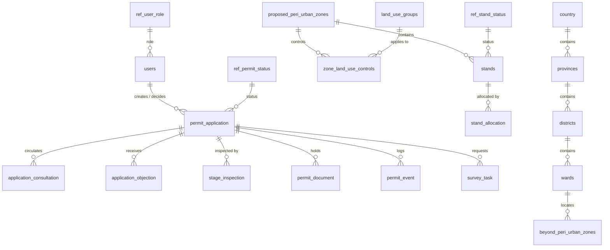

# SpartialIQ database — data dictionary

Generated 2026-09-29 from a copy of the Vungu master database (vungu_master_db_v1) with migrations 130–132 applied by `scripts/generate-data-dictionary.js` — do not edit by hand.

## Summary

| Schema | Purpose | Tables | Views | Rows | Size |
|---|---|--:|--:|--:|--:|
| `public` | Identity & access, payments, notifications, GIS layer/style registry, stands register, zones, and the PostGIS basemap (admin boundaries, OSM, imported cadastre). | 76 | 7 | 148,581 | 84.1 MB |
| `spatial_planning` | Development control case file (RTCP Act): permit applications and everything hanging off them — consultation, objections, committee, decisions, building plans, stage inspections, enforcement, survey tasks, environmental health. | 63 | 8 | 154 | 2.5 MB |
| `planning_clerk` | Planning clerk statutory registers: acknowledgement/refusal letters, notices, receipts, dispatch, correspondence. | 7 | 0 | 0 | 248 kB |
| `council_ops` | Vungu RDC operational asset registers (Roads, WASH, livestock, council). Empty until authoritative imports. | 6 | 0 | 7 | 264 kB |
| `survey` | Shared data across all surveyors (users, districts, control points) | 14 | 4 | 2 | 744 kB |
| `ref` | Reference/lookup data: one small table per closed vocabulary. Business tables reference ref.<domain>(code) by FOREIGN KEY. | 117 | 0 | 681 | 3.7 MB |
| **Total** | database size 117 MB | **283** | **19** | | |

## Design rules

- **Every fact is stored once.** Derived values are computed (views) or `GENERATED` columns (`stands.centroid`, `proposed_peri_urban_zones.area_ha`) so they cannot drift.
- **Every closed vocabulary is a table** in the `ref` schema (`code` PK, `label`, `description`, `sort_order`, `is_active`). Business columns reference it by FOREIGN KEY `ON UPDATE CASCADE`; adding a status is an `INSERT`, not a migration.
- **Relationships are foreign keys, not copied names.** e.g. `stands.zone_id → proposed_peri_urban_zones.id`, `wards.parent_pcode → districts.pcode → provinces.pcode → country.pcode`.
- **Compatibility views keep old names working** where QGIS or the tile server still use them (`gweru_peri_urban_zone`, `vungu_beyond_peri_urban_zones`, `zones_master`, `stands_tile_view`).
- Per-surveyor workspace schemas (`surveyor_<name>`) are created at runtime by `survey.migrate_surveyor_to_schema()` and mirror `survey.*`; they are not listed here.
- Migrations 130–132 implement the above; see their headers for exactly what moved.

## Core relationships

## Contents

- [`public`](#schema-public)
- [`spatial_planning`](#schema-spatial-planning)
- [`planning_clerk`](#schema-planning-clerk)
- [`council_ops`](#schema-council-ops)
- [`survey`](#schema-survey)
- [`ref`](#schema-ref)

## Schema `public` {#schema-public}

Identity & access, payments, notifications, GIS layer/style registry, stands register, zones, and the PostGIS basemap (admin boundaries, OSM, imported cadastre).

### Identity & access

| Table / view | Purpose | Rows | References |
|---|---|--:|---|
| `analytics` | Product analytics events (who did what, when). | 0 | `users` |
| `citizen_documents` | Citizen KYC / supporting documents with verification outcome. | 1 | `users`, `ref.citizen_document_kind`, `ref.verification_status` |
| `invites` | One-time staff invitation tokens (role -> ref.user_role). | 1 | `users`, `ref.user_role` |
| `lands_registry_checks` | Audit of title-deed verification lookups against lands_registry_deeds. | 2 | `users` |
| `lands_registry_deeds` | Deeds Registry extract used to verify title claims. | 10 | `ref.deed_status` |
| `local_authorities` | Contact details of local planning authorities. | 1 |  |
| `schema_migrations` | Applied migration files (scripts/migrate-render.js). | 10 |  |
| `site_content` | IT-Admin-editable content for the public council pages. One row per page slug; body holds the content blocks. Frontend falls back to a bundled default when a slug has no row here. | 0 | `users` |
| `users` | Portal accounts (citizens and council staff). role -> ref.user_role, status -> ref.user_status; sign-in allowed only when status = 'active'. | 18 | `ref.user_status`, `ref.user_role`, `ref.applicant_type`, `ref.residency_status` |

#### public.analytics

Product analytics events (who did what, when).

| Column | Type | Null | Key | Notes |
|---|---|:-:|---|---|
| `id` | uuid |  | PK | default uuid_generate_v4() |
| `user_id` | uuid | ✓ | FK → users.{ |  |
| `action` | varchar(100) |  |  |  |
| `resource_type` | varchar(100) | ✓ |  |  |
| `resource_id` | varchar(255) | ✓ |  |  |
| `metadata` | jsonb | ✓ |  | default '{}' |
| `ip_address` | inet | ✓ |  |  |
| `user_agent` | text | ✓ |  |  |
| `created_at` | timestamptz | ✓ |  | default now() |

#### public.citizen_documents

Citizen KYC / supporting documents with verification outcome.

| Column | Type | Null | Key | Notes |
|---|---|:-:|---|---|
| `id` | uuid |  | PK | default gen_random_uuid() |
| `user_id` | uuid |  | FK → users.{ |  |
| `doc_kind` | varchar(32) |  | FK → ref.citizen_document_kind.{ |  |
| `storage_url` | text |  |  |  |
| `mime_type` | varchar(64) |  |  |  |
| `bytes` | bigint |  |  |  |
| `sha256_hex` | varchar(64) | ✓ |  |  |
| `extracted_name` | varchar(255) | ✓ |  |  |
| `extracted_id_number` | varchar(64) | ✓ |  |  |
| `extracted_dob` | date | ✓ |  |  |
| `verification_status` | varchar(20) |  | FK → ref.verification_status.{ | default 'pending' |
| `verification_notes` | text | ✓ |  |  |
| `verified_by` | uuid | ✓ | FK → users.{ |  |
| `verified_at` | timestamptz | ✓ |  |  |
| `verifier_provider` | varchar(32) | ✓ |  |  |
| `verifier_payload` | jsonb | ✓ |  |  |
| `verifier_confidence` | numeric(5,4) | ✓ |  |  |
| `created_at` | timestamptz |  |  | default now() |
| `updated_at` | timestamptz |  |  | default now() |
| `deleted_at` | timestamptz | ✓ |  |  |
| `deleted_by` | uuid | ✓ |  |  |

#### public.invites

One-time staff invitation tokens (role -> ref.user_role).

| Column | Type | Null | Key | Notes |
|---|---|:-:|---|---|
| `id` | uuid |  | PK | default uuid_generate_v4() |
| `token` | varchar(255) |  | UQ |  |
| `email` | varchar(255) |  |  |  |
| `role` | varchar(50) |  | FK → ref.user_role.{ |  |
| `job_title` | varchar(255) | ✓ |  |  |
| `department` | varchar(255) | ✓ |  |  |
| `invited_by` | uuid | ✓ | FK → users.{ |  |
| `used` | boolean | ✓ |  | default false |
| `used_at` | timestamptz | ✓ |  |  |
| `expires_at` | timestamptz | ✓ |  | default (now() + '7 days') |
| `created_at` | timestamptz | ✓ |  | default now() |

#### public.lands_registry_checks

Audit of title-deed verification lookups against lands_registry_deeds.

| Column | Type | Null | Key | Notes |
|---|---|:-:|---|---|
| `id` | uuid |  | PK | default gen_random_uuid() |
| `deed_number` | varchar(32) |  |  |  |
| `requested_by` | uuid | ✓ | FK → users.{ |  |
| `requester_name` | varchar(160) | ✓ |  |  |
| `matched` | boolean |  |  | default false |
| `holder_match` | boolean |  |  | default false |
| `result_status` | varchar(20) | ✓ |  |  |
| `created_at` | timestamptz |  |  | default now() |

#### public.lands_registry_deeds

Deeds Registry extract used to verify title claims.

| Column | Type | Null | Key | Notes |
|---|---|:-:|---|---|
| `id` | uuid |  | PK | default gen_random_uuid() |
| `deed_number` | varchar(32) |  | UQ |  |
| `holder_name` | varchar(160) |  |  |  |
| `holder_national_id` | varchar(32) | ✓ |  |  |
| `stand_no` | varchar(64) | ✓ |  |  |
| `property_description` | text | ✓ |  |  |
| `district` | varchar(80) |  |  | default 'Vungu' |
| `hectares` | numeric(12,4) | ✓ |  |  |
| `status` | varchar(20) |  | FK → ref.deed_status.{ | default 'active' |
| `registered_at` | date |  |  | default CURRENT_DATE |
| `created_at` | timestamptz |  |  | default now() |
| `updated_at` | timestamptz |  |  | default now() |

#### public.local_authorities

Contact details of local planning authorities.

| Column | Type | Null | Key | Notes |
|---|---|:-:|---|---|
| `id` | integer |  | PK | serial |
| `authority_name` | text |  | UQ |  |
| `telephone` | text | ✓ |  |  |
| `email` | text | ✓ |  |  |
| `address` | text | ✓ |  |  |
| `created_at` | timestamptz |  |  | default now() |

#### public.schema_migrations

Applied migration files (scripts/migrate-render.js).

| Column | Type | Null | Key | Notes |
|---|---|:-:|---|---|
| `filename` | text |  | PK |  |
| `applied_at` | timestamptz | ✓ |  | default now() |

#### public.site_content

IT-Admin-editable content for the public council pages. One row per page slug; body holds the content blocks. Frontend falls back to a bundled default when a slug has no row here.

| Column | Type | Null | Key | Notes |
|---|---|:-:|---|---|
| `slug` | text |  | PK |  |
| `title` | text |  |  |  |
| `body` | jsonb |  |  | default '{}' |
| `updated_at` | timestamptz |  |  | default now() |
| `updated_by` | uuid | ✓ | FK → users.{ |  |

#### public.users

Portal accounts (citizens and council staff). role -> ref.user_role, status -> ref.user_status; sign-in allowed only when status = 'active'.

| Column | Type | Null | Key | Notes |
|---|---|:-:|---|---|
| `id` | uuid |  | PK | default uuid_generate_v4() |
| `email` | varchar(255) |  | UQ |  |
| `password_hash` | varchar(255) |  |  |  |
| `organization` | varchar(255) | ✓ |  |  |
| `role` | varchar(50) | ✓ | FK → ref.user_role.{ | default 'registered' |
| `created_at` | timestamptz | ✓ |  | default now() |
| `full_name` | varchar(255) |  |  | Display name (the only name column; migration 131 removed the duplicate users.name). |
| `last_login_at` | timestamptz | ✓ |  |  |
| `job_title` | varchar(255) | ✓ |  |  |
| `department` | varchar(255) | ✓ |  |  |
| `phone` | varchar(50) | ✓ |  |  |
| `status` | varchar(20) |  | FK → ref.user_status.{ | default 'active' — Account status -> ref.user_status. The account can sign in only when status = 'active' (replaces the old boolean users.active). |
| `applicant_type` | varchar(32) | ✓ | FK → ref.applicant_type.{ |  |
| `national_id` | varchar(64) | ✓ |  | Applicant national ID / passport number, captured once and reused to prefill development applications. |
| `physical_address` | text | ✓ |  | Applicant postal/physical address, captured once and reused to prefill development applications. |
| `deleted_at` | timestamptz | ✓ |  |  |
| `deleted_by` | uuid | ✓ |  |  |
| `mfa_enabled` | boolean |  |  | default false |
| `mfa_secret` | text | ✓ |  | Base32 TOTP secret. Only present while mfa_enabled=true or between /mfa/setup and /mfa/verify. Never returned to the client after enrolment. |
| `mfa_backup_codes` | jsonb | ✓ |  | Array of bcrypt-hashed one-time backup codes, consumed on use. Regenerated whenever MFA is re-enabled. |
| `residency_status` | varchar(16) |  | FK → ref.residency_status.{ | default 'unverified' |
| `residency_method` | varchar(32) | ✓ |  |  |
| `residency_verified_at` | timestamptz | ✓ |  |  |
| `updated_at` | timestamptz | ✓ |  | default now() |

### Legacy online application intake

| Table / view | Purpose | Rows | References |
|---|---|--:|---|
| `application_comments` | Comments on a development_applications row. | 0 | `development_applications` |
| `application_documents` | Documents attached to a development_applications row. | 0 | `development_applications` |
| `application_drafts` | Unsubmitted application wizard drafts (JSON). | 0 |  |
| `application_status_history` | Status transitions of development_applications. | 0 | `users` |
| `application_timeline` | Human-readable timeline events of development_applications. | 0 | `development_applications` |
| `development_applications` | Citizen online application wizard submissions (legacy intake; permit_application.dev_app_id links the formal case). status -> ref.application_status. | 0 | `ref.application_status` |
| `inspection_bookings` | Per-stage inspection bookings. Stage names from Manual 2021 Annexure 12. | 0 | `users`, `spatial_planning.permit_application`, `ref.inspection_booking_status` |
| `inspection_photos` | Photos attached to an inspection_bookings visit. | 0 | `inspection_bookings`, `users` |
| `inspection_status_events` | Status transitions of inspection_bookings. | 0 | `users`, `inspection_bookings` |
| `plan_review_findings` | Findings raised against a plan_reviews upload (severity -> ref.finding_severity). | 0 | `plan_reviews`, `ref.finding_severity` |
| `plan_reviews` | Uploaded building plans awaiting automated/staff review. | 0 | `users`, `ref.plan_review_status` |
| `application_summary` *(view)* | Read model: development_applications with document counts. | view |  |

#### public.application_comments

Comments on a development_applications row.

| Column | Type | Null | Key | Notes |
|---|---|:-:|---|---|
| `id` | integer |  | PK | serial |
| `application_id` | varchar(20) |  | FK → development_applications.{ |  |
| `comment_text` | text |  |  |  |
| `is_internal` | boolean | ✓ |  | default false |
| `created_at` | timestamptz | ✓ |  | default now() |

#### public.application_documents

Documents attached to a development_applications row.

| Column | Type | Null | Key | Notes |
|---|---|:-:|---|---|
| `id` | integer |  | PK | serial |
| `application_id` | varchar(20) |  | FK → development_applications.{ |  |
| `document_name` | varchar(255) |  |  |  |
| `document_type` | varchar(100) |  |  |  |
| `file_size` | bigint | ✓ |  |  |
| `file_url` | text | ✓ |  |  |
| `uploaded_at` | timestamptz | ✓ |  | default now() |

#### public.application_drafts

Unsubmitted application wizard drafts (JSON).

| Column | Type | Null | Key | Notes |
|---|---|:-:|---|---|
| `id` | varchar(25) |  | PK |  |
| `user_id` | varchar(50) |  |  |  |
| `draft_data` | jsonb |  |  |  |
| `created_at` | timestamptz | ✓ |  | default now() |
| `updated_at` | timestamptz | ✓ |  | default now() |

#### public.application_status_history

Status transitions of development_applications.

| Column | Type | Null | Key | Notes |
|---|---|:-:|---|---|
| `id` | bigint |  | PK | serial |
| `application_id` | varchar(32) |  |  |  |
| `from_status` | varchar(64) | ✓ |  |  |
| `to_status` | varchar(64) |  |  |  |
| `changed_by` | uuid | ✓ | FK → users.{ |  |
| `notes` | text | ✓ |  |  |
| `changed_at` | timestamptz |  |  | default now() |

#### public.application_timeline

Human-readable timeline events of development_applications.

| Column | Type | Null | Key | Notes |
|---|---|:-:|---|---|
| `id` | integer |  | PK | serial |
| `application_id` | varchar(20) |  | FK → development_applications.{ |  |
| `event_type` | varchar(50) |  |  |  |
| `event_description` | text | ✓ |  |  |
| `event_date` | timestamptz |  |  |  |
| `created_at` | timestamptz | ✓ |  | default now() |

#### public.development_applications

Citizen online application wizard submissions (legacy intake; permit_application.dev_app_id links the formal case). status -> ref.application_status.

| Column | Type | Null | Key | Notes |
|---|---|:-:|---|---|
| `id` | varchar(20) |  | PK |  |
| `user_id` | varchar(50) |  |  |  |
| `selection_data` | jsonb |  |  |  |
| `eligibility_data` | jsonb |  |  |  |
| `form_data` | jsonb |  |  |  |
| `fees_data` | jsonb | ✓ |  |  |
| `status` | varchar(50) | ✓ | FK → ref.application_status.{ | default 'submitted' |
| `submitted_at` | timestamptz | ✓ |  |  |
| `created_at` | timestamptz | ✓ |  | default now() |
| `updated_at` | timestamptz | ✓ |  | default now() |

#### public.inspection_bookings

Per-stage inspection bookings. Stage names from Manual 2021 Annexure 12.

| Column | Type | Null | Key | Notes |
|---|---|:-:|---|---|
| `id` | uuid |  | PK | default gen_random_uuid() |
| `application_id` | varchar(32) |  |  |  |
| `stage_number` | integer |  |  |  |
| `stage_name` | varchar(64) |  |  |  |
| `citizen_id` | varchar(64) | ✓ |  |  |
| `inspector_id` | uuid | ✓ | FK → users.{ |  |
| `status` | varchar(20) |  | FK → ref.inspection_booking_status.{ | default 'pending_payment' |
| `fee_paid_at` | timestamptz | ✓ |  |  |
| `scheduled_for` | timestamptz | ✓ |  |  |
| `completed_at` | timestamptz | ✓ |  |  |
| `passed` | boolean | ✓ |  |  |
| `citizen_notes` | text | ✓ |  |  |
| `inspector_notes` | text | ✓ |  |  |
| `created_at` | timestamptz |  |  | default now() |
| `updated_at` | timestamptz |  |  | default now() |
| `permit_app_id` | uuid | ✓ | FK → spatial_planning.permit_application.{ |  |

#### public.inspection_photos

Photos attached to an inspection_bookings visit.

| Column | Type | Null | Key | Notes |
|---|---|:-:|---|---|
| `id` | uuid |  | PK | default gen_random_uuid() |
| `booking_id` | uuid |  | FK → inspection_bookings.{ |  |
| `uploaded_by` | uuid | ✓ | FK → users.{ |  |
| `storage_url` | text |  |  |  |
| `mime_type` | varchar(64) |  |  |  |
| `bytes` | bigint |  |  |  |
| `width_px` | integer | ✓ |  |  |
| `height_px` | integer | ✓ |  |  |
| `sha256_hex` | varchar(64) | ✓ |  |  |
| `caption` | varchar(255) | ✓ |  |  |
| `taken_at` | timestamptz | ✓ |  |  |
| `taken_lng` | float8 | ✓ |  |  |
| `taken_lat` | float8 | ✓ |  |  |
| `created_at` | timestamptz |  |  | default now() |
| `deleted_at` | timestamptz | ✓ |  |  |
| `deleted_by` | uuid | ✓ |  |  |

#### public.inspection_status_events

Status transitions of inspection_bookings.

| Column | Type | Null | Key | Notes |
|---|---|:-:|---|---|
| `id` | bigint |  | PK | serial |
| `booking_id` | uuid |  | FK → inspection_bookings.{ |  |
| `from_status` | varchar(20) | ✓ |  |  |
| `to_status` | varchar(20) |  |  |  |
| `scheduled_for` | timestamptz | ✓ |  |  |
| `actor_id` | uuid | ✓ | FK → users.{ |  |
| `actor_role` | varchar(32) | ✓ |  |  |
| `notes` | text | ✓ |  |  |
| `created_at` | timestamptz |  |  | default now() |

#### public.plan_review_findings

Findings raised against a plan_reviews upload (severity -> ref.finding_severity).

| Column | Type | Null | Key | Notes |
|---|---|:-:|---|---|
| `id` | bigint |  | PK | serial |
| `review_id` | uuid |  | FK → plan_reviews.{ |  |
| `severity` | varchar(8) |  | FK → ref.finding_severity.{ |  |
| `code` | varchar(64) |  |  |  |
| `message` | text |  |  |  |
| `source` | jsonb | ✓ |  |  |
| `bbox` | jsonb | ✓ |  |  |
| `created_at` | timestamptz |  |  | default now() |

#### public.plan_reviews

Uploaded building plans awaiting automated/staff review.

| Column | Type | Null | Key | Notes |
|---|---|:-:|---|---|
| `id` | uuid |  | PK | default gen_random_uuid() |
| `application_id` | varchar(32) |  |  |  |
| `uploaded_by` | uuid | ✓ | FK → users.{ |  |
| `storage_url` | text |  |  |  |
| `mime_type` | varchar(64) |  |  |  |
| `bytes` | bigint |  |  |  |
| `sha256_hex` | varchar(64) | ✓ |  |  |
| `status` | varchar(20) |  | FK → ref.plan_review_status.{ | default 'pending' |
| `notes` | text | ✓ |  |  |
| `created_at` | timestamptz |  |  | default now() |
| `updated_at` | timestamptz |  |  | default now() |

#### public.application_summary (view)

Read model: development_applications with document counts.

| Column | Type | Null | Key | Notes |
|---|---|:-:|---|---|
| `id` | varchar(20) | ✓ |  |  |
| `user_id` | varchar(50) | ✓ |  |  |
| `status` | varchar(50) | ✓ |  |  |
| `submitted_at` | timestamptz | ✓ |  |  |
| `updated_at` | timestamptz | ✓ |  |  |
| `parcel_name` | text | ✓ |  |  |
| `parcel_id` | text | ✓ |  |  |
| `applicant_name` | text | ✓ |  |  |
| `contact_email` | text | ✓ |  |  |
| `development_type` | text | ✓ |  |  |
| `total_fees` | numeric | ✓ |  |  |
| `document_count` | bigint | ✓ |  |  |

### Payments & notifications

| Table / view | Purpose | Rows | References |
|---|---|--:|---|
| `exchange_rates` | Daily interbank rates. The system selects the most recent (rate_date DESC) when computing ZiG↔USD conversion. Authority defaults to RBZ. | 0 |  |
| `notifications_outbox` | Outbox-pattern queue. Every email/SMS/in-app notification is written here first; a worker drains pending rows. | 105 | `ref.notification_channel`, `ref.notification_status` |
| `payments` | Online payments through a gateway (payment_gateway), in USD with the ZWG equivalent at rate_used. | 0 | `users`, `exchange_rates`, `ref.currency`, `ref.payment_purpose`, `ref.payment_gateway`, `ref.payment_status` |

#### public.exchange_rates

Daily interbank rates. The system selects the most recent (rate_date DESC) when computing ZiG↔USD conversion. Authority defaults to RBZ.

| Column | Type | Null | Key | Notes |
|---|---|:-:|---|---|
| `id` | uuid |  | PK | default gen_random_uuid() |
| `rate_date` | date |  |  |  |
| `base_ccy` | varchar(8) |  |  | default 'USD' |
| `quote_ccy` | varchar(8) |  |  | default 'ZWG' |
| `rate` | numeric(20,8) |  |  |  |
| `source` | varchar(64) |  |  |  |
| `source_url` | text | ✓ |  |  |
| `fetched_at` | timestamptz |  |  | default now() |
| `created_at` | timestamptz |  |  | default now() |

#### public.notifications_outbox

Outbox-pattern queue. Every email/SMS/in-app notification is written here first; a worker drains pending rows.

| Column | Type | Null | Key | Notes |
|---|---|:-:|---|---|
| `id` | uuid |  | PK | default gen_random_uuid() |
| `user_id` | varchar(64) | ✓ |  |  |
| `email` | varchar(255) | ✓ |  |  |
| `channel` | varchar(16) |  | FK → ref.notification_channel.{ | default 'email' |
| `kind` | varchar(64) |  |  |  |
| `subject` | varchar(255) |  |  |  |
| `body_text` | text |  |  |  |
| `body_html` | text | ✓ |  |  |
| `payload` | jsonb |  |  | default '{}' |
| `status` | varchar(16) |  | FK → ref.notification_status.{ | default 'pending' |
| `attempts` | integer |  |  | default 0 |
| `last_error` | text | ✓ |  |  |
| `scheduled_at` | timestamptz |  |  | default now() |
| `sent_at` | timestamptz | ✓ |  |  |
| `created_at` | timestamptz |  |  | default now() |
| `updated_at` | timestamptz |  |  | default now() |

#### public.payments

Online payments through a gateway (payment_gateway), in USD with the ZWG equivalent at rate_used.

| Column | Type | Null | Key | Notes |
|---|---|:-:|---|---|
| `id` | uuid |  | PK | default gen_random_uuid() |
| `purpose` | varchar(32) |  | FK → ref.payment_purpose.{ |  |
| `related_kind` | varchar(32) | ✓ |  |  |
| `related_id` | varchar(64) | ✓ |  |  |
| `payer_id` | uuid | ✓ | FK → users.{ |  |
| `payer_email` | varchar(255) | ✓ |  |  |
| `payer_phone` | varchar(32) | ✓ |  |  |
| `amount_usd` | numeric(14,2) |  |  |  |
| `amount_zwg` | numeric(16,2) |  |  |  |
| `rate_used` | numeric(20,8) |  |  |  |
| `rate_id` | uuid | ✓ | FK → exchange_rates.{ |  |
| `wallet_ccy` | varchar(8) |  | FK → ref.currency.{ |  |
| `driver` | varchar(32) |  | FK → ref.payment_gateway.{ | default 'manual' |
| `provider_ref` | varchar(255) | ✓ |  |  |
| `provider_status` | varchar(64) | ✓ |  |  |
| `status` | varchar(20) |  | FK → ref.payment_status.{ | default 'pending' |
| `issued_receipt_no` | varchar(32) | ✓ |  |  |
| `paid_at` | timestamptz | ✓ |  |  |
| `receipt_url` | text | ✓ |  |  |
| `metadata` | jsonb |  |  | default '{}' |
| `created_at` | timestamptz |  |  | default now() |
| `updated_at` | timestamptz |  |  | default now() |

### Stands, zones & land use

| Table / view | Purpose | Rows | References |
|---|---|--:|---|
| `beyond_peri_urban_zones` | Beyond-peri-urban settlement zones; ward_pcode -> wards. Tiles/QGIS read the view vungu_beyond_peri_urban_zones. | 16 | `wards` |
| `development_matrix` | Matrix defining permitted uses for each zone type | 7 |  |
| `land_use_groups` | Land-use groups used by the zone control matrix. | 10 | `ref.development_scale`, `users` |
| `planning_assistant_templates` | Typical layout & envelope constants used by the planning-assistant rules engine. Authority: Development Management Control Manual 2021. | 8 | `ref.zone_type`, `ref.development_scale` |
| `proposed_peri_urban_zones` | THE planning-zone table (master plan peri-urban zones). stands.zone_id and zone_land_use_controls.zone_id reference it. Served to tiles through zones_master. | 36 | `ref.development_scale`, `users` |
| `stand_allocation` | Auditable stand-number allocation register (H3): who received which stand, under what reference/conditions, authorised by whom. History preserved via status=revoked + soft delete. | 0 | `stands`, `users`, `ref.allocation_status`, `ref.land_use_purpose` |
| `stands` | Offerable land parcels. Citizens see status='available' rows on the public map. | 20 | `users`, `ref.stand_status`, `ref.development_scale`, `proposed_peri_urban_zones` |
| `zone_land_use_controls` | Zone x land-use-group control matrix: permitted / prohibited / special consent (ref.land_use_control). | 0 | `land_use_groups`, `ref.land_use_control`, `proposed_peri_urban_zones`, `users` |
| `gweru_peri_urban_zone` *(view)* | Compatibility view for the QGIS project layer of the same name. Storage is proposed_peri_urban_zones (131). | view |  |
| `stands_tile_view` *(view)* | Vector-tile source for the stands layer (integer fid for MVT feature ids). | view |  |
| `v_stands` *(view)* | Stands with zone (FK) and ward (spatial containment of the label point) resolved. | view |  |
| `vungu_beyond_peri_urban_zones` *(view)* | Tile/QGIS source for beyond-peri-urban zones: admin names derived from the ward hierarchy. Storage: beyond_peri_urban_zones. | view |  |
| `zones_master` *(view)* | Canonical peri-urban zoning (SSOT). Mirrors proposed_peri_urban_zones (permit master, FK target). Map + permits both read this. See docs/SSOT-spatial.md. | view |  |

#### public.beyond_peri_urban_zones

Beyond-peri-urban settlement zones; ward_pcode -> wards. Tiles/QGIS read the view vungu_beyond_peri_urban_zones.

| Column | Type | Null | Key | Notes |
|---|---|:-:|---|---|
| `fid` | integer |  | PK | serial |
| `ward_pcode` | varchar(20) | ✓ | FK → wards.{ |  |
| `settlement` | varchar(60) | ✓ |  |  |
| `zone_code` | varchar(20) | ✓ |  |  |
| `geom` | geometry(MultiPolygon,4326) | ✓ |  |  |

#### public.development_matrix

Matrix defining permitted uses for each zone type

| Column | Type | Null | Key | Notes |
|---|---|:-:|---|---|
| `id` | integer |  | PK | serial |
| `zone_code` | text |  |  |  |
| `use_code` | text |  |  |  |
| `permission_code` | text |  |  |  |
| `permission_description` | text | ✓ |  |  |
| `conditions` | text | ✓ |  |  |
| `restrictions` | text | ✓ |  |  |
| `created_at` | timestamp | ✓ |  | default CURRENT_TIMESTAMP |
| `updated_at` | timestamp | ✓ |  | default CURRENT_TIMESTAMP |

#### public.land_use_groups

Land-use groups used by the zone control matrix.

| Column | Type | Null | Key | Notes |
|---|---|:-:|---|---|
| `id` | uuid |  | PK | default gen_random_uuid() |
| `group_code` | varchar(32) |  | UQ |  |
| `description` | text | ✓ |  |  |
| `group_category` | varchar(32) | ✓ |  |  |
| `development_category` | varchar(32) | ✓ |  |  |
| `use_scale` | varchar(32) | ✓ | FK → ref.development_scale.{ |  |
| `notes` | text | ✓ |  |  |
| `is_active` | boolean |  |  | default true |
| `created_at` | timestamptz | ✓ |  | default now() |
| `created_by` | uuid | ✓ | FK → users.{ |  |
| `updated_at` | timestamptz | ✓ |  |  |
| `updated_by` | uuid | ✓ | FK → users.{ |  |

#### public.planning_assistant_templates

Typical layout & envelope constants used by the planning-assistant rules engine. Authority: Development Management Control Manual 2021.

| Column | Type | Null | Key | Notes |
|---|---|:-:|---|---|
| `id` | uuid |  | PK | default gen_random_uuid() |
| `zone_type` | varchar(64) |  | FK → ref.zone_type.{ |  |
| `scale_category` | varchar(20) |  | FK → ref.development_scale.{ |  |
| `purpose` | varchar(64) |  |  |  |
| `display_name` | varchar(128) |  |  |  |
| `description` | text | ✓ |  |  |
| `min_area_sqm` | numeric(12,2) | ✓ |  |  |
| `max_area_sqm` | numeric(12,2) | ✓ |  |  |
| `min_frontage_m` | numeric(8,2) | ✓ |  |  |
| `max_plot_coverage_pct` | numeric(5,2) | ✓ |  |  |
| `max_floor_area_ratio` | numeric(5,2) | ✓ |  |  |
| `max_height_m` | numeric(6,2) | ✓ |  |  |
| `max_storeys` | integer | ✓ |  |  |
| `setback_front_m` | numeric(6,2) | ✓ |  |  |
| `setback_rear_m` | numeric(6,2) | ✓ |  |  |
| `setback_side_m` | numeric(6,2) | ✓ |  |  |
| `extras` | jsonb |  |  | default '{}' |
| `ward` | varchar(64) | ✓ |  |  |
| `source_citation` | text | ✓ |  |  |
| `is_active` | boolean |  |  | default true |
| `created_at` | timestamptz | ✓ |  | default now() |
| `updated_at` | timestamptz | ✓ |  | default now() |

#### public.proposed_peri_urban_zones

THE planning-zone table (master plan peri-urban zones). stands.zone_id and zone_land_use_controls.zone_id reference it. Served to tiles through zones_master.

| Column | Type | Null | Key | Notes |
|---|---|:-:|---|---|
| `id` | integer |  | PK | identity |
| `zone` | text | ✓ |  |  |
| `zone_code` | varchar | ✓ |  |  |
| `zone_type` | text | ✓ |  |  |
| `scale_category` | text | ✓ | FK → ref.development_scale.{ |  |
| `authority` | text | ✓ |  |  |
| `zone_description` | text | ✓ |  |  |
| `is_active` | boolean | ✓ |  |  |
| `map_color` | text | ✓ |  |  |
| `display_order` | integer | ✓ |  |  |
| `geom` | geometry(MultiPolygon,4326) | ✓ |  |  |
| `ward` | varchar | ✓ |  |  |
| `created_at` | timestamptz | ✓ |  | default now() |
| `updated_at` | timestamptz | ✓ |  | default now() |
| `created_by` | uuid | ✓ | FK → users.{ |  |
| `area_ha` | numeric(14,4) | ✓ |  | generated: round(((st_area((geom)::geography) / (10000)::double precision))::numeric, 4) — Area in hectares, GENERATED from geom (geodesic). |

#### public.stand_allocation

Auditable stand-number allocation register (H3): who received which stand, under what reference/conditions, authorised by whom. History preserved via status=revoked + soft delete.

| Column | Type | Null | Key | Notes |
|---|---|:-:|---|---|
| `id` | uuid |  | PK | default gen_random_uuid() |
| `stand_id` | uuid |  | FK → stands.{ |  |
| `reference_no` | varchar(32) |  | UQ |  |
| `allocated_to` | uuid | ✓ | FK → users.{ |  |
| `allottee_name` | varchar(160) | ✓ |  |  |
| `purpose` | varchar(40) |  | FK → ref.land_use_purpose.{ | default 'residential' |
| `conditions` | text | ✓ |  |  |
| `authorized_by` | uuid | ✓ | FK → users.{ |  |
| `allocated_at` | timestamptz |  |  | default now() |
| `status` | varchar(16) |  | FK → ref.allocation_status.{ | default 'active' |
| `revoked_at` | timestamptz | ✓ |  |  |
| `revoked_by` | uuid | ✓ | FK → users.{ |  |
| `revoke_reason` | text | ✓ |  |  |
| `deleted_at` | timestamptz | ✓ |  |  |
| `deleted_by` | uuid | ✓ |  |  |
| `created_at` | timestamptz |  |  | default now() |

#### public.stands

Offerable land parcels. Citizens see status='available' rows on the public map.

| Column | Type | Null | Key | Notes |
|---|---|:-:|---|---|
| `id` | uuid |  | PK | default gen_random_uuid() |
| `stand_number` | varchar(64) |  |  |  |
| `ward` | varchar(64) |  |  |  |
| `zone_type` | varchar(64) | ✓ |  |  |
| `use_scale` | varchar(20) | ✓ | FK → ref.development_scale.{ |  |
| `area_sqm` | numeric(12,2) |  |  |  |
| `frontage_m` | numeric(8,2) | ✓ |  |  |
| `depth_m` | numeric(8,2) | ✓ |  |  |
| `price_usd` | numeric(12,2) | ✓ |  |  |
| `status` | varchar(20) |  | FK → ref.stand_status.{ | default 'available' |
| `description` | text | ✓ |  |  |
| `geom` | geometry(Polygon,4326) |  |  |  |
| `centroid` | geometry(Point,4326) | ✓ |  | generated: st_pointonsurface(geom) — Label point, GENERATED from geom (ST_PointOnSurface) — never written by the application. |
| `reserved_by` | uuid | ✓ | FK → users.{ |  |
| `reserved_at` | timestamptz | ✓ |  |  |
| `reserved_until` | timestamptz | ✓ |  | When a citizen starts an application, the stand is reserved until this timestamp. After expiry the row reverts to 'available'. |
| `allocated_to` | uuid | ✓ | FK → users.{ |  |
| `allocated_at` | timestamptz | ✓ |  |  |
| `created_by` | uuid | ✓ | FK → users.{ |  |
| `created_at` | timestamptz | ✓ |  | default now() |
| `updated_at` | timestamptz | ✓ |  | default now() |
| `statutory_plan_id` | uuid | ✓ |  |  |
| `zone_id` | integer | ✓ | FK → proposed_peri_urban_zones.{ | Planning zone -> proposed_peri_urban_zones.id (INTEGER; was a UUID pointing at a duplicate zones table until 131). |

#### public.zone_land_use_controls

Zone x land-use-group control matrix: permitted / prohibited / special consent (ref.land_use_control).

| Column | Type | Null | Key | Notes |
|---|---|:-:|---|---|
| `id` | uuid |  | PK | default gen_random_uuid() |
| `land_use_group_id` | uuid |  | FK → land_use_groups.{ |  |
| `control_type` | varchar(20) |  | FK → ref.land_use_control.{ |  |
| `authority` | varchar(100) | ✓ |  | default 'Vungu RDC' |
| `notes` | text | ✓ |  |  |
| `conditions` | text | ✓ |  |  |
| `created_at` | timestamptz | ✓ |  | default now() |
| `updated_at` | timestamptz | ✓ |  | default now() |
| `deleted_at` | timestamptz | ✓ |  |  |
| `deleted_by` | uuid | ✓ |  |  |
| `zone_id` | integer |  | FK → proposed_peri_urban_zones.{ |  |
| `created_by` | uuid | ✓ | FK → users.{ |  |

#### public.gweru_peri_urban_zone (view)

Compatibility view for the QGIS project layer of the same name. Storage is proposed_peri_urban_zones (131).

| Column | Type | Null | Key | Notes |
|---|---|:-:|---|---|
| `id` | integer | ✓ |  |  |
| `zone` | text | ✓ |  |  |
| `zone_code` | varchar | ✓ |  |  |
| `zone_type` | text | ✓ |  |  |
| `map_color` | text | ✓ |  |  |
| `display_order` | integer | ✓ |  |  |
| `is_active` | boolean | ✓ |  |  |
| `geom` | geometry(MultiPolygon,4326) | ✓ |  |  |

#### public.stands_tile_view (view)

Vector-tile source for the stands layer (integer fid for MVT feature ids).

| Column | Type | Null | Key | Notes |
|---|---|:-:|---|---|
| `fid` | integer | ✓ |  |  |
| `stand_id` | text | ✓ |  |  |
| `stand_number` | varchar(64) | ✓ |  |  |
| `ward` | varchar(64) | ✓ |  |  |
| `zone_type` | varchar(64) | ✓ |  |  |
| `use_scale` | varchar(20) | ✓ |  |  |
| `status` | varchar(20) | ✓ |  |  |
| `area_sqm_int` | integer | ✓ |  |  |
| `price_usd_cents` | integer | ✓ |  |  |
| `geom` | geometry(Polygon,4326) | ✓ |  |  |

#### public.v_stands (view)

Stands with zone (FK) and ward (spatial containment of the label point) resolved.

| Column | Type | Null | Key | Notes |
|---|---|:-:|---|---|
| `id` | uuid | ✓ |  |  |
| `stand_number` | varchar(64) | ✓ |  |  |
| `ward` | varchar(64) | ✓ |  |  |
| `ward_pcode` | varchar | ✓ |  |  |
| `ward_name` | varchar | ✓ |  |  |
| `zone_id` | integer | ✓ |  |  |
| `zone_name` | text | ✓ |  |  |
| `zone_code` | varchar | ✓ |  |  |
| `zone_type` | varchar(64) | ✓ |  |  |
| `use_scale` | varchar(20) | ✓ |  |  |
| `area_sqm` | numeric(12,2) | ✓ |  |  |
| `frontage_m` | numeric(8,2) | ✓ |  |  |
| `depth_m` | numeric(8,2) | ✓ |  |  |
| `price_usd` | numeric(12,2) | ✓ |  |  |
| `status` | varchar(20) | ✓ |  |  |
| `description` | text | ✓ |  |  |
| `geom` | geometry(Polygon,4326) | ✓ |  |  |
| `centroid` | geometry(Point,4326) | ✓ |  |  |
| `reserved_by` | uuid | ✓ |  |  |
| `reserved_at` | timestamptz | ✓ |  |  |
| `reserved_until` | timestamptz | ✓ |  |  |
| `allocated_to` | uuid | ✓ |  |  |
| `allocated_at` | timestamptz | ✓ |  |  |
| `statutory_plan_id` | uuid | ✓ |  |  |
| `created_by` | uuid | ✓ |  |  |
| `created_at` | timestamptz | ✓ |  |  |
| `updated_at` | timestamptz | ✓ |  |  |

#### public.vungu_beyond_peri_urban_zones (view)

Tile/QGIS source for beyond-peri-urban zones: admin names derived from the ward hierarchy. Storage: beyond_peri_urban_zones.

| Column | Type | Null | Key | Notes |
|---|---|:-:|---|---|
| `fid` | integer | ✓ |  |  |
| `zone_code` | varchar(20) | ✓ |  |  |
| `settlement` | varchar(60) | ✓ |  |  |
| `adm3_en` | varchar | ✓ |  |  |
| `adm3_pcode` | varchar(20) | ✓ |  |  |
| `adm2_en` | varchar | ✓ |  |  |
| `adm2_pcode` | varchar | ✓ |  |  |
| `adm1_en` | varchar | ✓ |  |  |
| `adm1_pcode` | varchar | ✓ |  |  |
| `geom` | geometry(MultiPolygon,4326) | ✓ |  |  |

#### public.zones_master (view)

Canonical peri-urban zoning (SSOT). Mirrors proposed_peri_urban_zones (permit master, FK target). Map + permits both read this. See docs/SSOT-spatial.md.

| Column | Type | Null | Key | Notes |
|---|---|:-:|---|---|
| `id` | integer | ✓ |  |  |
| `zone` | text | ✓ |  |  |
| `zone_code` | varchar | ✓ |  |  |
| `is_active` | boolean | ✓ |  |  |
| `display_order` | integer | ✓ |  |  |
| `geom` | geometry(MultiPolygon,4326) | ✓ |  |  |

### GIS registry

| Table / view | Purpose | Rows | References |
|---|---|--:|---|
| `gis_layer` | Governed enterprise GIS layer catalogue. Carries no symbology - see gis_style. | 31 | `ref.geometry_type` |
| `gis_style` | Governed, versioned layer styles (status -> ref.style_status; one published per layer, published rows immutable). | 32 | `gis_layer`, `ref.style_status`, `ref.style_fidelity`, `ref.style_source`, `ref.style_renderer` |
| `gis_style_audit` | Append-only audit trail of gis_style lifecycle events. | 195 | `ref.style_status` |
| `ingestion_jobs` | Data ingestion jobs for importing spatial data | 0 | `admin_users` |
| `layer_data` | Features of a user-defined layer (layers). | 0 | `layers` |
| `layers` | User-defined map layers (features in layer_data). | 6 | `users`, `ref.layer_type` |
| `places` | Gazetteer used by public place search. | 0 |  |
| `spatial_layers` | Catalogue of PostGIS tables exposed as dynamic GeoJSON layers (/api/dynamic-layers). | 40 |  |
| `gis_published_style` *(view)* | Read model: each active gis_layer with its currently published style. | view |  |

#### public.gis_layer

Governed enterprise GIS layer catalogue. Carries no symbology - see gis_style.

| Column | Type | Null | Key | Notes |
|---|---|:-:|---|---|
| `layer_id` | text |  | PK |  |
| `display_name` | text |  |  |  |
| `description` | text | ✓ |  |  |
| `geometry` | text |  | FK → ref.geometry_type.{ |  |
| `data_source` | text | ✓ |  |  |
| `data_srid` | integer | ✓ |  |  |
| `data_synced_at` | timestamptz | ✓ |  | When spatial DATA last synced. Independent of style publication. |
| `qgis_project` | text | ✓ |  |  |
| `qgis_layer` | text | ✓ |  |  |
| `owner` | text | ✓ |  |  |
| `steward` | text | ✓ |  |  |
| `access_roles` | text[] |  |  | default ARRAY['admin', 'gis_officer', 'planner'] |
| `min_zoom` | integer | ✓ |  |  |
| `max_zoom` | integer | ✓ |  |  |
| `is_active` | boolean |  |  | default true |
| `metadata` | jsonb |  |  | default '{}' |
| `created_at` | timestamptz |  |  | default now() |
| `updated_at` | timestamptz |  |  | default now() |

#### public.gis_style

Governed, versioned layer styles (status -> ref.style_status; one published per layer, published rows immutable).

| Column | Type | Null | Key | Notes |
|---|---|:-:|---|---|
| `style_id` | uuid |  | PK | default gen_random_uuid() |
| `layer_id` | text |  | FK → gis_layer.{ |  |
| `style_name` | text |  |  |  |
| `style_version` | integer |  |  |  |
| `status` | varchar(20) |  | FK → ref.style_status.{ | default 'draft' |
| `source` | text |  | FK → ref.style_source.{ | default 'qgis' |
| `source_path` | text | ✓ |  |  |
| `source_checksum` | text | ✓ |  |  |
| `definition` | jsonb |  |  | Renderer-neutral style doc (vungu.gis.style/1). Immutable once published. |
| `renderer_type` | text |  | FK → ref.style_renderer.{ |  |
| `classification_attribute` | text | ✓ |  |  |
| `classification_method` | text | ✓ |  |  |
| `scale_min_zoom` | integer | ✓ |  |  |
| `scale_max_zoom` | integer | ✓ |  |  |
| `opacity` | numeric(4,3) |  |  | default 1.000 |
| `fidelity` | text |  | FK → ref.style_fidelity.{ | default 'direct' — MapLibre representability. `server` routes the layer to QGIS Server WMS instead of vector tiles. |
| `fidelity_notes` | jsonb |  |  | default '[]' |
| `checksum` | text |  |  |  |
| `metadata` | jsonb |  |  | default '{}' |
| `change_summary` | text | ✓ |  |  |
| `created_by` | text | ✓ |  |  |
| `approved_by` | text | ✓ |  |  |
| `published_by` | text | ✓ |  |  |
| `created_at` | timestamptz |  |  | default now() |
| `updated_at` | timestamptz |  |  | default now() |
| `approved_at` | timestamptz | ✓ |  |  |
| `published_at` | timestamptz | ✓ |  |  |

#### public.gis_style_audit

Append-only audit trail of gis_style lifecycle events.

| Column | Type | Null | Key | Notes |
|---|---|:-:|---|---|
| `audit_id` | bigint |  | PK | serial |
| `layer_id` | text |  |  |  |
| `style_id` | uuid | ✓ |  |  |
| `event` | text |  |  |  |
| `from_status` | varchar(20) | ✓ | FK → ref.style_status.{ |  |
| `to_status` | varchar(20) | ✓ | FK → ref.style_status.{ |  |
| `from_version` | integer | ✓ |  |  |
| `to_version` | integer | ✓ |  |  |
| `reason` | text | ✓ |  |  |
| `change_summary` | text | ✓ |  |  |
| `source_path` | text | ✓ |  |  |
| `checksum` | text | ✓ |  |  |
| `actor` | text | ✓ |  |  |
| `actor_role` | text | ✓ |  |  |
| `detail` | jsonb |  |  | default '{}' |
| `created_at` | timestamptz |  |  | default now() |

#### public.ingestion_jobs

Data ingestion jobs for importing spatial data

| Column | Type | Null | Key | Notes |
|---|---|:-:|---|---|
| `id` | integer |  | PK | serial |
| `job_name` | varchar(255) |  |  |  |
| `job_type` | varchar(50) |  |  |  |
| `status` | varchar(20) | ✓ |  | default 'pending' |
| `file_path` | varchar(500) | ✓ |  |  |
| `file_size` | bigint | ✓ |  |  |
| `config` | jsonb |  |  | default '{}' |
| `results` | jsonb |  |  | default '{}' |
| `errors` | jsonb | ✓ |  | default '[]' |
| `progress` | jsonb | ✓ |  | default '{"percentage": 0, "total_steps": 0, "current_step": ""}' |
| `started_at` | timestamptz | ✓ |  |  |
| `completed_at` | timestamptz | ✓ |  |  |
| `created_by` | integer | ✓ | FK → admin_users.{ |  |
| `created_at` | timestamptz | ✓ |  | default now() |
| `updated_at` | timestamptz | ✓ |  | default now() |

#### public.layer_data

Features of a user-defined layer (layers).

| Column | Type | Null | Key | Notes |
|---|---|:-:|---|---|
| `id` | uuid |  | PK | default uuid_generate_v4() |
| `layer_id` | uuid |  | FK → layers.{ |  |
| `geom` | geometry(Geometry,4326) |  |  |  |
| `properties` | jsonb | ✓ |  | default '{}' |
| `created_at` | timestamptz | ✓ |  | default now() |

#### public.layers

User-defined map layers (features in layer_data).

| Column | Type | Null | Key | Notes |
|---|---|:-:|---|---|
| `id` | uuid |  | PK | default uuid_generate_v4() |
| `name` | varchar(255) |  |  |  |
| `description` | text | ✓ |  |  |
| `type` | varchar(50) |  | FK → ref.layer_type.{ |  |
| `published` | boolean | ✓ |  | default false |
| `visible` | boolean | ✓ |  | default true |
| `style` | jsonb | ✓ |  | default '{}' |
| `metadata` | jsonb | ✓ |  | default '{}' |
| `created_by` | uuid | ✓ | FK → users.{ |  |
| `created_at` | timestamptz | ✓ |  | default now() |
| `updated_at` | timestamptz | ✓ |  | default now() |

#### public.places

Gazetteer used by public place search.

| Column | Type | Null | Key | Notes |
|---|---|:-:|---|---|
| `id` | uuid |  | PK | default gen_random_uuid() |
| `name` | varchar(255) | ✓ |  |  |
| `type` | varchar(100) | ✓ |  |  |
| `geom` | geometry(Point,4326) | ✓ |  |  |
| `relevance` | numeric(3,2) | ✓ |  |  |
| `properties` | jsonb | ✓ |  |  |
| `created_at` | timestamptz | ✓ |  |  |

#### public.spatial_layers

Catalogue of PostGIS tables exposed as dynamic GeoJSON layers (/api/dynamic-layers).

| Column | Type | Null | Key | Notes |
|---|---|:-:|---|---|
| `id` | integer |  | PK | serial |
| `table_name` | varchar(255) |  | UQ |  |
| `display_name` | varchar(255) |  |  |  |
| `geometry_type` | varchar(50) | ✓ |  | default 'point' |
| `description` | text | ✓ |  |  |
| `style_config` | jsonb | ✓ |  | default '{}' |
| `is_visible` | boolean | ✓ |  | default true |
| `created_at` | timestamp | ✓ |  | default now() |
| `updated_at` | timestamp | ✓ |  | default now() |

#### public.gis_published_style (view)

Read model: each active gis_layer with its currently published style.

| Column | Type | Null | Key | Notes |
|---|---|:-:|---|---|
| `layer_id` | text | ✓ |  |  |
| `display_name` | text | ✓ |  |  |
| `description` | text | ✓ |  |  |
| `geometry` | text | ✓ |  |  |
| `data_source` | text | ✓ |  |  |
| `data_srid` | integer | ✓ |  |  |
| `data_synced_at` | timestamptz | ✓ |  |  |
| `qgis_project` | text | ✓ |  |  |
| `qgis_layer` | text | ✓ |  |  |
| `owner` | text | ✓ |  |  |
| `steward` | text | ✓ |  |  |
| `access_roles` | text[] | ✓ |  |  |
| `min_zoom` | integer | ✓ |  |  |
| `max_zoom` | integer | ✓ |  |  |
| `style_id` | uuid | ✓ |  |  |
| `style_name` | text | ✓ |  |  |
| `style_version` | integer | ✓ |  |  |
| `source` | text | ✓ |  |  |
| `source_path` | text | ✓ |  |  |
| `definition` | jsonb | ✓ |  |  |
| `renderer_type` | text | ✓ |  |  |
| `classification_attribute` | text | ✓ |  |  |
| `classification_method` | text | ✓ |  |  |
| `opacity` | numeric(4,3) | ✓ |  |  |
| `fidelity` | text | ✓ |  |  |
| `fidelity_notes` | jsonb | ✓ |  |  |
| `checksum` | text | ✓ |  |  |
| `approved_by` | text | ✓ |  |  |
| `published_by` | text | ✓ |  |  |
| `style_published_at` | timestamptz | ✓ |  |  |

### Basemap — administrative boundaries

| Table / view | Purpose | Rows | References |
|---|---|--:|---|
| `admin_areas` | OSM administrative areas (Vungu clip). | 11 | `ref.osm_feature_class` |
| `country` | Zimbabwe national boundary (ADM0) | 1 |  |
| `districts` | Zimbabwe district boundaries (ADM2) | 91 | `provinces` |
| `provinces` | Zimbabwe province boundaries (ADM1) | 10 | `country` |
| `vungu_clip_boundary` | Single MultiPolygon SSOT for clipping OSM basemap tables to Vungu RDC (ZW1704 wards + 250m). | 1 |  |
| `wards` | Zimbabwe ward boundaries (ADM3) | 1,961 | `districts` |

#### public.admin_areas

OSM administrative areas (Vungu clip).

| Column | Type | Null | Key | Notes |
|---|---|:-:|---|---|
| `fid` | integer |  | PK | identity |
| `geom` | geometry(MultiPolygon,4326) | ✓ |  |  |
| `osm_id` | varchar(12) | ✓ |  |  |
| `fclass` | varchar(28) | ✓ | FK → ref.osm_feature_class.{ |  |
| `name` | varchar(100) | ✓ |  |  |

#### public.country

Zimbabwe national boundary (ADM0)

| Column | Type | Null | Key | Notes |
|---|---|:-:|---|---|
| `fid` | integer |  | PK | serial |
| `geom` | geometry(MultiPolygon,4326) | ✓ |  |  |
| `pcode` | varchar | ✓ | UQ |  |
| `name_en` | varchar | ✓ |  |  |
| `parent_pcode` | varchar | ✓ |  |  |
| `level` | bigint | ✓ |  |  |

#### public.districts

Zimbabwe district boundaries (ADM2)

| Column | Type | Null | Key | Notes |
|---|---|:-:|---|---|
| `fid` | integer |  | PK | serial |
| `geom` | geometry(MultiPolygon,4326) | ✓ |  |  |
| `pcode` | varchar | ✓ | UQ |  |
| `name_en` | varchar | ✓ |  |  |
| `parent_pcode` | varchar | ✓ | FK → provinces.{ |  |
| `level` | bigint | ✓ |  |  |

#### public.provinces

Zimbabwe province boundaries (ADM1)

| Column | Type | Null | Key | Notes |
|---|---|:-:|---|---|
| `fid` | integer |  | PK | serial |
| `geom` | geometry(MultiPolygon,4326) | ✓ |  |  |
| `pcode` | varchar | ✓ | UQ |  |
| `name_en` | varchar | ✓ |  |  |
| `parent_pcode` | varchar | ✓ | FK → country.{ |  |
| `level` | bigint | ✓ |  |  |

#### public.vungu_clip_boundary

Single MultiPolygon SSOT for clipping OSM basemap tables to Vungu RDC (ZW1704 wards + 250m).

| Column | Type | Null | Key | Notes |
|---|---|:-:|---|---|
| `id` | integer |  | PK | default 1 |
| `geom` | geometry(MultiPolygon,4326) |  |  |  |
| `source` | text |  |  | default 'wards ZW1704% + 250m buffer' |
| `created_at` | timestamptz |  |  | default now() |

#### public.wards

Zimbabwe ward boundaries (ADM3)

| Column | Type | Null | Key | Notes |
|---|---|:-:|---|---|
| `fid` | integer |  | PK | serial |
| `geom` | geometry(MultiPolygon,4326) | ✓ |  |  |
| `pcode` | varchar | ✓ | UQ |  |
| `name_en` | varchar | ✓ |  |  |
| `parent_pcode` | varchar | ✓ | FK → districts.{ |  |
| `level` | bigint | ✓ |  |  |

### Basemap — council imports

| Table / view | Purpose | Rows | References |
|---|---|--:|---|
| `gweru_business_centres` | Gweru rural district business centres. | 67 |  |
| `gweru_chiefdoms` | Gweru rural district chiefdoms (QGIS project layer). | 5 |  |
| `gweru_health_centres` | Gweru rural district health facilities (MoHCC survey attributes). | 0 |  |
| `gweru_rivers` | Gweru rural district rivers (QGIS project layer). | 260 |  |
| `gweru_rural_farms` | Gweru rural farms with land-use compliance attributes (land-use management module). | 672 | `ref.compliance_status`, `ref.title_deed_type` |
| `gweru_rural_planning_boundary` | Gweru rural district planning boundary. | 1 |  |
| `vungu_cemeteries` | Vungu master plan: cemeteries. | 1 |  |
| `vungu_farm_cadastre` | Vungu master plan: farm cadastre (whole farms), imported from the council GeoPackage. | 687 |  |
| `vungu_parcels` | Vungu master plan: subdivided parcels, imported from the council GeoPackage. | 733 |  |
| `vungu_waste_management` | Vungu master plan: waste management sites. | 2 |  |

#### public.gweru_business_centres

Gweru rural district business centres.

| Column | Type | Null | Key | Notes |
|---|---|:-:|---|---|
| `id` | integer |  | PK | serial |
| `geom` | geometry(Point,4326) | ✓ |  |  |
| `fid` | integer | ✓ |  |  |
| `province_n` | varchar(254) | ✓ |  |  |
| `district_n` | varchar(254) | ✓ |  |  |
| `ward_no_` | integer | ✓ |  |  |
| `village_na` | varchar(254) | ✓ |  |  |
| `sector` | varchar(254) | ✓ |  |  |
| `admin3name` | varchar(254) | ✓ |  |  |
| `admin3pcod` | varchar(254) | ✓ |  |  |
| `admin2name` | varchar(254) | ✓ |  |  |
| `admin2pcod` | varchar(254) | ✓ |  |  |
| `admin1name` | varchar(254) | ✓ |  |  |
| `admin1pcod` | varchar(254) | ✓ |  |  |

#### public.gweru_chiefdoms

Gweru rural district chiefdoms (QGIS project layer).

| Column | Type | Null | Key | Notes |
|---|---|:-:|---|---|
| `id` | integer |  | PK | serial |
| `geom` | geometry(MultiPolygon,4326) | ✓ |  |  |
| `national` | varchar(254) | ✓ |  |  |
| `province` | varchar(50) | ✓ |  |  |
| `district` | varchar(50) | ✓ |  |  |
| `wardnumber` | integer | ✓ |  |  |
| `local_auth` | varchar(50) | ✓ |  |  |
| `assembly` | varchar(50) | ✓ |  |  |
| `chief` | varchar(254) | ✓ |  |  |
| `layer` | varchar(254) | ✓ |  |  |
| `path` | varchar(254) | ✓ |  |  |

#### public.gweru_health_centres

Gweru rural district health facilities (MoHCC survey attributes).

| Column | Type | Null | Key | Notes |
|---|---|:-:|---|---|
| `id` | integer |  | PK | identity |
| `geom` | geometry(MultiPoint,4326) | ✓ |  |  |
| `district` | varchar(50) | ✓ |  |  |
| `longitude` | float8 | ✓ |  |  |
| `latitude` | float8 | ✓ |  |  |
| `elevation` | float8 | ✓ |  |  |
| `updated` | integer | ✓ |  |  |
| `nameoffaci` | varchar(50) | ✓ |  |  |
| `ownership` | varchar(50) | ✓ |  |  |
| `yearbuilt` | integer | ✓ |  |  |
| `typeoffaci` | varchar(50) | ✓ |  |  |
| `numofdocto` | integer | ✓ |  |  |
| `numofnurse` | integer | ✓ |  |  |
| `numofnur_1` | integer | ✓ |  |  |
| `numofpcn` | integer | ✓ |  |  |
| `numofehts` | integer | ✓ |  |  |
| `numofpharm` | integer | ✓ |  |  |
| `numoflabte` | integer | ✓ |  |  |
| `numofbeds` | integer | ✓ |  |  |
| `numofmater` | integer | ✓ |  |  |
| `numofgener` | integer | ✓ |  |  |
| `cathmentpo` | integer | ✓ |  |  |
| `distneares` | float8 | ✓ |  |  |
| `hascommuni` | integer | ✓ |  |  |
| `hascommu_1` | integer | ✓ |  |  |
| `haswaterpi` | integer | ✓ |  |  |
| `haswaterun` | integer | ✓ |  |  |
| `haselectri` | integer | ✓ |  |  |
| `haselect_1` | integer | ✓ |  |  |
| `distnear_1` | float8 | ✓ |  |  |
| `hassanitat` | integer | ✓ |  |  |
| `hassanit_1` | integer | ✓ |  |  |
| `hassanit_2` | integer | ✓ |  |  |
| `hassecurit` | integer | ✓ |  |  |
| `hassecur_1` | integer | ✓ |  |  |
| `hasroadtar` | integer | ✓ |  |  |
| `hasroadgra` | integer | ✓ |  |  |
| `hasinciner` | integer | ✓ |  |  |
| `hasautoway` | integer | ✓ |  |  |
| `hasdental` | integer | ✓ |  |  |
| `comments` | varchar(254) | ✓ |  |  |
| `type_edite` | varchar(40) | ✓ |  |  |

#### public.gweru_rivers

Gweru rural district rivers (QGIS project layer).

| Column | Type | Null | Key | Notes |
|---|---|:-:|---|---|
| `id` | integer |  | PK | serial |
| `geom` | geometry(MultiLineString,4326) | ✓ |  |  |
| `fid_1` | integer | ✓ |  |  |
| `fid` | numeric | ✓ |  |  |
| `fnode_` | numeric | ✓ |  |  |
| `tnode_` | numeric | ✓ |  |  |
| `lpoly_` | numeric | ✓ |  |  |
| `rpoly_` | numeric | ✓ |  |  |
| `length` | numeric | ✓ |  |  |
| `river_n` | varchar(254) | ✓ |  |  |
| `river_type` | varchar(254) | ✓ |  |  |
| `shape_leng` | numeric | ✓ |  |  |

#### public.gweru_rural_farms

Gweru rural farms with land-use compliance attributes (land-use management module).

| Column | Type | Null | Key | Notes |
|---|---|:-:|---|---|
| `id` | integer |  | PK | serial |
| `geom` | geometry(MultiPolygon,4326) | ✓ |  |  |
| `objectid` | integer | ✓ |  |  |
| `row_id` | varchar(7) | ✓ |  |  |
| `name` | varchar(40) | ✓ |  |  |
| `name_cfu` | varchar(40) | ✓ |  |  |
| `map_sheet` | varchar(40) | ✓ |  |  |
| `province` | varchar(40) | ✓ |  |  |
| `district` | varchar(40) | ✓ |  |  |
| `status` | varchar(25) | ✓ |  |  |
| `area_ha` | float8 | ✓ |  |  |
| `zone_id` | integer | ✓ |  |  |
| `current_land_use_group_id` | uuid | ✓ |  |  |
| `compliance_status` | varchar(20) | ✓ | FK → ref.compliance_status.{ |  |
| `last_compliance_check` | timestamptz | ✓ |  |  |
| `street_address` | text | ✓ |  |  |
| `title_deed_type` | varchar(50) | ✓ | FK → ref.title_deed_type.{ |  |
| `title_deed_number` | varchar(100) | ✓ |  |  |
| `title_deed_info` | jsonb | ✓ |  |  |
| `communal_area_details` | jsonb | ✓ |  |  |
| `has_restrictions` | boolean | ✓ |  | default false |
| `current_use_description` | text | ✓ |  |  |
| `last_use_description` | text | ✓ |  |  |
| `last_use_year` | integer | ✓ |  |  |
| `owner_id` | uuid | ✓ |  |  |

#### public.gweru_rural_planning_boundary

Gweru rural district planning boundary.

| Column | Type | Null | Key | Notes |
|---|---|:-:|---|---|
| `id` | integer |  | PK | serial |
| `geom` | geometry(Polygon,4326) | ✓ |  |  |
| `adm2_en` | varchar(50) | ✓ |  |  |
| `adm2_pcode` | varchar(50) | ✓ |  |  |
| `adm1_pcode` | varchar(50) | ✓ |  |  |

#### public.vungu_cemeteries

Vungu master plan: cemeteries.

| Column | Type | Null | Key | Notes |
|---|---|:-:|---|---|
| `fid` | integer |  | PK | serial |
| `id` | text | ✓ |  |  |
| `name` | text | ✓ |  |  |
| `geom` | geometry(MultiPolygon,4326) | ✓ |  |  |

#### public.vungu_farm_cadastre

Vungu master plan: farm cadastre (whole farms), imported from the council GeoPackage.

| Column | Type | Null | Key | Notes |
|---|---|:-:|---|---|
| `fid` | integer |  | PK | serial |
| `objectid` | integer | ✓ |  |  |
| `row_id` | text | ✓ |  |  |
| `name` | text | ✓ |  |  |
| `name_cfu` | text | ✓ |  |  |
| `map_sheet` | text | ✓ |  |  |
| `province` | text | ✓ |  |  |
| `district` | text | ✓ |  |  |
| `status` | text | ✓ |  |  |
| `area_ha` | numeric(14,3) | ✓ |  |  |
| `geom` | geometry(MultiPolygon,4326) | ✓ |  |  |

#### public.vungu_parcels

Vungu master plan: subdivided parcels, imported from the council GeoPackage.

| Column | Type | Null | Key | Notes |
|---|---|:-:|---|---|
| `fid` | integer |  | PK | serial |
| `gid` | integer | ✓ |  |  |
| `objectid` | integer | ✓ |  |  |
| `row_id` | text | ✓ |  |  |
| `name` | text | ✓ |  |  |
| `name_cfu` | text | ✓ |  |  |
| `map_sheet` | text | ✓ |  |  |
| `province` | text | ✓ |  |  |
| `district` | text | ✓ |  |  |
| `status` | text | ✓ |  |  |
| `area_ha` | numeric(14,3) | ✓ |  |  |
| `geom` | geometry(MultiPolygon,4326) | ✓ |  |  |

#### public.vungu_waste_management

Vungu master plan: waste management sites.

| Column | Type | Null | Key | Notes |
|---|---|:-:|---|---|
| `fid` | integer |  | PK | serial |
| `id` | text | ✓ |  |  |
| `use` | text | ✓ |  |  |
| `geom` | geometry(MultiPolygon,4326) | ✓ |  |  |

### Basemap — OpenStreetMap

| Table / view | Purpose | Rows | References |
|---|---|--:|---|
| `admin_users` | Administrative users with roles and permissions | 1 |  |
| `buildings` | OSM building footprints (Vungu clip). | 139,619 | `ref.osm_feature_class` |
| `landuse` | OSM land-use polygons (Vungu clip). | 121 | `ref.osm_feature_class` |
| `natural_areas` | OSM natural-feature polygons (Vungu clip). | 0 | `ref.osm_feature_class` |
| `natural_points` | OSM natural-feature points (Vungu clip). | 2 | `ref.osm_feature_class` |
| `places_areas` | OSM settlement polygons (Vungu clip). | 0 | `ref.osm_feature_class` |
| `places_of_worship_areas` | OSM places of worship, polygons (Vungu clip). | 4 | `ref.osm_feature_class` |
| `places_of_worship_points` | OSM places of worship, points (Vungu clip). | 1 | `ref.osm_feature_class` |
| `places_points` | OSM settlement points (Vungu clip). | 11 | `ref.osm_feature_class` |
| `pois_areas` | OSM points of interest, polygons (Vungu clip). | 42 | `ref.osm_feature_class` |
| `pois_points` | OSM points of interest (Vungu clip). | 25 | `ref.osm_feature_class` |
| `protected_areas` | OSM protected areas (Vungu clip). | 2 | `ref.osm_feature_class` |
| `railways` | OSM railways (Vungu clip). | 225 | `ref.osm_feature_class` |
| `roads` | OSM road centre-lines (Vungu clip). | 2,876 | `ref.osm_feature_class` |
| `traffic_areas` | OSM traffic-related polygons (parking etc., Vungu clip). | 3 | `ref.osm_feature_class` |
| `traffic_points` | OSM traffic points (signals, crossings, Vungu clip). | 102 | `ref.osm_feature_class` |
| `transport_areas` | OSM transport polygons (stations, Vungu clip). | 1 | `ref.osm_feature_class` |
| `transport_points` | OSM transport points (stops, Vungu clip). | 3 | `ref.osm_feature_class` |
| `user_session` | One row per issued refresh token (device/session). Login/refresh insert or rotate a row; logout and admin "revoke session" set revoked_at. /auth/refresh rejects a token whose session row is missing, revoked, or past expires_at, giving real (not just stateless-JWT) logout invalidation and device revocation. | 345 | `users` |
| `water_areas` | OSM water bodies (Vungu clip). | 66 | `ref.osm_feature_class` |
| `waterways` | OSM rivers/streams (Vungu clip). | 80 | `ref.osm_feature_class` |

#### public.admin_users

Administrative users with roles and permissions

| Column | Type | Null | Key | Notes |
|---|---|:-:|---|---|
| `id` | integer |  | PK | serial |
| `email` | varchar(255) |  | UQ |  |
| `password_hash` | varchar(255) |  |  |  |
| `role` | varchar(50) |  |  | default 'viewer' |
| `permissions` | jsonb |  |  | default '[]' |
| `first_name` | varchar(100) | ✓ |  |  |
| `last_name` | varchar(100) | ✓ |  |  |
| `is_active` | boolean | ✓ |  | default true |
| `last_login` | timestamptz | ✓ |  |  |
| `created_at` | timestamptz | ✓ |  | default now() |
| `updated_at` | timestamptz | ✓ |  | default now() |

#### public.buildings

OSM building footprints (Vungu clip).

| Column | Type | Null | Key | Notes |
|---|---|:-:|---|---|
| `fid` | integer |  | PK | identity |
| `geom` | geometry(MultiPolygon,4326) | ✓ |  |  |
| `osm_id` | varchar(12) | ✓ |  |  |
| `fclass` | varchar(28) | ✓ | FK → ref.osm_feature_class.{ |  |
| `name` | varchar(100) | ✓ |  |  |
| `type` | varchar(20) | ✓ |  |  |

#### public.landuse

OSM land-use polygons (Vungu clip).

| Column | Type | Null | Key | Notes |
|---|---|:-:|---|---|
| `fid` | integer |  | PK | identity |
| `geom` | geometry(MultiPolygon,4326) | ✓ |  |  |
| `osm_id` | varchar(12) | ✓ |  |  |
| `fclass` | varchar(28) | ✓ | FK → ref.osm_feature_class.{ |  |
| `name` | varchar(100) | ✓ |  |  |

#### public.natural_areas

OSM natural-feature polygons (Vungu clip).

| Column | Type | Null | Key | Notes |
|---|---|:-:|---|---|
| `fid` | integer |  | PK | identity |
| `geom` | geometry(MultiPolygon,4326) | ✓ |  |  |
| `osm_id` | varchar(12) | ✓ |  |  |
| `fclass` | varchar(28) | ✓ | FK → ref.osm_feature_class.{ |  |
| `name` | varchar(100) | ✓ |  |  |

#### public.natural_points

OSM natural-feature points (Vungu clip).

| Column | Type | Null | Key | Notes |
|---|---|:-:|---|---|
| `fid` | integer |  | PK | identity |
| `geom` | geometry(Point,4326) | ✓ |  |  |
| `osm_id` | varchar(12) | ✓ |  |  |
| `fclass` | varchar(28) | ✓ | FK → ref.osm_feature_class.{ |  |
| `name` | varchar(100) | ✓ |  |  |

#### public.places_areas

OSM settlement polygons (Vungu clip).

| Column | Type | Null | Key | Notes |
|---|---|:-:|---|---|
| `fid` | integer |  | PK | identity |
| `geom` | geometry(MultiPolygon,4326) | ✓ |  |  |
| `osm_id` | varchar(12) | ✓ |  |  |
| `fclass` | varchar(28) | ✓ | FK → ref.osm_feature_class.{ |  |
| `population` | integer | ✓ |  |  |
| `name` | varchar(100) | ✓ |  |  |

#### public.places_of_worship_areas

OSM places of worship, polygons (Vungu clip).

| Column | Type | Null | Key | Notes |
|---|---|:-:|---|---|
| `fid` | integer |  | PK | identity |
| `geom` | geometry(MultiPolygon,4326) | ✓ |  |  |
| `osm_id` | varchar(12) | ✓ |  |  |
| `fclass` | varchar(28) | ✓ | FK → ref.osm_feature_class.{ |  |
| `name` | varchar(100) | ✓ |  |  |

#### public.places_of_worship_points

OSM places of worship, points (Vungu clip).

| Column | Type | Null | Key | Notes |
|---|---|:-:|---|---|
| `fid` | integer |  | PK | identity |
| `geom` | geometry(Point,4326) | ✓ |  |  |
| `osm_id` | varchar(12) | ✓ |  |  |
| `fclass` | varchar(28) | ✓ | FK → ref.osm_feature_class.{ |  |
| `name` | varchar(100) | ✓ |  |  |

#### public.places_points

OSM settlement points (Vungu clip).

| Column | Type | Null | Key | Notes |
|---|---|:-:|---|---|
| `fid` | integer |  | PK | identity |
| `geom` | geometry(Point,4326) | ✓ |  |  |
| `osm_id` | varchar(12) | ✓ |  |  |
| `fclass` | varchar(28) | ✓ | FK → ref.osm_feature_class.{ |  |
| `population` | integer | ✓ |  |  |
| `name` | varchar(100) | ✓ |  |  |

#### public.pois_areas

OSM points of interest, polygons (Vungu clip).

| Column | Type | Null | Key | Notes |
|---|---|:-:|---|---|
| `fid` | integer |  | PK | identity |
| `geom` | geometry(MultiPolygon,4326) | ✓ |  |  |
| `osm_id` | varchar(12) | ✓ |  |  |
| `fclass` | varchar(28) | ✓ | FK → ref.osm_feature_class.{ |  |
| `name` | varchar(100) | ✓ |  |  |

#### public.pois_points

OSM points of interest (Vungu clip).

| Column | Type | Null | Key | Notes |
|---|---|:-:|---|---|
| `fid` | integer |  | PK | identity |
| `geom` | geometry(Point,4326) | ✓ |  |  |
| `osm_id` | varchar(12) | ✓ |  |  |
| `fclass` | varchar(28) | ✓ | FK → ref.osm_feature_class.{ |  |
| `name` | varchar(100) | ✓ |  |  |

#### public.protected_areas

OSM protected areas (Vungu clip).

| Column | Type | Null | Key | Notes |
|---|---|:-:|---|---|
| `fid` | integer |  | PK | identity |
| `geom` | geometry(MultiPolygon,4326) | ✓ |  |  |
| `osm_id` | varchar(12) | ✓ |  |  |
| `fclass` | varchar(28) | ✓ | FK → ref.osm_feature_class.{ |  |

#### public.railways

OSM railways (Vungu clip).

| Column | Type | Null | Key | Notes |
|---|---|:-:|---|---|
| `fid` | integer |  | PK | identity |
| `geom` | geometry(LineString,4326) | ✓ |  |  |
| `osm_id` | varchar(12) | ✓ |  |  |
| `fclass` | varchar(28) | ✓ | FK → ref.osm_feature_class.{ |  |
| `name` | varchar(100) | ✓ |  |  |
| `layer` | integer | ✓ |  |  |
| `bridge` | varchar(1) | ✓ |  |  |
| `tunnel` | varchar(1) | ✓ |  |  |

#### public.roads

OSM road centre-lines (Vungu clip).

| Column | Type | Null | Key | Notes |
|---|---|:-:|---|---|
| `fid` | integer |  | PK | identity |
| `geom` | geometry(LineString,4326) | ✓ |  |  |
| `osm_id` | varchar(12) | ✓ |  |  |
| `fclass` | varchar(28) | ✓ | FK → ref.osm_feature_class.{ |  |
| `name` | varchar(100) | ✓ |  |  |
| `ref` | varchar(20) | ✓ |  |  |
| `oneway` | varchar(1) | ✓ |  |  |
| `maxspeed` | integer | ✓ |  |  |
| `layer` | integer | ✓ |  |  |
| `bridge` | varchar(1) | ✓ |  |  |
| `tunnel` | varchar(1) | ✓ |  |  |

#### public.traffic_areas

OSM traffic-related polygons (parking etc., Vungu clip).

| Column | Type | Null | Key | Notes |
|---|---|:-:|---|---|
| `fid` | integer |  | PK | identity |
| `geom` | geometry(MultiPolygon,4326) | ✓ |  |  |
| `osm_id` | varchar(12) | ✓ |  |  |
| `fclass` | varchar(28) | ✓ | FK → ref.osm_feature_class.{ |  |
| `name` | varchar(100) | ✓ |  |  |
| `calming` | varchar(30) | ✓ |  |  |

#### public.traffic_points

OSM traffic points (signals, crossings, Vungu clip).

| Column | Type | Null | Key | Notes |
|---|---|:-:|---|---|
| `fid` | integer |  | PK | identity |
| `geom` | geometry(Point,4326) | ✓ |  |  |
| `osm_id` | varchar(12) | ✓ |  |  |
| `fclass` | varchar(28) | ✓ | FK → ref.osm_feature_class.{ |  |
| `name` | varchar(100) | ✓ |  |  |
| `calming` | varchar(30) | ✓ |  |  |

#### public.transport_areas

OSM transport polygons (stations, Vungu clip).

| Column | Type | Null | Key | Notes |
|---|---|:-:|---|---|
| `fid` | integer |  | PK | identity |
| `geom` | geometry(MultiPolygon,4326) | ✓ |  |  |
| `osm_id` | varchar(12) | ✓ |  |  |
| `fclass` | varchar(28) | ✓ | FK → ref.osm_feature_class.{ |  |
| `name` | varchar(100) | ✓ |  |  |

#### public.transport_points

OSM transport points (stops, Vungu clip).

| Column | Type | Null | Key | Notes |
|---|---|:-:|---|---|
| `fid` | integer |  | PK | identity |
| `geom` | geometry(Point,4326) | ✓ |  |  |
| `osm_id` | varchar(12) | ✓ |  |  |
| `fclass` | varchar(28) | ✓ | FK → ref.osm_feature_class.{ |  |
| `name` | varchar(100) | ✓ |  |  |

#### public.user_session

One row per issued refresh token (device/session). Login/refresh insert or rotate a row; logout and admin "revoke session" set revoked_at. /auth/refresh rejects a token whose session row is missing, revoked, or past expires_at, giving real (not just stateless-JWT) logout invalidation and device revocation.

| Column | Type | Null | Key | Notes |
|---|---|:-:|---|---|
| `id` | uuid |  | PK | default gen_random_uuid() |
| `user_id` | uuid |  | FK → users.{ |  |
| `refresh_token_hash` | varchar(64) |  |  |  |
| `user_agent` | text | ✓ |  |  |
| `ip` | varchar(64) | ✓ |  |  |
| `created_at` | timestamptz |  |  | default now() |
| `last_used_at` | timestamptz |  |  | default now() |
| `expires_at` | timestamptz |  |  |  |
| `revoked_at` | timestamptz | ✓ |  |  |

#### public.water_areas

OSM water bodies (Vungu clip).

| Column | Type | Null | Key | Notes |
|---|---|:-:|---|---|
| `fid` | integer |  | PK | identity |
| `geom` | geometry(MultiPolygon,4326) | ✓ |  |  |
| `osm_id` | varchar(12) | ✓ |  |  |
| `fclass` | varchar(28) | ✓ | FK → ref.osm_feature_class.{ |  |
| `name` | varchar(100) | ✓ |  |  |

#### public.waterways

OSM rivers/streams (Vungu clip).

| Column | Type | Null | Key | Notes |
|---|---|:-:|---|---|
| `fid` | integer |  | PK | identity |
| `geom` | geometry(LineString,4326) | ✓ |  |  |
| `osm_id` | varchar(12) | ✓ |  |  |
| `fclass` | varchar(28) | ✓ | FK → ref.osm_feature_class.{ |  |
| `width` | integer | ✓ |  |  |
| `name` | varchar(100) | ✓ |  |  |

## Schema `spatial_planning` {#schema-spatial-planning}

Development control case file (RTCP Act): permit applications and everything hanging off them — consultation, objections, committee, decisions, building plans, stage inspections, enforcement, survey tasks, environmental health.

| Table / view | Purpose | Rows | References |
|---|---|--:|---|
| `agenda_item` | An application on a committee meeting agenda, with its resolution. | 0 | `spatial_planning.permit_application`, `spatial_planning.committee_meeting`, `users`, `ref.agenda_purpose`, `ref.agenda_outcome` |
| `application_appeal` | Appeal against a planning decision (appeal_status, appeal_decision). | 0 | `spatial_planning.permit_application`, `ref.appellant_type`, `ref.appeal_status`, `ref.appeal_decision` |
| `application_consultation` | Circulation of an application to a statutory body and its response (consultee_body_type, consultation_response). | 0 | `users`, `spatial_planning.permit_application`, `ref.priority`, `ref.consultation_task_status`, `ref.consultation_response`, `ref.consultee_body_type` |
| `application_objection` | Objection lodged during the public-notice period and its consideration. | 1 | `users`, `spatial_planning.permit_application` |
| `available_stand` | Stands advertised as available on the public portal. | 2 | `ref.stand_status` |
| `building_complaint` | Public reports of unauthorised or dangerous building work. Anonymous reports are first-class. | 6 | `users`, `spatial_planning.permit_application`, `ref.complaint_category`, `ref.complaint_status`, `ref.complaint_severity` |
| `building_plan` | Building plan submission (per revision) and its appraisal. | 0 | `users`, `spatial_planning.permit_application`, `ref.building_plan_status` |
| `building_plan_annotation` | Mark-up comments on a building plan page. | 0 | `users`, `spatial_planning.building_plan`, `ref.finding_severity` |
| `case_message` | Shared per-permit conversation: internal notes, citizen messages, specialist comments, decision/document-request notes. visibility column is the read-access model. | 0 | `spatial_planning.permit_application`, `users`, `spatial_planning.case_message`, `ref.message_visibility`, `ref.case_message_type` |
| `checklist_category` | Reference: inspection checklist categories. | 8 |  |
| `checklist_item` | Reference: inspection checklist items and the stages they apply to. | 39 | `spatial_planning.checklist_category` |
| `committee_meeting` | Town-planning committee meetings; agenda_item tables applications onto them for hearing. | 0 | `users`, `ref.meeting_status` |
| `committee_member` | Standing committee roster; members may be councillors without app accounts. | 0 | `users` |
| `control_point` | Survey control points (Gauss conform) used by survey tasks. | 0 | `users`, `ref.control_point_class` |
| `document_request` | Request to the applicant for additional documents. | 0 | `users`, `spatial_planning.permit_application`, `ref.document_request_status` |
| `document_review` | Officer review of an uploaded permit document. | 0 | `spatial_planning.document_request`, `users`, `spatial_planning.permit_document`, `ref.document_review_decision` |
| `enforcement_compliance_check` | Site visit checking compliance with an enforcement order. | 0 | `spatial_planning.enforcement_order`, `users` |
| `enforcement_order` | Enforcement / stop notice served for unauthorised development. | 0 | `users`, `spatial_planning.permit_application`, `ref.enforcement_status`, `ref.enforcement_order_type` |
| `eo_handoff_package` | Planner recommendation package handed to the Executive Officer for decision. | 0 | `spatial_planning.permit_application`, `users`, `ref.handoff_status` |
| `existing_use` | Recorded existing land use of a property. | 0 | `spatial_planning.property` |
| `generated_document` | System-generated letters/reports/permits, versioned (supersedes). | 0 | `spatial_planning.permit_application`, `users`, `spatial_planning.generated_document`, `ref.generated_document_status`, `ref.generated_document_type` |
| `gis_feature` | Features drawn by GIS officers in editable layers. | 0 |  |
| `gis_feature_history` | Change history of gis_feature (who changed what). | 0 |  |
| `health_abatement_notice` | Public Health Act notices: abatement (s. 83), closure (s. 87), works in default (s. 84), prohibition. | 0 | `users`, `spatial_planning.health_nuisance_complaint`, `spatial_planning.health_premises`, `ref.abatement_notice_type`, `ref.notice_service_method`, `ref.abatement_status`, `ref.abatement_escalation` |
| `health_burial_permit` | Burial, exhumation and reburial permits under the Public Health Act [Ch. 15:09]. | 0 | `users`, `ref.burial_permit_kind` |
| `health_field_programme` | One round of a recurring public-health field programme: refuse, sanitation, vector control, education. | 0 | `users`, `ref.location_source`, `ref.field_programme_status`, `ref.field_programme_type` |
| `health_food_handler_cert` | Food-handler health certificates issued by the council. Revoked, never deleted. | 0 | `spatial_planning.health_premises`, `users` |
| `health_licence_clearance` | EHO health clearance a shop, liquor or hawker licence cannot be granted without. | 0 | `users`, `spatial_planning.health_premises_inspection`, `spatial_planning.health_premises`, `ref.licence_clearance_status`, `ref.licence_type` |
| `health_nuisance_complaint` | Nuisance and public-health complaints. Anonymous reports are first-class and carry no contact details. | 0 | `users`, `spatial_planning.health_premises`, `ref.location_source`, `ref.nuisance_status`, `ref.nuisance_category` |
| `health_outbreak` | Notifiable disease outbreak log. location is the cluster centre or suspected source, never a patient address. | 0 | `users`, `ref.notifiable_disease`, `ref.location_source`, `ref.outbreak_status` |
| `health_premises` | Premises the Public Health Act requires the council to inspect. Soft-deletes; the base layer for EHO spatial queries. | 0 | `spatial_planning.permit_application`, `users`, `ref.premises_type`, `ref.location_source` |
| `health_premises_inspection` | Routine EHO inspection of premises in use. The evidence an abatement notice rests on. | 0 | `spatial_planning.health_premises`, `spatial_planning.health_abatement_notice`, `users`, `ref.location_source`, `ref.premises_inspection_scope`, `ref.premises_inspection_verdict` |
| `health_water_sample` | Water quality register. A NULL count means not tested, which is not a pass. | 0 | `users`, `ref.water_source_type`, `ref.location_source`, `ref.water_sample_result` |
| `inspection_checklist_result` | Per-item checklist outcome of a stage inspection. | 0 | `spatial_planning.stage_inspection_photo`, `spatial_planning.checklist_item`, `spatial_planning.stage_inspection`, `ref.checklist_result` |
| `inspection_stage` | Reference: the building inspection stages and their prerequisites (DM Handbook). | 9 |  |
| `meeting_attendance` | Committee member attendance per meeting. | 0 | `spatial_planning.committee_member`, `spatial_planning.committee_meeting`, `users`, `ref.attendance_status` |
| `occupation_certificate` | Certificate of occupation issued after final inspection. | 0 | `users`, `spatial_planning.permit_application` |
| `parcel_lineage` | Parent -> child property derivation (subdivision / consolidation). | 0 | `spatial_planning.property`, `ref.parcel_lineage_action` |
| `parcel_owner` | Owners/occupiers/agents linked to a property. | 0 | `spatial_planning.property`, `ref.parcel_party_role` |
| `permit_application` | Statutory permit application with TPD reference and DM Handbook 2021 workflow. | 25 | `users`, `ref.location_source`, `ref.development_type`, `ref.permit_status`, `ref.statutory_clock_state` |
| `permit_document` | Documents attached to a permit application (upload or generated). | 0 | `users`, `spatial_planning.permit_application`, `ref.document_source` |
| `permit_event` | Append-only audit trail for a permit application (status changes, case updates, referrals, decisions). Display source for "who did what, when". | 11 | `users`, `spatial_planning.permit_application` |
| `planning_project` | Planning Studio subdivision project (layout JSON + geometry). | 6 | `spatial_planning.permit_application` |
| `planning_revision` | Saved revisions of a planning_project. | 9 | `spatial_planning.planning_project` |
| `prohibition_order` | Prohibition order (escalation of an enforcement order). | 0 | `users`, `spatial_planning.enforcement_order`, `ref.prohibition_status` |
| `property` | Parcel-centric land register: permanent property record keyed by stand_number. | 0 | `users` |
| `property_assessment` | Rating roll values for a property (1:1 with property). | 0 | `spatial_planning.property` |
| `public_notice` | Section 26(3) public-notification record: advert / abutting-owner / site-notice verification + objection-period window and closure. One row per permit. | 0 | `users`, `spatial_planning.permit_application` |
| `stage_inspection` | Building stage inspection visit (one row per attempt). | 0 | `spatial_planning.inspection_stage`, `users`, `spatial_planning.permit_application`, `spatial_planning.building_plan`, `ref.stage_inspection_result` |
| `stage_inspection_field_event` | Append-only inspector movement log. The arrived event carries the attendance GPS fix. | 0 | `users`, `spatial_planning.stage_inspection`, `ref.site_precision`, `ref.geofence_result`, `ref.field_event_type` |
| `stage_inspection_flag` | Anti-corruption / quality concern raised against a stage inspection. Allows a later inspector to formally report that a previous inspection was not carried out properly. | 0 | `users`, `spatial_planning.stage_inspection`, `ref.inspection_flag_status`, `ref.inspection_flag_reason` |
| `stage_inspection_photo` | Photographic evidence captured during a stage inspection. Anti-corruption: every photo is hashed and tied to the uploader so it cannot be silently substituted. | 0 | `users`, `spatial_planning.stage_inspection` |
| `statutory_plan` | RTCP Parts II/IV plan register: regional/master/local plans, s7/16/19 lifecycle, s71 operative date. | 0 | `users`, `ref.statutory_plan_status`, `ref.statutory_plan_kind` |
| `survey_beacon` | Beacons recorded on a survey task. | 9 | `users`, `spatial_planning.survey_task`, `ref.beacon_status`, `ref.beacon_type` |
| `survey_comment` | Discussion on a survey task. | 0 | `spatial_planning.survey_task`, `users`, `ref.comment_audience` |
| `survey_coordinate` | Coordinates captured on a survey task. | 9 | `spatial_planning.survey_task`, `users`, `ref.coordinate_system` |
| `survey_document` | Documents generated for a survey task (DSG certificate, report). | 0 | `users`, `spatial_planning.survey_task`, `ref.survey_document_type` |
| `survey_finding` | Surveyor findings and recommendation for a task. | 9 | `users`, `spatial_planning.survey_task`, `ref.survey_recommendation` |
| `survey_layout` | Township layout plan prepared under a survey task. | 0 | `users`, `spatial_planning.survey_task`, `ref.survey_layout_status` |
| `survey_parcel` | Parcel computed from survey coordinates (area, closure). | 0 | `spatial_planning.survey_task`, `users`, `ref.parcel_status` |
| `survey_task` | Survey task assigned to a surveyor (verification, pegging, layout …). | 11 | `users`, `spatial_planning.permit_application`, `ref.survey_task_status`, `ref.priority`, `ref.survey_task_type` |
| `survey_task_control_point` | Control points used on a survey task (M:N). | 0 | `spatial_planning.control_point`, `spatial_planning.survey_task` |
| `zoning_designation` | Zoning designation history of a property. | 0 | `spatial_planning.property` |
| `stage_inspection_flag_summary` *(view)* | Read model: open inspection flags per inspection. | view |  |
| `stage_inspection_scoring` *(view)* | System-computed pass/fail per stage inspection. N/A items count as score 0 in the average — DM Handbook 2021 strict-scoring rule (migration 073). | view |  |
| `v_application_summary` *(view)* | Read model: permit application with consultation/objection/plan/inspection counts. | view |  |
| `v_eo_decision_queue` *(view)* | EO Planner inbox: permits awaiting determination with latest handoff state + deemed-refusal countdown. Read by GET /eo-planner/cases. | view |  |
| `v_inspection_progress` *(view)* | Read model: inspection stage progress per application. | view |  |
| `v_inspector_queue` *(view)* | Read model: building inspector work queue. | view |  |
| `v_specialist_findings` *(view)* | Federated, read-only roll-up of every specialist finding for a permit: statutory consultations, surveyor findings, stage inspections, and plan-review findings — keyed on permit_app_id. | view |  |
| `v_survey_task` *(view)* | Read model: survey tasks with application and finding. | view |  |

#### spatial_planning.agenda_item

An application on a committee meeting agenda, with its resolution.

| Column | Type | Null | Key | Notes |
|---|---|:-:|---|---|
| `id` | uuid |  | PK | default gen_random_uuid() |
| `meeting_id` | uuid |  | FK → spatial_planning.committee_meeting.{ |  |
| `permit_app_id` | uuid |  | FK → spatial_planning.permit_application.{ |  |
| `item_order` | integer | ✓ |  |  |
| `purpose` | varchar(40) |  | FK → ref.agenda_purpose.{ | default 'determination' |
| `outcome` | varchar(30) |  | FK → ref.agenda_outcome.{ | default 'pending' |
| `resolution` | text | ✓ |  |  |
| `heard_at` | timestamptz | ✓ |  |  |
| `created_by` | uuid | ✓ | FK → users.{ |  |
| `created_at` | timestamptz |  |  | default now() |
| `deleted_at` | timestamptz | ✓ |  |  |
| `deleted_by` | uuid | ✓ |  |  |

#### spatial_planning.application_appeal

Appeal against a planning decision (appeal_status, appeal_decision).

| Column | Type | Null | Key | Notes |
|---|---|:-:|---|---|
| `id` | uuid |  | PK | default gen_random_uuid() |
| `permit_app_id` | uuid |  | FK → spatial_planning.permit_application.{ |  |
| `appellant_type` | varchar(20) |  | FK → ref.appellant_type.{ |  |
| `appellant_name` | varchar(255) |  |  |  |
| `appellant_address` | text | ✓ |  |  |
| `appeal_grounds` | text |  |  |  |
| `lodged_at` | date |  |  | default CURRENT_DATE |
| `document_url` | text | ✓ |  |  |
| `status` | varchar(20) |  | FK → ref.appeal_status.{ | default 'lodged' |
| `hearing_date` | date | ✓ |  |  |
| `decision` | varchar(20) | ✓ | FK → ref.appeal_decision.{ |  |
| `decision_notes` | text | ✓ |  |  |
| `decided_at` | date | ✓ |  |  |
| `created_at` | timestamptz |  |  | default now() |
| `updated_at` | timestamptz |  |  | default now() |

#### spatial_planning.application_consultation

Circulation of an application to a statutory body and its response (consultee_body_type, consultation_response).

| Column | Type | Null | Key | Notes |
|---|---|:-:|---|---|
| `id` | uuid |  | PK | default gen_random_uuid() |
| `permit_app_id` | uuid |  | FK → spatial_planning.permit_application.{ |  |
| `body_name` | varchar(120) |  |  |  |
| `body_type` | varchar(40) | ✓ | FK → ref.consultee_body_type.{ |  |
| `contact_name` | varchar(120) | ✓ |  |  |
| `contact_email` | varchar(255) | ✓ |  |  |
| `circulated_at` | date | ✓ |  |  |
| `response_due_at` | date | ✓ |  |  |
| `response_status` | varchar(20) |  | FK → ref.consultation_response.{ | default 'pending' |
| `response_received_at` | date | ✓ |  |  |
| `response_notes` | text | ✓ |  |  |
| `response_document_url` | text | ✓ |  |  |
| `created_by` | uuid | ✓ | FK → users.{ |  |
| `created_at` | timestamptz |  |  | default now() |
| `updated_at` | timestamptz |  |  | default now() |
| `assigned_to` | uuid | ✓ | FK → users.{ |  |
| `blocking` | boolean |  |  | default false — TRUE = this referral's finding is a blocking condition for the determination; FALSE = advisory / non-blocking. |
| `escalated_at` | timestamptz | ✓ |  | Set when the referral is escalated / reminded (overdue chase). NULL until first escalation. |
| `priority` | varchar(10) |  | FK → ref.priority.{ | default 'normal' |
| `task_status` | varchar(16) |  | FK → ref.consultation_task_status.{ | default 'open' — Task lifecycle (who/where it is). Distinct from response_status, which is the specialist's finding outcome. |
| `task_type` | varchar(40) | ✓ |  | Routes the task to a specialist workspace: gis_review \| survey \| environmental \| building_plan \| eo_review \| statutory_body \| other. |

#### spatial_planning.application_objection

Objection lodged during the public-notice period and its consideration.

| Column | Type | Null | Key | Notes |
|---|---|:-:|---|---|
| `id` | uuid |  | PK | default gen_random_uuid() |
| `permit_app_id` | uuid |  | FK → spatial_planning.permit_application.{ |  |
| `objector_name` | varchar(255) |  |  |  |
| `objector_address` | text | ✓ |  |  |
| `objector_id_number` | varchar(40) | ✓ |  |  |
| `grounds` | jsonb |  |  | default '[]' |
| `grounds_detail` | text | ✓ |  |  |
| `received_at` | date |  |  | default CURRENT_DATE |
| `document_url` | text | ✓ |  |  |
| `consideration_notes` | text | ✓ |  |  |
| `sustained` | boolean | ✓ |  |  |
| `considered_at` | date | ✓ |  |  |
| `considered_by` | uuid | ✓ | FK → users.{ |  |
| `created_at` | timestamptz |  |  | default now() |
| `updated_at` | timestamptz |  |  | default now() |
| `resolution_document_url` | text | ✓ |  |  |

#### spatial_planning.available_stand

Stands advertised as available on the public portal.

| Column | Type | Null | Key | Notes |
|---|---|:-:|---|---|
| `id` | uuid |  | PK | default gen_random_uuid() |
| `stand_number` | varchar(50) |  | UQ |  |
| `suburb_ward` | varchar(100) | ✓ |  |  |
| `area_sqm` | numeric | ✓ |  |  |
| `zone` | varchar(32) | ✓ |  |  |
| `status` | varchar(20) |  | FK → ref.stand_status.{ | default 'available' |
| `description` | text | ✓ |  |  |
| `longitude` | float8 | ✓ |  |  |
| `latitude` | float8 | ✓ |  |  |
| `created_at` | timestamptz |  |  | default now() |
| `updated_at` | timestamptz |  |  | default now() |

#### spatial_planning.building_complaint

Public reports of unauthorised or dangerous building work. Anonymous reports are first-class.

| Column | Type | Null | Key | Notes |
|---|---|:-:|---|---|
| `id` | uuid |  | PK | default gen_random_uuid() |
| `reference` | varchar(24) |  | UQ |  |
| `category` | varchar(30) |  | FK → ref.complaint_category.{ |  |
| `severity` | varchar(12) |  | FK → ref.complaint_severity.{ | default 'routine' — emergency = danger to life; drives queue order, not a free-text priority. |
| `status` | varchar(20) |  | FK → ref.complaint_status.{ | default 'received' |
| `description` | text |  |  |  |
| `stand_number` | varchar(40) | ✓ |  |  |
| `suburb_ward` | varchar(120) | ✓ |  |  |
| `location_note` | text | ✓ |  |  |
| `observed_lat` | numeric(10,7) | ✓ |  |  |
| `observed_lng` | numeric(10,7) | ✓ |  |  |
| `reporter_name` | varchar(160) | ✓ |  |  |
| `reporter_phone` | varchar(40) | ✓ |  |  |
| `anonymous` | boolean |  |  | default false |
| `permit_app_id` | uuid | ✓ | FK → spatial_planning.permit_application.{ |  |
| `received_at` | timestamptz |  |  | default now() |
| `received_by` | uuid | ✓ | FK → users.{ |  |
| `assigned_to` | uuid | ✓ | FK → users.{ |  |
| `inspected_at` | timestamptz | ✓ |  |  |
| `inspected_by` | uuid | ✓ | FK → users.{ |  |
| `finding` | text | ✓ |  |  |
| `closed_at` | timestamptz | ✓ |  |  |
| `closed_by` | uuid | ✓ | FK → users.{ |  |
| `updated_at` | timestamptz |  |  | default now() |

#### spatial_planning.building_plan

Building plan submission (per revision) and its appraisal.

| Column | Type | Null | Key | Notes |
|---|---|:-:|---|---|
| `id` | uuid |  | PK | default gen_random_uuid() |
| `permit_app_id` | uuid |  | FK → spatial_planning.permit_application.{ |  |
| `revision` | integer |  |  | default 1 |
| `revision_label` | varchar(20) | ✓ |  |  |
| `plan_document_url` | text |  |  |  |
| `site_plan_url` | text | ✓ |  |  |
| `structural_drawings_url` | text | ✓ |  |  |
| `services_drawings_url` | text | ✓ |  |  |
| `architect_name` | varchar(120) | ✓ |  |  |
| `architect_reg_no` | varchar(40) | ✓ |  |  |
| `engineer_name` | varchar(120) | ✓ |  |  |
| `engineer_reg_no` | varchar(40) | ✓ |  |  |
| `gross_floor_area_sqm` | numeric(10,2) | ✓ |  |  |
| `number_of_storeys` | integer | ✓ |  |  |
| `building_use` | varchar(60) | ✓ |  |  |
| `submitted_at` | date |  |  | default CURRENT_DATE |
| `status` | varchar(30) |  | FK → ref.building_plan_status.{ | default 'submitted' |
| `appraised_by` | uuid | ✓ | FK → users.{ |  |
| `appraised_at` | date | ✓ |  |  |
| `appraisal_notes` | text | ✓ |  |  |
| `created_by` | uuid | ✓ | FK → users.{ |  |
| `created_at` | timestamptz |  |  | default now() |
| `updated_at` | timestamptz |  |  | default now() |

#### spatial_planning.building_plan_annotation

Mark-up comments on a building plan page.

| Column | Type | Null | Key | Notes |
|---|---|:-:|---|---|
| `id` | bigint |  | PK | serial |
| `building_plan_id` | uuid |  | FK → spatial_planning.building_plan.{ |  |
| `page_number` | integer | ✓ |  |  |
| `severity` | varchar(8) |  | FK → ref.finding_severity.{ |  |
| `code` | varchar(40) | ✓ |  |  |
| `message` | text |  |  |  |
| `bbox` | jsonb | ✓ |  |  |
| `resolved` | boolean |  |  | default false |
| `resolved_at` | timestamptz | ✓ |  |  |
| `created_by` | uuid | ✓ | FK → users.{ |  |
| `created_at` | timestamptz |  |  | default now() |

#### spatial_planning.case_message

Shared per-permit conversation: internal notes, citizen messages, specialist comments, decision/document-request notes. visibility column is the read-access model.

| Column | Type | Null | Key | Notes |
|---|---|:-:|---|---|
| `id` | uuid |  | PK | default gen_random_uuid() |
| `permit_app_id` | uuid |  | FK → spatial_planning.permit_application.{ |  |
| `author_id` | uuid | ✓ | FK → users.{ |  |
| `author_role` | varchar(40) | ✓ |  |  |
| `message_type` | varchar(30) |  | FK → ref.case_message_type.{ | default 'internal_note' |
| `visibility` | varchar(20) |  | FK → ref.message_visibility.{ | default 'internal' |
| `body` | text |  |  |  |
| `in_reply_to` | uuid | ✓ | FK → spatial_planning.case_message.{ |  |
| `attachments` | jsonb |  |  | default '[]' |
| `related_request_id` | uuid | ✓ |  |  |
| `created_at` | timestamptz |  |  | default now() |
| `edited_at` | timestamptz | ✓ |  |  |

#### spatial_planning.checklist_category

Reference: inspection checklist categories.

| Column | Type | Null | Key | Notes |
|---|---|:-:|---|---|
| `id` | integer |  | PK | serial |
| `code` | varchar(20) |  | UQ |  |
| `label` | varchar(120) |  |  |  |
| `sort_order` | integer |  |  | default 0 |

#### spatial_planning.checklist_item

Reference: inspection checklist items and the stages they apply to.

| Column | Type | Null | Key | Notes |
|---|---|:-:|---|---|
| `id` | integer |  | PK | serial |
| `category_id` | integer |  | FK → spatial_planning.checklist_category.{ |  |
| `applicable_stages` | integer[] |  |  |  |
| `code` | varchar(20) |  | UQ |  |
| `description` | text |  |  |  |
| `is_mandatory` | boolean |  |  | default true |
| `sort_order` | integer |  |  | default 0 |

#### spatial_planning.committee_meeting

Town-planning committee meetings; agenda_item tables applications onto them for hearing.

| Column | Type | Null | Key | Notes |
|---|---|:-:|---|---|
| `id` | uuid |  | PK | default gen_random_uuid() |
| `title` | varchar(160) |  |  |  |
| `meeting_date` | date |  |  |  |
| `location` | varchar(160) | ✓ |  |  |
| `status` | varchar(20) |  | FK → ref.meeting_status.{ | default 'scheduled' |
| `notes` | text | ✓ |  |  |
| `created_by` | uuid | ✓ | FK → users.{ |  |
| `created_at` | timestamptz |  |  | default now() |
| `updated_at` | timestamptz |  |  | default now() |
| `quorum` | integer | ✓ |  | Minimum members present for a valid resolution; NULL = not enforced. |
| `deleted_at` | timestamptz | ✓ |  |  |
| `deleted_by` | uuid | ✓ |  |  |

#### spatial_planning.committee_member

Standing committee roster; members may be councillors without app accounts.

| Column | Type | Null | Key | Notes |
|---|---|:-:|---|---|
| `id` | uuid |  | PK | default gen_random_uuid() |
| `full_name` | varchar(160) |  |  |  |
| `title` | varchar(120) | ✓ |  |  |
| `user_id` | uuid | ✓ | FK → users.{ |  |
| `active` | boolean |  |  | default true |
| `created_by` | uuid | ✓ | FK → users.{ |  |
| `created_at` | timestamptz |  |  | default now() |
| `updated_at` | timestamptz |  |  | default now() |

#### spatial_planning.control_point

Survey control points (Gauss conform) used by survey tasks.

| Column | Type | Null | Key | Notes |
|---|---|:-:|---|---|
| `id` | integer |  | PK | serial |
| `monu_num` | varchar(20) |  | UQ |  |
| `monu_name` | varchar(100) |  |  |  |
| `type` | varchar(10) |  | FK → ref.control_point_class.{ | default 'SEC' |
| `gauss_lo` | smallint | ✓ |  |  |
| `y_gauss` | numeric(15,3) | ✓ |  |  |
| `x_gauss` | numeric(15,3) | ✓ |  |  |
| `msl_hgt` | numeric(10,3) | ✓ |  |  |
| `created_by` | uuid | ✓ | FK → users.{ |  |
| `created_at` | timestamptz |  |  | default now() |

#### spatial_planning.document_request

Request to the applicant for additional documents.

| Column | Type | Null | Key | Notes |
|---|---|:-:|---|---|
| `id` | uuid |  | PK | default gen_random_uuid() |
| `permit_app_id` | uuid |  | FK → spatial_planning.permit_application.{ |  |
| `requested_by` | uuid | ✓ | FK → users.{ |  |
| `doc_kind` | varchar(40) |  |  |  |
| `reason` | text | ✓ |  |  |
| `status` | varchar(20) |  | FK → ref.document_request_status.{ | default 'open' |
| `due_at` | date | ✓ |  |  |
| `fulfilled_document_id` | uuid | ✓ |  |  |
| `fulfilled_at` | timestamptz | ✓ |  |  |
| `resolved_by` | uuid | ✓ | FK → users.{ |  |
| `created_at` | timestamptz |  |  | default now() |
| `updated_at` | timestamptz |  |  | default now() |

#### spatial_planning.document_review

Officer review of an uploaded permit document.

| Column | Type | Null | Key | Notes |
|---|---|:-:|---|---|
| `id` | uuid |  | PK | default gen_random_uuid() |
| `permit_document_id` | uuid |  | FK → spatial_planning.permit_document.{ |  |
| `reviewer_id` | uuid | ✓ | FK → users.{ |  |
| `decision` | varchar(24) |  | FK → ref.document_review_decision.{ |  |
| `notes` | text | ✓ |  |  |
| `document_request_id` | uuid | ✓ | FK → spatial_planning.document_request.{ |  |
| `reviewed_at` | timestamptz |  |  | default now() |

#### spatial_planning.enforcement_compliance_check

Site visit checking compliance with an enforcement order.

| Column | Type | Null | Key | Notes |
|---|---|:-:|---|---|
| `id` | uuid |  | PK | default gen_random_uuid() |
| `enforcement_order_id` | uuid |  | FK → spatial_planning.enforcement_order.{ |  |
| `visited_at` | date |  |  |  |
| `complied` | boolean | ✓ |  |  |
| `notes` | text | ✓ |  |  |
| `photo_urls` | jsonb |  |  | default '[]' |
| `inspector_id` | uuid | ✓ | FK → users.{ |  |
| `created_at` | timestamptz |  |  | default now() |

#### spatial_planning.enforcement_order

Enforcement / stop notice served for unauthorised development.

| Column | Type | Null | Key | Notes |
|---|---|:-:|---|---|
| `id` | uuid |  | PK | default gen_random_uuid() |
| `permit_app_id` | uuid | ✓ | FK → spatial_planning.permit_application.{ |  |
| `order_reference` | varchar(40) | ✓ | UQ |  |
| `order_type` | varchar(30) |  | FK → ref.enforcement_order_type.{ |  |
| `subject_name` | varchar(255) |  |  |  |
| `subject_address` | text |  |  |  |
| `stand_number` | varchar(40) | ✓ |  |  |
| `location` | geometry(Point,4326) | ✓ |  |  |
| `breach_description` | text |  |  |  |
| `required_action` | text |  |  |  |
| `compliance_period` | integer |  |  | default 30 |
| `issued_at` | date |  |  | default CURRENT_DATE |
| `compliance_due_at` | date | ✓ |  |  |
| `served_at` | date | ✓ |  |  |
| `status` | varchar(20) |  | FK → ref.enforcement_status.{ | default 'draft' |
| `notes` | text | ✓ |  |  |
| `issued_by` | uuid | ✓ | FK → users.{ |  |
| `created_at` | timestamptz |  |  | default now() |
| `updated_at` | timestamptz |  |  | default now() |

#### spatial_planning.eo_handoff_package

Planner recommendation package handed to the Executive Officer for decision.

| Column | Type | Null | Key | Notes |
|---|---|:-:|---|---|
| `id` | uuid |  | PK | default gen_random_uuid() |
| `permit_app_id` | uuid |  | FK → spatial_planning.permit_application.{ |  |
| `submitted_by` | uuid | ✓ | FK → users.{ |  |
| `recommendation` | varchar(40) | ✓ |  |  |
| `reasons` | text | ✓ |  |  |
| `conditions` | jsonb |  |  | default '[]' |
| `attachments` | jsonb |  |  | default '[]' |
| `findings_snapshot` | jsonb | ✓ |  |  |
| `status` | varchar(20) |  | FK → ref.handoff_status.{ | default 'submitted' |
| `eo_decision` | varchar(40) | ✓ |  |  |
| `eo_notes` | text | ✓ |  |  |
| `decided_by` | uuid | ✓ | FK → users.{ |  |
| `decided_at` | timestamptz | ✓ |  |  |
| `created_at` | timestamptz |  |  | default now() |
| `updated_at` | timestamptz |  |  | default now() |
| `returned_to_role` | varchar(40) | ✓ |  | When status = 'returned': the role the EO Planner sent the case back to (planner \| gis_officer \| surveyor \| env_officer \| building_inspector). |
| `return_reason` | text | ✓ |  | When status = 'returned': the EO Planner's reason / instruction to that role. |

#### spatial_planning.existing_use

Recorded existing land use of a property.

| Column | Type | Null | Key | Notes |
|---|---|:-:|---|---|
| `id` | uuid |  | PK | default gen_random_uuid() |
| `property_id` | uuid |  | FK → spatial_planning.property.{ |  |
| `land_use` | varchar(120) |  |  |  |
| `recorded_at` | date | ✓ |  |  |
| `notes` | text | ✓ |  |  |
| `created_at` | timestamptz |  |  | default now() |

#### spatial_planning.generated_document

System-generated letters/reports/permits, versioned (supersedes).

| Column | Type | Null | Key | Notes |
|---|---|:-:|---|---|
| `id` | uuid |  | PK | default gen_random_uuid() |
| `permit_app_id` | uuid |  | FK → spatial_planning.permit_application.{ |  |
| `doc_type` | varchar(30) |  | FK → ref.generated_document_type.{ |  |
| `storage_url` | text | ✓ |  |  |
| `mime_type` | varchar(64) |  |  | default 'application/pdf' |
| `bytes` | bigint | ✓ |  |  |
| `sha256_hex` | varchar(64) | ✓ |  |  |
| `version` | integer |  |  | default 1 |
| `supersedes` | uuid | ✓ | FK → spatial_planning.generated_document.{ |  |
| `payload` | jsonb | ✓ |  |  |
| `generated_by` | uuid | ✓ | FK → users.{ |  |
| `created_at` | timestamptz |  |  | default now() |
| `content` | text | ✓ |  | Rendered document body (HTML) stored in-DB. Used when storage_url is NULL (ephemeral-filesystem deploys). Served via GET /generated-documents/:id. |
| `title` | varchar(200) | ✓ |  | Human-readable document title for listings (e.g. "Development Permit — Conditional Approval"). |
| `status` | varchar(16) |  | FK → ref.generated_document_status.{ | default 'issued' — Lifecycle of this document version: draft (not yet finalised) \| approved (signed off, not yet sent) \| issued (the authoritative copy) \| superseded (a later version now takes precedence) \| voided (withdrawn, never valid). |

#### spatial_planning.gis_feature

Features drawn by GIS officers in editable layers.

| Column | Type | Null | Key | Notes |
|---|---|:-:|---|---|
| `id` | bigint |  | PK | serial |
| `layer` | text |  |  | default 'digitized' |
| `props` | jsonb |  |  | default '{}' |
| `geom` | geometry(Geometry,4326) |  |  |  |
| `created_by` | text | ✓ |  |  |
| `created_at` | timestamptz |  |  | default now() |
| `updated_at` | timestamptz |  |  | default now() |
| `deleted_at` | timestamptz | ✓ |  |  |
| `deleted_by` | uuid | ✓ |  |  |

#### spatial_planning.gis_feature_history

Change history of gis_feature (who changed what).

| Column | Type | Null | Key | Notes |
|---|---|:-:|---|---|
| `id` | bigint |  | PK | serial |
| `feature_id` | bigint | ✓ |  |  |
| `layer` | text | ✓ |  |  |
| `action` | text |  |  |  |
| `props` | jsonb | ✓ |  |  |
| `geom` | geometry(Geometry,4326) | ✓ |  |  |
| `detail` | jsonb | ✓ |  |  |
| `actor` | text | ✓ |  |  |
| `at` | timestamptz |  |  | default now() |

#### spatial_planning.health_abatement_notice

Public Health Act notices: abatement (s. 83), closure (s. 87), works in default (s. 84), prohibition.

| Column | Type | Null | Key | Notes |
|---|---|:-:|---|---|
| `id` | uuid |  | PK | default gen_random_uuid() |
| `reference` | varchar(24) |  | UQ |  |
| `notice_type` | varchar(20) |  | FK → ref.abatement_notice_type.{ |  |
| `premises_id` | uuid | ✓ | FK → spatial_planning.health_premises.{ |  |
| `complaint_id` | uuid | ✓ | FK → spatial_planning.health_nuisance_complaint.{ |  |
| `stand_number` | varchar(40) | ✓ |  |  |
| `suburb_ward` | varchar(120) | ✓ |  |  |
| `subject_name` | varchar(160) |  |  |  |
| `subject_address` | varchar(300) | ✓ |  |  |
| `subject_contact` | varchar(40) | ✓ |  |  |
| `nuisance_description` | text |  |  |  |
| `required_action` | text |  |  |  |
| `compliance_days` | integer |  |  |  |
| `served_at` | timestamptz |  |  | default now() |
| `served_method` | varchar(16) |  | FK → ref.notice_service_method.{ | default 'hand' |
| `status` | varchar(16) |  | FK → ref.abatement_status.{ | default 'served' |
| `extended_to` | date | ✓ |  |  |
| `escalation` | varchar(20) | ✓ | FK → ref.abatement_escalation.{ |  |
| `outcome_notes` | text | ✓ |  |  |
| `closed_at` | timestamptz | ✓ |  |  |
| `issued_by_name` | varchar(160) |  |  |  |
| `issued_by` | uuid | ✓ | FK → users.{ |  |
| `created_at` | timestamptz |  |  | default now() |
| `updated_at` | timestamptz |  |  | default now() |

#### spatial_planning.health_burial_permit

Burial, exhumation and reburial permits under the Public Health Act [Ch. 15:09].

| Column | Type | Null | Key | Notes |
|---|---|:-:|---|---|
| `id` | uuid |  | PK | default gen_random_uuid() |
| `reference` | varchar(24) |  | UQ |  |
| `permit_kind` | varchar(12) |  | FK → ref.burial_permit_kind.{ | default 'burial' |
| `deceased_name` | varchar(160) |  |  |  |
| `deceased_id_number` | varchar(40) | ✓ |  |  |
| `date_of_death` | date |  |  |  |
| `cause_of_death` | varchar(200) | ✓ |  |  |
| `cemetery` | varchar(160) |  |  |  |
| `ward` | varchar(120) | ✓ |  |  |
| `interment_at` | timestamptz | ✓ |  |  |
| `applicant_name` | varchar(160) | ✓ |  |  |
| `applicant_relation` | varchar(60) | ✓ |  |  |
| `applicant_contact` | varchar(40) | ✓ |  |  |
| `issued_by_name` | varchar(160) |  |  |  |
| `issued_at` | timestamptz |  |  | default now() |
| `issued_by` | uuid | ✓ | FK → users.{ |  |
| `notes` | text | ✓ |  |  |
| `cancelled_at` | timestamptz | ✓ |  |  |
| `cancelled_by` | uuid | ✓ | FK → users.{ |  |
| `cancelled_reason` | text | ✓ |  |  |
| `created_at` | timestamptz |  |  | default now() |

#### spatial_planning.health_field_programme

One round of a recurring public-health field programme: refuse, sanitation, vector control, education.

| Column | Type | Null | Key | Notes |
|---|---|:-:|---|---|
| `id` | uuid |  | PK | default gen_random_uuid() |
| `reference` | varchar(24) |  | UQ |  |
| `programme_type` | varchar(24) |  | FK → ref.field_programme_type.{ |  |
| `title` | varchar(200) |  |  |  |
| `ward` | varchar(120) |  |  |  |
| `village_or_area` | varchar(200) | ✓ |  |  |
| `scheduled_for` | date |  |  |  |
| `executed_at` | timestamptz | ✓ |  |  |
| `status` | varchar(16) |  | FK → ref.field_programme_status.{ | default 'planned' |
| `target_quantity` | integer | ✓ |  |  |
| `achieved_quantity` | integer | ✓ |  |  |
| `quantity_unit` | varchar(40) | ✓ |  |  |
| `team_lead` | varchar(160) | ✓ |  |  |
| `team_size` | integer | ✓ |  |  |
| `notes` | text | ✓ |  |  |
| `cancelled_reason` | text | ✓ |  |  |
| `location` | geometry(Point,4326) | ✓ |  |  |
| `location_source` | varchar(20) | ✓ | FK → ref.location_source.{ |  |
| `location_accuracy_m` | numeric(8,2) | ✓ |  |  |
| `created_at` | timestamptz |  |  | default now() |
| `created_by` | uuid | ✓ | FK → users.{ |  |
| `updated_at` | timestamptz |  |  | default now() |

#### spatial_planning.health_food_handler_cert

Food-handler health certificates issued by the council. Revoked, never deleted.

| Column | Type | Null | Key | Notes |
|---|---|:-:|---|---|
| `id` | uuid |  | PK | default gen_random_uuid() |
| `reference` | varchar(24) |  | UQ |  |
| `premises_id` | uuid |  | FK → spatial_planning.health_premises.{ |  |
| `handler_name` | varchar(160) |  |  |  |
| `handler_id_number` | varchar(40) | ✓ |  |  |
| `issued_at` | timestamptz |  |  | default now() |
| `expires_at` | date |  |  |  |
| `medical_clearance_source` | varchar(200) |  |  |  |
| `notes` | text | ✓ |  |  |
| `revoked_at` | timestamptz | ✓ |  |  |
| `revoked_by` | uuid | ✓ | FK → users.{ |  |
| `revoked_reason` | text | ✓ |  |  |
| `created_at` | timestamptz |  |  | default now() |
| `issued_by` | uuid | ✓ | FK → users.{ |  |

#### spatial_planning.health_licence_clearance

EHO health clearance a shop, liquor or hawker licence cannot be granted without.

| Column | Type | Null | Key | Notes |
|---|---|:-:|---|---|
| `id` | uuid |  | PK | default gen_random_uuid() |
| `reference` | varchar(24) |  | UQ |  |
| `licence_type` | varchar(20) |  | FK → ref.licence_type.{ |  |
| `applicant_name` | varchar(160) |  |  |  |
| `applicant_contact` | varchar(40) | ✓ |  |  |
| `trading_name` | varchar(200) | ✓ |  |  |
| `premises_id` | uuid | ✓ | FK → spatial_planning.health_premises.{ |  |
| `stand_number` | varchar(40) | ✓ |  |  |
| `suburb_ward` | varchar(120) | ✓ |  |  |
| `received_at` | timestamptz |  |  | default now() |
| `inspection_id` | uuid | ✓ | FK → spatial_planning.health_premises_inspection.{ |  |
| `status` | varchar(16) |  | FK → ref.licence_clearance_status.{ | default 'pending' |
| `conditions` | text | ✓ |  |  |
| `refusal_reason` | text | ✓ |  |  |
| `decided_at` | timestamptz | ✓ |  |  |
| `decided_by` | uuid | ✓ | FK → users.{ |  |
| `decided_by_name` | varchar(160) | ✓ |  |  |
| `valid_until` | date | ✓ |  |  |
| `notes` | text | ✓ |  |  |
| `created_at` | timestamptz |  |  | default now() |
| `created_by` | uuid | ✓ | FK → users.{ |  |
| `updated_at` | timestamptz |  |  | default now() |

#### spatial_planning.health_nuisance_complaint

Nuisance and public-health complaints. Anonymous reports are first-class and carry no contact details.

| Column | Type | Null | Key | Notes |
|---|---|:-:|---|---|
| `id` | uuid |  | PK | default gen_random_uuid() |
| `reference` | varchar(24) |  | UQ |  |
| `category` | varchar(16) |  | FK → ref.nuisance_category.{ |  |
| `description` | text |  |  |  |
| `status` | varchar(16) |  | FK → ref.nuisance_status.{ | default 'open' |
| `premises_id` | uuid | ✓ | FK → spatial_planning.health_premises.{ |  |
| `stand_number` | varchar(40) | ✓ |  |  |
| `suburb_ward` | varchar(120) | ✓ |  |  |
| `location_note` | text | ✓ |  |  |
| `complainant_name` | varchar(160) | ✓ |  |  |
| `complainant_contact` | varchar(40) | ✓ |  |  |
| `anonymous` | boolean |  |  | default false |
| `abatement_notice_ref` | varchar(40) | ✓ |  |  |
| `location` | geometry(Point,4326) | ✓ |  |  |
| `location_source` | varchar(20) | ✓ | FK → ref.location_source.{ |  |
| `location_accuracy_m` | numeric(8,2) | ✓ |  |  |
| `received_at` | timestamptz |  |  | default now() |
| `received_by` | uuid | ✓ | FK → users.{ |  |
| `updated_at` | timestamptz |  |  | default now() |
| `closed_at` | timestamptz | ✓ |  |  |
| `closed_by` | uuid | ✓ | FK → users.{ |  |

#### spatial_planning.health_outbreak

Notifiable disease outbreak log. location is the cluster centre or suspected source, never a patient address.

| Column | Type | Null | Key | Notes |
|---|---|:-:|---|---|
| `id` | uuid |  | PK | default gen_random_uuid() |
| `reference` | varchar(24) |  | UQ |  |
| `disease` | varchar(20) |  | FK → ref.notifiable_disease.{ |  |
| `first_reported_at` | timestamptz |  |  | default now() |
| `suspected_source` | text |  |  |  |
| `cases_count` | integer |  |  | default 1 |
| `ward` | varchar(120) |  |  |  |
| `status` | varchar(16) |  | FK → ref.outbreak_status.{ | default 'investigating' |
| `actions_taken` | text | ✓ |  |  |
| `location` | geometry(Point,4326) | ✓ |  |  |
| `location_source` | varchar(20) | ✓ | FK → ref.location_source.{ |  |
| `location_accuracy_m` | numeric(8,2) | ✓ |  |  |
| `catchment_m` | integer | ✓ |  | Officer-recorded catchment radius in metres; drives the "what is inside this outbreak" query. |
| `reported_by` | uuid | ✓ | FK → users.{ |  |
| `created_at` | timestamptz |  |  | default now() |
| `updated_at` | timestamptz |  |  | default now() |
| `closed_at` | timestamptz | ✓ |  |  |
| `closed_by` | uuid | ✓ | FK → users.{ |  |

#### spatial_planning.health_premises

Premises the Public Health Act requires the council to inspect. Soft-deletes; the base layer for EHO spatial queries.

| Column | Type | Null | Key | Notes |
|---|---|:-:|---|---|
| `id` | uuid |  | PK | default gen_random_uuid() |
| `reference` | varchar(24) |  | UQ |  |
| `name` | varchar(200) |  |  |  |
| `premises_type` | varchar(24) |  | FK → ref.premises_type.{ |  |
| `stand_number` | varchar(40) | ✓ |  |  |
| `suburb_ward` | varchar(120) | ✓ |  |  |
| `operator_name` | varchar(160) | ✓ |  |  |
| `operator_contact` | varchar(40) | ✓ |  |  |
| `permit_app_id` | uuid | ✓ | FK → spatial_planning.permit_application.{ |  |
| `fitness_certificate_no` | varchar(40) | ✓ |  |  |
| `fitness_certificate_expiry` | date | ✓ |  |  |
| `last_inspected_at` | timestamptz | ✓ |  |  |
| `notes` | text | ✓ |  |  |
| `location` | geometry(Point,4326) | ✓ |  |  |
| `location_source` | varchar(20) | ✓ | FK → ref.location_source.{ | Where the position came from. A map_pick is a guess and must not be read as a survey. |
| `location_accuracy_m` | numeric(8,2) | ✓ |  |  |
| `created_at` | timestamptz |  |  | default now() |
| `created_by` | uuid | ✓ | FK → users.{ |  |
| `updated_at` | timestamptz |  |  | default now() |
| `deleted_at` | timestamptz | ✓ |  |  |
| `deleted_by` | uuid | ✓ | FK → users.{ |  |

#### spatial_planning.health_premises_inspection

Routine EHO inspection of premises in use. The evidence an abatement notice rests on.

| Column | Type | Null | Key | Notes |
|---|---|:-:|---|---|
| `id` | uuid |  | PK | default gen_random_uuid() |
| `reference` | varchar(24) |  | UQ |  |
| `premises_id` | uuid |  | FK → spatial_planning.health_premises.{ |  |
| `inspected_at` | timestamptz |  |  | default now() |
| `inspector_name` | varchar(160) |  |  |  |
| `scope` | varchar(20) |  | FK → ref.premises_inspection_scope.{ |  |
| `verdict` | varchar(16) |  | FK → ref.premises_inspection_verdict.{ |  |
| `findings` | text |  |  |  |
| `action_required` | text | ✓ |  |  |
| `follow_up_date` | date | ✓ |  |  |
| `notice_id` | uuid | ✓ | FK → spatial_planning.health_abatement_notice.{ |  |
| `location` | geometry(Point,4326) | ✓ |  |  |
| `location_source` | varchar(20) | ✓ | FK → ref.location_source.{ |  |
| `location_accuracy_m` | numeric(8,2) | ✓ |  |  |
| `created_at` | timestamptz |  |  | default now() |
| `created_by` | uuid | ✓ | FK → users.{ |  |
| `updated_at` | timestamptz |  |  | default now() |

#### spatial_planning.health_water_sample

Water quality register. A NULL count means not tested, which is not a pass.

| Column | Type | Null | Key | Notes |
|---|---|:-:|---|---|
| `id` | uuid |  | PK | default gen_random_uuid() |
| `reference` | varchar(24) |  | UQ |  |
| `source_label` | varchar(200) |  |  |  |
| `source_type` | varchar(20) | ✓ | FK → ref.water_source_type.{ |  |
| `sampled_at` | timestamptz |  |  | default now() |
| `ecoli_count` | integer | ✓ |  |  |
| `faecal_coliform` | integer | ✓ |  |  |
| `free_chlorine` | numeric(6,3) | ✓ |  |  |
| `ph` | numeric(4,2) | ✓ |  |  |
| `result` | varchar(16) |  | FK → ref.water_sample_result.{ | default 'pending' |
| `actions_taken` | text | ✓ |  |  |
| `location` | geometry(Point,4326) | ✓ |  |  |
| `location_source` | varchar(20) | ✓ | FK → ref.location_source.{ |  |
| `location_accuracy_m` | numeric(8,2) | ✓ |  |  |
| `sampled_by` | uuid | ✓ | FK → users.{ |  |
| `created_at` | timestamptz |  |  | default now() |
| `updated_at` | timestamptz |  |  | default now() |

#### spatial_planning.inspection_checklist_result

Per-item checklist outcome of a stage inspection.

| Column | Type | Null | Key | Notes |
|---|---|:-:|---|---|
| `id` | bigint |  | PK | serial |
| `stage_inspection_id` | uuid |  | FK → spatial_planning.stage_inspection.{ |  |
| `checklist_item_id` | integer |  | FK → spatial_planning.checklist_item.{ |  |
| `result` | varchar(10) |  | FK → ref.checklist_result.{ |  |
| `notes` | text | ✓ |  |  |
| `score` | numeric(4,1) | ✓ |  | Inspector-assigned score 0.0–10.0 for this checklist item. NULL if not applicable. |
| `photo_id` | uuid | ✓ | FK → spatial_planning.stage_inspection_photo.{ | Optional photo evidence specifically captured for this checklist item. |

#### spatial_planning.inspection_stage

Reference: the building inspection stages and their prerequisites (DM Handbook).

| Column | Type | Null | Key | Notes |
|---|---|:-:|---|---|
| `stage_number` | integer |  | PK |  |
| `stage_name` | varchar(80) |  |  |  |
| `description` | text | ✓ |  |  |
| `prerequisites` | integer[] |  |  | default '{}' |
| `sort_order` | integer |  |  | default 0 |

#### spatial_planning.meeting_attendance

Committee member attendance per meeting.

| Column | Type | Null | Key | Notes |
|---|---|:-:|---|---|
| `id` | uuid |  | PK | default gen_random_uuid() |
| `meeting_id` | uuid |  | FK → spatial_planning.committee_meeting.{ |  |
| `member_id` | uuid |  | FK → spatial_planning.committee_member.{ |  |
| `status` | varchar(12) |  | FK → ref.attendance_status.{ | default 'present' |
| `recorded_by` | uuid | ✓ | FK → users.{ |  |
| `recorded_at` | timestamptz |  |  | default now() |

#### spatial_planning.occupation_certificate

Certificate of occupation issued after final inspection.

| Column | Type | Null | Key | Notes |
|---|---|:-:|---|---|
| `id` | uuid |  | PK | default gen_random_uuid() |
| `permit_app_id` | uuid |  | UQ, FK → spatial_planning.permit_application.{ |  |
| `certificate_no` | varchar(40) |  | UQ |  |
| `issued_at` | date |  |  | default CURRENT_DATE |
| `occupant_name` | varchar(255) | ✓ |  |  |
| `building_use` | varchar(60) | ✓ |  |  |
| `gross_floor_area_sqm` | numeric(10,2) | ✓ |  |  |
| `issued_by` | uuid | ✓ | FK → users.{ |  |
| `countersigned_by` | uuid | ✓ | FK → users.{ |  |
| `certificate_pdf_url` | text | ✓ |  |  |
| `notes` | text | ✓ |  |  |
| `created_at` | timestamptz |  |  | default now() |

#### spatial_planning.parcel_lineage

Parent -> child property derivation (subdivision / consolidation).

| Column | Type | Null | Key | Notes |
|---|---|:-:|---|---|
| `id` | uuid |  | PK | default gen_random_uuid() |
| `parent_property_id` | uuid |  | FK → spatial_planning.property.{ |  |
| `child_property_id` | uuid |  | FK → spatial_planning.property.{ |  |
| `action` | varchar(20) |  | FK → ref.parcel_lineage_action.{ |  |
| `created_at` | timestamptz |  |  | default now() |

#### spatial_planning.parcel_owner

Owners/occupiers/agents linked to a property.

| Column | Type | Null | Key | Notes |
|---|---|:-:|---|---|
| `id` | uuid |  | PK | default gen_random_uuid() |
| `property_id` | uuid |  | FK → spatial_planning.property.{ |  |
| `name` | varchar(255) |  |  |  |
| `company` | varchar(255) | ✓ |  |  |
| `role` | varchar(20) |  | FK → ref.parcel_party_role.{ | default 'owner' |
| `postal_address` | text | ✓ |  |  |
| `phone` | varchar(40) | ✓ |  |  |
| `email` | varchar(255) | ✓ |  |  |
| `since` | date | ✓ |  |  |
| `created_at` | timestamptz |  |  | default now() |

#### spatial_planning.permit_application

Statutory permit application with TPD reference and DM Handbook 2021 workflow.

| Column | Type | Null | Key | Notes |
|---|---|:-:|---|---|
| `id` | uuid |  | PK | default gen_random_uuid() |
| `dev_app_id` | varchar(20) | ✓ |  |  |
| `tpd_reference` | varchar(40) | ✓ | UQ |  |
| `dev_register_no` | varchar(40) | ✓ |  |  |
| `stand_number` | varchar(40) | ✓ |  |  |
| `suburb_ward` | varchar(80) | ✓ |  |  |
| `street_address` | text | ✓ |  |  |
| `stand_area_sqm` | numeric(12,2) | ✓ |  |  |
| `location` | geometry(Point,4326) | ✓ |  |  |
| `applicant_name` | varchar(255) |  |  |  |
| `applicant_id_number` | varchar(40) | ✓ |  |  |
| `applicant_phone` | varchar(32) | ✓ |  |  |
| `applicant_email` | varchar(255) | ✓ |  |  |
| `development_type` | varchar(60) |  | FK → ref.development_type.{ |  |
| `description` | text | ✓ |  |  |
| `site_plan_url` | text | ✓ |  |  |
| `status` | varchar(30) |  | FK → ref.permit_status.{ | default 'registered' |
| `received_at` | date |  |  | default CURRENT_DATE |
| `acknowledged_at` | date | ✓ |  |  |
| `decision_at` | date | ✓ |  |  |
| `decision_conditions` | text | ✓ |  |  |
| `decision_officer` | uuid | ✓ | FK → users.{ |  |
| `created_by` | uuid | ✓ | FK → users.{ |  |
| `created_at` | timestamptz |  |  | default now() |
| `updated_at` | timestamptz |  |  | default now() |
| `fee_paid_at` | timestamptz | ✓ |  |  |
| `estimated_cost` | numeric(14,2) | ✓ |  |  |
| `plinth_area` | numeric(12,2) | ✓ |  |  |
| `floors` | integer | ✓ |  |  |
| `parking_bays` | integer | ✓ |  |  |
| `title_deed_no` | varchar(60) | ✓ |  |  |
| `classification` | varchar(40) | ✓ |  |  |
| `recommendation` | varchar(40) | ✓ |  |  |
| `recommendation_reasons` | text | ✓ |  |  |
| `due_diligence` | jsonb | ✓ |  |  |
| `committee_report` | jsonb | ✓ |  |  |
| `zoning_assessment` | jsonb | ✓ |  |  |
| `permit_conditions` | jsonb | ✓ |  | Structured conditions of approval (array of {id,text,test flags}). The authoritative, enforceable list — inspectors and citizens read this. |
| `assigned_to` | uuid | ✓ | FK → users.{ |  |
| `statutory_due_date` | date | ✓ |  |  |
| `clock_state` | varchar(10) |  | FK → ref.statutory_clock_state.{ | default 'running' |
| `clock_paused_days` | integer |  |  | default 0 |
| `revision` | integer |  |  | default 0 — Optimistic-lock counter. Case/status PATCH routes require the caller's expectedRevision to match before writing, and bump this by 1 on success. Mismatch => 409 conflict, not a silent overwrite. |
| `location_source` | varchar(20) | ✓ | FK → ref.location_source.{ |  |
| `location_accuracy_m` | numeric(8,2) | ✓ |  |  |
| `location_set_by` | uuid | ✓ | FK → users.{ |  |
| `location_set_at` | timestamptz | ✓ |  |  |

#### spatial_planning.permit_document

Documents attached to a permit application (upload or generated).

| Column | Type | Null | Key | Notes |
|---|---|:-:|---|---|
| `id` | uuid |  | PK | default gen_random_uuid() |
| `permit_app_id` | uuid |  | FK → spatial_planning.permit_application.{ |  |
| `document_id` | uuid |  |  |  |
| `source` | varchar(20) |  | FK → ref.document_source.{ |  |
| `doc_role` | varchar(40) | ✓ |  |  |
| `storage_url` | text | ✓ |  |  |
| `added_by` | uuid | ✓ | FK → users.{ |  |
| `created_at` | timestamptz |  |  | default now() |
| `file_name` | varchar(255) | ✓ |  |  |
| `mime_type` | varchar(64) | ✓ |  |  |
| `bytes` | bigint | ✓ |  |  |
| `sha256_hex` | char(64) | ✓ |  | Content hash of a directly uploaded file (source = external). NULL for rows that link an existing document. |

#### spatial_planning.permit_event

Append-only audit trail for a permit application (status changes, case updates, referrals, decisions). Display source for "who did what, when".

| Column | Type | Null | Key | Notes |
|---|---|:-:|---|---|
| `id` | uuid |  | PK | default gen_random_uuid() |
| `permit_app_id` | uuid |  | FK → spatial_planning.permit_application.{ |  |
| `event_type` | varchar(60) |  |  |  |
| `actor_id` | uuid | ✓ | FK → users.{ |  |
| `actor_role` | varchar(40) | ✓ |  |  |
| `detail` | jsonb | ✓ |  |  |
| `created_at` | timestamptz |  |  | default now() |

#### spatial_planning.planning_project

Planning Studio subdivision project (layout JSON + geometry).

| Column | Type | Null | Key | Notes |
|---|---|:-:|---|---|
| `id` | text |  | PK |  |
| `name` | text |  |  | default 'Untitled subdivision' |
| `source_parcel_id` | text | ✓ |  |  |
| `area_sqm` | float8 | ✓ |  |  |
| `lot_count` | integer |  |  | default 0 |
| `road_length_m` | float8 | ✓ |  |  |
| `data` | jsonb |  |  |  |
| `geom` | geometry(MultiPolygon,4326) | ✓ |  |  |
| `created_by` | text | ✓ |  |  |
| `created_at` | timestamptz |  |  | default now() |
| `updated_at` | timestamptz |  |  | default now() |
| `revision` | integer |  |  | default 0 |
| `deleted_at` | timestamptz | ✓ |  |  |
| `deleted_by` | uuid | ✓ |  |  |
| `permit_app_id` | uuid | ✓ | FK → spatial_planning.permit_application.{ |  |

#### spatial_planning.planning_revision

Saved revisions of a planning_project.

| Column | Type | Null | Key | Notes |
|---|---|:-:|---|---|
| `id` | bigint |  | PK | serial |
| `project_id` | text |  | FK → spatial_planning.planning_project.{ |  |
| `revision` | integer |  |  |  |
| `name` | text | ✓ |  |  |
| `status` | text |  |  | default 'draft' |
| `data` | jsonb |  |  |  |
| `created_by` | text | ✓ |  |  |
| `created_at` | timestamptz |  |  | default now() |

#### spatial_planning.prohibition_order

Prohibition order (escalation of an enforcement order).

| Column | Type | Null | Key | Notes |
|---|---|:-:|---|---|
| `id` | uuid |  | PK | default gen_random_uuid() |
| `enforcement_order_id` | uuid | ✓ | FK → spatial_planning.enforcement_order.{ |  |
| `order_reference` | varchar(40) | ✓ | UQ |  |
| `subject_name` | varchar(255) |  |  |  |
| `subject_address` | text |  |  |  |
| `stand_number` | varchar(40) | ✓ |  |  |
| `location` | geometry(Point,4326) | ✓ |  |  |
| `prohibited_activity` | text |  |  |  |
| `reason` | text |  |  |  |
| `issued_at` | date |  |  | default CURRENT_DATE |
| `served_at` | date | ✓ |  |  |
| `lifted_at` | date | ✓ |  |  |
| `status` | varchar(20) |  | FK → ref.prohibition_status.{ | default 'issued' |
| `issued_by` | uuid | ✓ | FK → users.{ |  |
| `created_at` | timestamptz |  |  | default now() |
| `updated_at` | timestamptz |  |  | default now() |

#### spatial_planning.property

Parcel-centric land register: permanent property record keyed by stand_number.

| Column | Type | Null | Key | Notes |
|---|---|:-:|---|---|
| `id` | uuid |  | PK | default gen_random_uuid() |
| `stand_number` | varchar(60) |  | UQ |  |
| `suburb_ward` | varchar(120) | ✓ |  |  |
| `street_address` | text | ✓ |  |  |
| `aan` | varchar(40) | ✓ |  |  |
| `pid` | varchar(40) | ✓ |  |  |
| `area_sqm` | numeric(12,2) | ✓ |  |  |
| `frontage_m` | numeric(10,2) | ✓ |  |  |
| `units` | integer | ✓ |  |  |
| `dwellings` | integer | ✓ |  |  |
| `corner_lot` | boolean |  |  | default false |
| `dev_agreement` | boolean |  |  | default false |
| `follow_up_date` | date | ✓ |  |  |
| `heritage_conservation_district` | boolean |  |  | default false |
| `heritage_municipal` | boolean |  |  | default false |
| `heritage_national` | boolean |  |  | default false |
| `heritage_notes` | text | ✓ |  |  |
| `created_by` | uuid | ✓ | FK → users.{ |  |
| `created_at` | timestamptz |  |  | default now() |
| `updated_at` | timestamptz |  |  | default now() |

#### spatial_planning.property_assessment

Rating roll values for a property (1:1 with property).

| Column | Type | Null | Key | Notes |
|---|---|:-:|---|---|
| `property_id` | uuid |  | PK, FK → spatial_planning.property.{ |  |
| `aan` | varchar(40) | ✓ |  |  |
| `roll_number` | varchar(40) | ✓ |  |  |
| `valuation` | numeric(14,2) | ✓ |  |  |
| `rateable_value` | numeric(14,2) | ✓ |  |  |
| `rates_balance` | numeric(14,2) | ✓ |  |  |
| `last_paid_at` | date | ✓ |  |  |
| `updated_at` | timestamptz |  |  | default now() |

#### spatial_planning.public_notice

Section 26(3) public-notification record: advert / abutting-owner / site-notice verification + objection-period window and closure. One row per permit.

| Column | Type | Null | Key | Notes |
|---|---|:-:|---|---|
| `id` | uuid |  | PK | default gen_random_uuid() |
| `permit_app_id` | uuid |  | UQ, FK → spatial_planning.permit_application.{ |  |
| `advert_verified` | boolean |  |  | default false |
| `advert_reference` | text | ✓ |  |  |
| `advert_verified_at` | timestamptz | ✓ |  |  |
| `advert_verified_by` | uuid | ✓ | FK → users.{ |  |
| `abutting_owners_verified` | boolean |  |  | default false |
| `abutting_owners_verified_at` | timestamptz | ✓ |  |  |
| `abutting_owners_verified_by` | uuid | ✓ | FK → users.{ |  |
| `site_notice_verified` | boolean |  |  | default false |
| `site_notice_verified_at` | timestamptz | ✓ |  |  |
| `site_notice_verified_by` | uuid | ✓ | FK → users.{ |  |
| `objection_period_start` | date | ✓ |  |  |
| `objection_period_end` | date | ✓ |  |  |
| `objection_period_closed` | boolean |  |  | default false |
| `objection_period_closed_at` | timestamptz | ✓ |  |  |
| `objection_period_closed_by` | uuid | ✓ | FK → users.{ |  |
| `notes` | text | ✓ |  |  |
| `created_at` | timestamptz |  |  | default now() |
| `updated_at` | timestamptz |  |  | default now() |

#### spatial_planning.stage_inspection

Building stage inspection visit (one row per attempt).

| Column | Type | Null | Key | Notes |
|---|---|:-:|---|---|
| `id` | uuid |  | PK | default gen_random_uuid() |
| `permit_app_id` | uuid |  | FK → spatial_planning.permit_application.{ |  |
| `building_plan_id` | uuid | ✓ | FK → spatial_planning.building_plan.{ |  |
| `stage_number` | integer |  | FK → spatial_planning.inspection_stage.{ |  |
| `attempt` | integer |  |  | default 1 |
| `inspector_id` | uuid | ✓ | FK → users.{ |  |
| `scheduled_at` | timestamptz | ✓ |  |  |
| `inspected_at` | timestamptz | ✓ |  |  |
| `stamp_reference` | varchar(40) | ✓ |  |  |
| `weather_conditions` | varchar(60) | ✓ |  |  |
| `site_ready` | boolean | ✓ |  |  |
| `result` | varchar(25) | ✓ | FK → ref.stage_inspection_result.{ |  |
| `result_notes` | text | ✓ |  |  |
| `photo_urls` | jsonb |  |  | default '[]' |
| `signature_url` | text | ✓ |  |  |
| `created_at` | timestamptz |  |  | default now() |
| `updated_at` | timestamptz |  |  | default now() |
| `assigned_at` | timestamptz | ✓ |  |  |
| `assigned_by` | uuid | ✓ | FK → users.{ |  |

#### spatial_planning.stage_inspection_field_event

Append-only inspector movement log. The arrived event carries the attendance GPS fix.

| Column | Type | Null | Key | Notes |
|---|---|:-:|---|---|
| `id` | uuid |  | PK | default gen_random_uuid() |
| `stage_inspection_id` | uuid |  | FK → spatial_planning.stage_inspection.{ |  |
| `event_type` | varchar(30) |  | FK → ref.field_event_type.{ |  |
| `recorded_at` | timestamptz |  |  | default now() |
| `recorded_by` | uuid | ✓ | FK → users.{ |  |
| `observed_lat` | numeric(10,7) | ✓ |  |  |
| `observed_lng` | numeric(10,7) | ✓ |  |  |
| `accuracy_m` | numeric(8,2) | ✓ |  |  |
| `note` | text | ✓ |  |  |
| `site_distance_m` | numeric(12,2) | ✓ |  |  |
| `geofence_result` | varchar(16) | ✓ | FK → ref.geofence_result.{ |  |
| `site_precision` | varchar(16) | ✓ | FK → ref.site_precision.{ |  |

#### spatial_planning.stage_inspection_flag

Anti-corruption / quality concern raised against a stage inspection. Allows a later inspector to formally report that a previous inspection was not carried out properly.

| Column | Type | Null | Key | Notes |
|---|---|:-:|---|---|
| `id` | uuid |  | PK | default gen_random_uuid() |
| `stage_inspection_id` | uuid |  | FK → spatial_planning.stage_inspection.{ |  |
| `reason_code` | varchar(40) |  | FK → ref.inspection_flag_reason.{ |  |
| `description` | text |  |  |  |
| `evidence_photo_ids` | uuid[] |  |  | default '{}' |
| `flagged_by` | uuid |  | FK → users.{ |  |
| `flagged_by_role` | varchar(40) |  |  |  |
| `status` | varchar(20) |  | FK → ref.inspection_flag_status.{ | default 'open' |
| `resolution_notes` | text | ✓ |  |  |
| `resolved_by` | uuid | ✓ | FK → users.{ |  |
| `resolved_at` | timestamptz | ✓ |  |  |
| `created_at` | timestamptz |  |  | default now() |
| `updated_at` | timestamptz |  |  | default now() |

#### spatial_planning.stage_inspection_photo

Photographic evidence captured during a stage inspection. Anti-corruption: every photo is hashed and tied to the uploader so it cannot be silently substituted.

| Column | Type | Null | Key | Notes |
|---|---|:-:|---|---|
| `id` | uuid |  | PK | default gen_random_uuid() |
| `stage_inspection_id` | uuid |  | FK → spatial_planning.stage_inspection.{ |  |
| `storage_url` | text |  |  |  |
| `mime_type` | varchar(40) |  |  |  |
| `bytes` | integer |  |  |  |
| `sha256_hex` | char(64) |  |  |  |
| `caption` | varchar(255) | ✓ |  |  |
| `taken_at` | timestamptz | ✓ |  |  |
| `taken_lng` | float8 | ✓ |  |  |
| `taken_lat` | float8 | ✓ |  |  |
| `uploaded_by` | uuid | ✓ | FK → users.{ |  |
| `created_at` | timestamptz |  |  | default now() |

#### spatial_planning.statutory_plan

RTCP Parts II/IV plan register: regional/master/local plans, s7/16/19 lifecycle, s71 operative date.

| Column | Type | Null | Key | Notes |
|---|---|:-:|---|---|
| `id` | varchar(60) |  | PK |  |
| `kind` | varchar(10) |  | FK → ref.statutory_plan_kind.{ |  |
| `name` | varchar(255) |  |  |  |
| `authority_id` | varchar(60) |  |  | default 'lpa' |
| `status` | varchar(12) |  | FK → ref.statutory_plan_status.{ | default 'draft' |
| `effective_date` | timestamptz | ✓ |  |  |
| `doc` | jsonb |  |  |  |
| `boundary` | geometry(MultiPolygon,4326) | ✓ |  |  |
| `created_by` | uuid | ✓ | FK → users.{ |  |
| `created_at` | timestamptz |  |  | default now() |
| `updated_at` | timestamptz |  |  | default now() |

#### spatial_planning.survey_beacon

Beacons recorded on a survey task.

| Column | Type | Null | Key | Notes |
|---|---|:-:|---|---|
| `id` | uuid |  | PK | default gen_random_uuid() |
| `survey_task_id` | uuid |  | FK → spatial_planning.survey_task.{ |  |
| `corner_label` | varchar(40) | ✓ |  |  |
| `beacon_type` | varchar(20) |  | FK → ref.beacon_type.{ | default 'iron_peg' |
| `easting` | numeric(14,3) | ✓ |  |  |
| `northing` | numeric(14,3) | ✓ |  |  |
| `status` | varchar(15) |  | FK → ref.beacon_status.{ | default 'intact' |
| `notes` | text | ✓ |  |  |
| `recorded_by` | uuid | ✓ | FK → users.{ |  |
| `recorded_at` | timestamptz |  |  | default now() |
| `created_at` | timestamptz |  |  | default now() |

#### spatial_planning.survey_comment

Discussion on a survey task.

| Column | Type | Null | Key | Notes |
|---|---|:-:|---|---|
| `id` | uuid |  | PK | default gen_random_uuid() |
| `survey_task_id` | uuid |  | FK → spatial_planning.survey_task.{ |  |
| `author_id` | uuid | ✓ | FK → users.{ |  |
| `author_role` | varchar(30) | ✓ |  |  |
| `audience` | varchar(15) |  | FK → ref.comment_audience.{ | default 'all' |
| `body` | text |  |  |  |
| `created_at` | timestamptz |  |  | default now() |

#### spatial_planning.survey_coordinate

Coordinates captured on a survey task.

| Column | Type | Null | Key | Notes |
|---|---|:-:|---|---|
| `id` | uuid |  | PK | default gen_random_uuid() |
| `survey_task_id` | uuid |  | FK → spatial_planning.survey_task.{ |  |
| `label` | varchar(60) | ✓ |  |  |
| `coord_system` | varchar(20) |  | FK → ref.coordinate_system.{ | default 'WGS84' |
| `easting` | numeric(14,3) | ✓ |  |  |
| `northing` | numeric(14,3) | ✓ |  |  |
| `longitude` | float8 | ✓ |  |  |
| `latitude` | float8 | ✓ |  |  |
| `elevation` | numeric(8,2) | ✓ |  |  |
| `notes` | text | ✓ |  |  |
| `recorded_by` | uuid | ✓ | FK → users.{ |  |
| `recorded_at` | timestamptz |  |  | default now() |
| `created_at` | timestamptz |  |  | default now() |

#### spatial_planning.survey_document

Documents generated for a survey task (DSG certificate, report).

| Column | Type | Null | Key | Notes |
|---|---|:-:|---|---|
| `id` | uuid |  | PK | default gen_random_uuid() |
| `survey_task_id` | uuid |  | FK → spatial_planning.survey_task.{ |  |
| `doc_type` | varchar(20) |  | FK → ref.survey_document_type.{ |  |
| `title` | varchar(200) |  |  |  |
| `content` | text |  |  |  |
| `generated_by` | uuid | ✓ | FK → users.{ |  |
| `created_at` | timestamptz |  |  | default now() |

#### spatial_planning.survey_finding

Surveyor findings and recommendation for a task.

| Column | Type | Null | Key | Notes |
|---|---|:-:|---|---|
| `id` | uuid |  | PK | default gen_random_uuid() |
| `survey_task_id` | uuid |  | FK → spatial_planning.survey_task.{ |  |
| `summary` | text |  |  |  |
| `recommendation` | varchar(20) | ✓ | FK → ref.survey_recommendation.{ |  |
| `conditions` | text | ✓ |  |  |
| `notes` | text | ✓ |  |  |
| `submitted_by` | uuid | ✓ | FK → users.{ |  |
| `submitted_at` | timestamptz |  |  | default now() |
| `created_at` | timestamptz |  |  | default now() |

#### spatial_planning.survey_layout

Township layout plan prepared under a survey task.

| Column | Type | Null | Key | Notes |
|---|---|:-:|---|---|
| `id` | uuid |  | PK | default gen_random_uuid() |
| `survey_task_id` | uuid | ✓ | FK → spatial_planning.survey_task.{ |  |
| `layout_name` | varchar(120) |  |  |  |
| `parent_property` | varchar(120) | ✓ |  |  |
| `ward` | varchar(80) | ✓ |  |  |
| `parent_area_ha` | numeric(10,3) | ✓ |  |  |
| `stands_planned` | integer | ✓ |  |  |
| `status` | varchar(15) |  | FK → ref.survey_layout_status.{ | default 'pre_survey' |
| `designer` | varchar(120) | ✓ |  |  |
| `notes` | text | ✓ |  |  |
| `created_by` | uuid | ✓ | FK → users.{ |  |
| `created_at` | timestamptz |  |  | default now() |
| `updated_at` | timestamptz |  |  | default now() |

#### spatial_planning.survey_parcel

Parcel computed from survey coordinates (area, closure).

| Column | Type | Null | Key | Notes |
|---|---|:-:|---|---|
| `id` | uuid |  | PK | default gen_random_uuid() |
| `survey_task_id` | uuid |  | FK → spatial_planning.survey_task.{ |  |
| `points` | jsonb |  |  |  |
| `area_m2` | numeric(14,3) |  |  |  |
| `perimeter_m` | numeric(12,3) |  |  |  |
| `closure_error_m` | numeric(10,3) |  |  |  |
| `closure_ratio` | varchar(30) | ✓ |  |  |
| `status` | varchar(15) |  | FK → ref.parcel_status.{ | default 'draft' |
| `created_by` | uuid | ✓ | FK → users.{ |  |
| `created_at` | timestamptz |  |  | default now() |

#### spatial_planning.survey_task

Survey task assigned to a surveyor (verification, pegging, layout …).

| Column | Type | Null | Key | Notes |
|---|---|:-:|---|---|
| `id` | uuid |  | PK | default gen_random_uuid() |
| `permit_app_id` | uuid | ✓ | FK → spatial_planning.permit_application.{ |  |
| `task_type` | varchar(30) |  | FK → ref.survey_task_type.{ | default 'general' |
| `stand_number` | varchar(40) | ✓ |  |  |
| `suburb_ward` | varchar(80) | ✓ |  |  |
| `location` | geometry(Point,4326) | ✓ |  |  |
| `instructions` | text | ✓ |  |  |
| `priority` | varchar(10) |  | FK → ref.priority.{ | default 'normal' |
| `due_date` | date | ✓ |  |  |
| `status` | varchar(20) |  | FK → ref.survey_task_status.{ | default 'assigned' |
| `assigned_by` | uuid | ✓ | FK → users.{ |  |
| `assigned_to` | uuid | ✓ | FK → users.{ |  |
| `created_at` | timestamptz |  |  | default now() |
| `updated_at` | timestamptz |  |  | default now() |
| `gauss_lo` | smallint |  |  | default 31 |

#### spatial_planning.survey_task_control_point

Control points used on a survey task (M:N).

| Column | Type | Null | Key | Notes |
|---|---|:-:|---|---|
| `survey_task_id` | uuid |  | PK, FK → spatial_planning.survey_task.{ |  |
| `control_point_id` | integer |  | PK, FK → spatial_planning.control_point.{ |  |

#### spatial_planning.zoning_designation

Zoning designation history of a property.

| Column | Type | Null | Key | Notes |
|---|---|:-:|---|---|
| `id` | uuid |  | PK | default gen_random_uuid() |
| `property_id` | uuid |  | FK → spatial_planning.property.{ |  |
| `designation` | varchar(80) |  |  |  |
| `effective_date` | date | ✓ |  |  |
| `notes` | text | ✓ |  |  |
| `reference` | varchar(120) | ✓ |  |  |
| `created_at` | timestamptz |  |  | default now() |

#### spatial_planning.stage_inspection_flag_summary (view)

Read model: open inspection flags per inspection.

| Column | Type | Null | Key | Notes |
|---|---|:-:|---|---|
| `stage_inspection_id` | uuid | ✓ |  |  |
| `total_flags` | bigint | ✓ |  |  |
| `open_flags` | bigint | ✓ |  |  |
| `upheld_flags` | bigint | ✓ |  |  |
| `latest_flag_at` | timestamptz | ✓ |  |  |

#### spatial_planning.stage_inspection_scoring (view)

System-computed pass/fail per stage inspection. N/A items count as score 0 in the average — DM Handbook 2021 strict-scoring rule (migration 073).

| Column | Type | Null | Key | Notes |
|---|---|:-:|---|---|
| `stage_inspection_id` | uuid | ✓ |  |  |
| `item_count` | bigint | ✓ |  |  |
| `scored_count` | bigint | ✓ |  |  |
| `photo_count` | bigint | ✓ |  |  |
| `avg_score` | numeric | ✓ |  |  |
| `min_score` | numeric | ✓ |  |  |
| `max_score` | numeric | ✓ |  |  |
| `computed_result` | text | ✓ |  |  |

#### spatial_planning.v_application_summary (view)

Read model: permit application with consultation/objection/plan/inspection counts.

| Column | Type | Null | Key | Notes |
|---|---|:-:|---|---|
| `id` | uuid | ✓ |  |  |
| `tpd_reference` | varchar(40) | ✓ |  |  |
| `dev_register_no` | varchar(40) | ✓ |  |  |
| `stand_number` | varchar(40) | ✓ |  |  |
| `suburb_ward` | varchar(80) | ✓ |  |  |
| `applicant_name` | varchar(255) | ✓ |  |  |
| `development_type` | varchar(60) | ✓ |  |  |
| `status` | varchar(30) | ✓ |  |  |
| `received_at` | date | ✓ |  |  |
| `decision_at` | date | ✓ |  |  |
| `consultation_count` | bigint | ✓ |  |  |
| `objection_count` | bigint | ✓ |  |  |
| `building_plan_count` | bigint | ✓ |  |  |
| `inspection_count` | bigint | ✓ |  |  |
| `has_occupation_certificate` | boolean | ✓ |  |  |
| `created_by` | uuid | ✓ |  |  |

#### spatial_planning.v_eo_decision_queue (view)

EO Planner inbox: permits awaiting determination with latest handoff state + deemed-refusal countdown. Read by GET /eo-planner/cases.

| Column | Type | Null | Key | Notes |
|---|---|:-:|---|---|
| `id` | uuid | ✓ |  |  |
| `dev_register_no` | varchar(40) | ✓ |  |  |
| `tpd_reference` | varchar(40) | ✓ |  |  |
| `stand_number` | varchar(40) | ✓ |  |  |
| `suburb_ward` | varchar(80) | ✓ |  |  |
| `applicant_name` | varchar(255) | ✓ |  |  |
| `development_type` | varchar(60) | ✓ |  |  |
| `description` | text | ✓ |  |  |
| `status` | varchar(30) | ✓ |  |  |
| `fee_paid` | boolean | ✓ |  |  |
| `received_at` | date | ✓ |  |  |
| `statutory_due_date` | date | ✓ |  |  |
| `recommendation` | varchar(40) | ✓ |  |  |
| `created_at` | timestamptz | ✓ |  |  |
| `updated_at` | timestamptz | ✓ |  |  |
| `lng` | float8 | ✓ |  |  |
| `lat` | float8 | ✓ |  |  |
| `handoff_id` | uuid | ✓ |  |  |
| `handoff_status` | varchar(20) | ✓ |  |  |
| `handoff_recommendation` | varchar(40) | ✓ |  |  |
| `handoff_submitted_by` | uuid | ✓ |  |  |
| `handoff_submitted_at` | timestamptz | ✓ |  |  |
| `returned_to_role` | varchar(40) | ✓ |  |  |
| `days_to_deemed` | integer | ✓ |  |  |

#### spatial_planning.v_inspection_progress (view)

Read model: inspection stage progress per application.

| Column | Type | Null | Key | Notes |
|---|---|:-:|---|---|
| `permit_app_id` | uuid | ✓ |  |  |
| `stage_number` | integer | ✓ |  |  |
| `stage_name` | varchar(80) | ✓ |  |  |
| `prerequisites` | integer[] | ✓ |  |  |
| `inspection_id` | uuid | ✓ |  |  |
| `attempt` | integer | ✓ |  |  |
| `inspector_id` | uuid | ✓ |  |  |
| `scheduled_at` | timestamptz | ✓ |  |  |
| `inspected_at` | timestamptz | ✓ |  |  |
| `result` | varchar(25) | ✓ |  |  |
| `failed_items` | bigint | ✓ |  |  |
| `total_items` | bigint | ✓ |  |  |

#### spatial_planning.v_inspector_queue (view)

Read model: building inspector work queue.

| Column | Type | Null | Key | Notes |
|---|---|:-:|---|---|
| `permit_app_id` | uuid | ✓ |  |  |
| `dev_app_id` | varchar(20) | ✓ |  |  |
| `tpd_reference` | varchar(40) | ✓ |  |  |
| `dev_register_no` | varchar(40) | ✓ |  |  |
| `stand_number` | varchar(40) | ✓ |  |  |
| `suburb_ward` | varchar(80) | ✓ |  |  |
| `street_address` | text | ✓ |  |  |
| `applicant_name` | varchar(255) | ✓ |  |  |
| `development_type` | varchar(60) | ✓ |  |  |
| `description` | text | ✓ |  |  |
| `permit_status` | varchar(30) | ✓ |  |  |
| `permit_assigned_to` | uuid | ✓ |  |  |
| `statutory_due_date` | date | ✓ |  |  |
| `received_at` | date | ✓ |  |  |
| `permit_updated_at` | timestamptz | ✓ |  |  |
| `lng` | float8 | ✓ |  |  |
| `lat` | float8 | ✓ |  |  |
| `stage_inspection_id` | uuid | ✓ |  |  |
| `stage_number` | integer | ✓ |  |  |
| `attempt` | integer | ✓ |  |  |
| `inspector_id` | uuid | ✓ |  |  |
| `scheduled_at` | timestamptz | ✓ |  |  |
| `inspected_at` | timestamptz | ✓ |  |  |
| `assigned_at` | timestamptz | ✓ |  |  |
| `assigned_by` | uuid | ✓ |  |  |
| `result` | varchar(25) | ✓ |  |  |
| `booking_id` | uuid | ✓ |  |  |
| `booking_application_id` | varchar(32) | ✓ |  |  |
| `booking_status` | varchar(20) | ✓ |  |  |
| `booking_scheduled_for` | timestamptz | ✓ |  |  |
| `fee_paid_at` | timestamptz | ✓ |  |  |
| `has_occupation_certificate` | boolean | ✓ |  |  |

#### spatial_planning.v_specialist_findings (view)

Federated, read-only roll-up of every specialist finding for a permit: statutory consultations, surveyor findings, stage inspections, and plan-review findings — keyed on permit_app_id.

| Column | Type | Null | Key | Notes |
|---|---|:-:|---|---|
| `permit_app_id` | uuid | ✓ |  |  |
| `finding_type` | text | ✓ |  |  |
| `source_id` | uuid | ✓ |  |  |
| `source_label` | varchar | ✓ |  |  |
| `specialist_id` | uuid | ✓ |  |  |
| `outcome` | varchar | ✓ |  |  |
| `summary` | text | ✓ |  |  |
| `task_status` | varchar | ✓ |  |  |
| `priority` | varchar | ✓ |  |  |
| `received_at` | timestamptz | ✓ |  |  |
| `created_at` | timestamptz | ✓ |  |  |

#### spatial_planning.v_survey_task (view)

Read model: survey tasks with application and finding.

| Column | Type | Null | Key | Notes |
|---|---|:-:|---|---|
| `id` | uuid | ✓ |  |  |
| `permit_app_id` | uuid | ✓ |  |  |
| `task_type` | varchar(30) | ✓ |  |  |
| `stand_number` | varchar(40) | ✓ |  |  |
| `suburb_ward` | varchar(80) | ✓ |  |  |
| `lng` | float8 | ✓ |  |  |
| `lat` | float8 | ✓ |  |  |
| `instructions` | text | ✓ |  |  |
| `priority` | varchar(10) | ✓ |  |  |
| `due_date` | date | ✓ |  |  |
| `status` | varchar(20) | ✓ |  |  |
| `assigned_by` | uuid | ✓ |  |  |
| `assigned_to` | uuid | ✓ |  |  |
| `created_at` | timestamptz | ✓ |  |  |
| `updated_at` | timestamptz | ✓ |  |  |
| `applicant_name` | varchar(255) | ✓ |  |  |
| `applicant_phone` | varchar(32) | ✓ |  |  |
| `applicant_email` | varchar(255) | ✓ |  |  |
| `development_type` | varchar(60) | ✓ |  |  |
| `application_description` | text | ✓ |  |  |
| `application_status` | varchar(30) | ✓ |  |  |
| `site_plan_url` | text | ✓ |  |  |
| `dev_register_no` | varchar(40) | ✓ |  |  |
| `tpd_reference` | varchar(40) | ✓ |  |  |
| `finding_count` | bigint | ✓ |  |  |
| `gauss_lo` | smallint | ✓ |  |  |

## Schema `planning_clerk` {#schema-planning-clerk}

Planning clerk statutory registers: acknowledgement/refusal letters, notices, receipts, dispatch, correspondence.

| Table / view | Purpose | Rows | References |
|---|---|--:|---|
| `abutter_notification` | Notices sent to abutting owners (delivery_method). | 0 | `ref.delivery_method` |
| `acknowledgement_letter` | Register of acknowledgement letters sent for received applications. | 0 |  |
| `correspondence` | Incoming/outgoing correspondence register. | 0 | `ref.correspondence_direction`, `ref.correspondence_channel` |
| `fee_receipt` | Cash-office receipts for planning fees (fee_kind, payment_method). | 0 | `ref.fee_kind`, `ref.payment_method` |
| `notice_certificate` | Newspaper advert certificates filed for an application. | 0 |  |
| `permit_dispatch` | Dispatch of issued permits to applicants (delivery_method). | 0 | `ref.delivery_method` |
| `refusal_letter` | Register of refusal letters sent after council resolution. | 0 |  |

#### planning_clerk.abutter_notification

Notices sent to abutting owners (delivery_method).

| Column | Type | Null | Key | Notes |
|---|---|:-:|---|---|
| `id` | uuid |  | PK | default gen_random_uuid() |
| `permit_application_id` | uuid |  |  |  |
| `abutter_name` | varchar(255) |  |  | default '' |
| `abutter_address` | varchar(500) |  |  | default '' |
| `notified_at` | timestamptz |  |  |  |
| `method` | varchar(24) |  | FK → ref.delivery_method.{ |  |
| `receipt_ref` | varchar(120) |  |  | default '' |
| `notes` | text |  |  | default '' |
| `created_at` | timestamptz |  |  | default now() |
| `updated_at` | timestamptz |  |  | default now() |

#### planning_clerk.acknowledgement_letter

Register of acknowledgement letters sent for received applications.

| Column | Type | Null | Key | Notes |
|---|---|:-:|---|---|
| `id` | uuid |  | PK | default gen_random_uuid() |
| `letter_no` | varchar(64) |  |  |  |
| `permit_application_id` | uuid |  |  |  |
| `application_register_no` | varchar(120) |  |  | default '' |
| `application_received_at` | timestamptz |  |  |  |
| `due_by` | timestamptz |  |  |  |
| `sent_at` | timestamptz | ✓ |  |  |
| `recipient` | varchar(255) |  |  | default '' |
| `notes` | text |  |  | default '' |
| `created_at` | timestamptz |  |  | default now() |
| `updated_at` | timestamptz |  |  | default now() |

#### planning_clerk.correspondence

Incoming/outgoing correspondence register.

| Column | Type | Null | Key | Notes |
|---|---|:-:|---|---|
| `id` | uuid |  | PK | default gen_random_uuid() |
| `direction` | varchar(8) |  | FK → ref.correspondence_direction.{ |  |
| `date` | timestamptz |  |  |  |
| `permit_application_id` | uuid | ✓ |  |  |
| `ref_no` | varchar(120) |  |  | default '' |
| `party` | varchar(255) |  |  | default '' |
| `subject` | varchar(500) |  |  | default '' |
| `channel` | varchar(16) |  | FK → ref.correspondence_channel.{ |  |
| `attached_doc_ref` | varchar(255) |  |  | default '' |
| `notes` | text |  |  | default '' |
| `created_at` | timestamptz |  |  | default now() |
| `updated_at` | timestamptz |  |  | default now() |

#### planning_clerk.fee_receipt

Cash-office receipts for planning fees (fee_kind, payment_method).

| Column | Type | Null | Key | Notes |
|---|---|:-:|---|---|
| `id` | uuid |  | PK | default gen_random_uuid() |
| `receipt_no` | varchar(64) |  |  |  |
| `fee_kind` | varchar(24) |  | FK → ref.fee_kind.{ |  |
| `permit_application_id` | uuid | ✓ |  |  |
| `payer_name` | varchar(255) |  |  | default '' |
| `amount_zwl` | numeric(14,2) |  |  |  |
| `paid_at` | timestamptz |  |  |  |
| `payment_method` | varchar(16) |  | FK → ref.payment_method.{ |  |
| `reference` | varchar(120) |  |  | default '' |
| `issued_by` | varchar(160) |  |  | default '' |
| `notes` | text |  |  | default '' |
| `created_at` | timestamptz |  |  | default now() |
| `updated_at` | timestamptz |  |  | default now() |

#### planning_clerk.notice_certificate

Newspaper advert certificates filed for an application.

| Column | Type | Null | Key | Notes |
|---|---|:-:|---|---|
| `id` | uuid |  | PK | default gen_random_uuid() |
| `permit_application_id` | uuid |  |  |  |
| `newspaper_name` | varchar(255) |  |  | default '' |
| `advert_date` | timestamptz |  |  |  |
| `certificate_received_at` | timestamptz |  |  |  |
| `filed_under_ref` | varchar(120) |  |  | default '' |
| `notes` | text |  |  | default '' |
| `created_at` | timestamptz |  |  | default now() |
| `updated_at` | timestamptz |  |  | default now() |

#### planning_clerk.permit_dispatch

Dispatch of issued permits to applicants (delivery_method).

| Column | Type | Null | Key | Notes |
|---|---|:-:|---|---|
| `id` | uuid |  | PK | default gen_random_uuid() |
| `permit_application_id` | uuid |  |  |  |
| `dispatched_at` | timestamptz |  |  |  |
| `dispatched_by` | varchar(160) |  |  | default '' |
| `delivery_method` | varchar(24) |  | FK → ref.delivery_method.{ |  |
| `recipient` | varchar(255) |  |  | default '' |
| `proof_of_delivery_ref` | varchar(255) |  |  | default '' |
| `notes` | text |  |  | default '' |
| `created_at` | timestamptz |  |  | default now() |
| `updated_at` | timestamptz |  |  | default now() |

#### planning_clerk.refusal_letter

Register of refusal letters sent after council resolution.

| Column | Type | Null | Key | Notes |
|---|---|:-:|---|---|
| `id` | uuid |  | PK | default gen_random_uuid() |
| `letter_no` | varchar(64) |  |  |  |
| `permit_application_id` | uuid |  |  |  |
| `council_resolution_date` | timestamptz |  |  |  |
| `due_by` | timestamptz |  |  |  |
| `sent_at` | timestamptz | ✓ |  |  |
| `recipient` | varchar(255) |  |  | default '' |
| `reasons` | text |  |  | default '' |
| `notes` | text |  |  | default '' |
| `created_at` | timestamptz |  |  | default now() |
| `updated_at` | timestamptz |  |  | default now() |

## Schema `council_ops` {#schema-council-ops}

Vungu RDC operational asset registers (Roads, WASH, livestock, council). Empty until authoritative imports.

| Table / view | Purpose | Rows | References |
|---|---|--:|---|
| `council_asset` | Council-owned buildings, land and facilities. | 0 | `ref.council_asset_class`, `ref.data_quality` |
| `livestock_facility` | Dip tanks, stock pens and watering points. | 0 | `ref.livestock_facility_type`, `ref.data_quality` |
| `road_asset` | Council road inventory. | 0 | `ref.road_status`, `ref.data_quality` |
| `road_structure` | Bridges, culverts and causeways on council roads. | 0 | `council_ops.road_asset`, `ref.road_structure_type`, `ref.data_quality` |
| `service_desk_ticket` | Citizen service requests routed to a department. | 1 | `users`, `ref.service_ticket_status` |
| `wash_asset` | Water, sanitation & hygiene infrastructure. | 6 | `ref.wash_asset_type`, `ref.wash_operational_status`, `ref.data_quality` |

#### council_ops.council_asset

Council-owned buildings, land and facilities.

| Column | Type | Null | Key | Notes |
|---|---|:-:|---|---|
| `id` | uuid |  | PK | default gen_random_uuid() |
| `asset_code` | varchar(64) | ✓ | UQ |  |
| `name` | text |  |  |  |
| `asset_class` | varchar(40) |  | FK → ref.council_asset_class.{ |  |
| `department` | varchar(120) | ✓ |  |  |
| `condition` | varchar(40) | ✓ |  |  |
| `ward` | varchar(120) | ✓ |  |  |
| `data_quality` | varchar(24) |  | FK → ref.data_quality.{ | default 'unverified' |
| `source` | text | ✓ |  |  |
| `geom` | geometry(Geometry,4326) | ✓ |  |  |
| `created_at` | timestamptz |  |  | default now() |
| `updated_at` | timestamptz |  |  | default now() |

#### council_ops.livestock_facility

Dip tanks, stock pens and watering points.

| Column | Type | Null | Key | Notes |
|---|---|:-:|---|---|
| `id` | uuid |  | PK | default gen_random_uuid() |
| `facility_type` | varchar(40) |  | FK → ref.livestock_facility_type.{ |  |
| `name` | text | ✓ |  |  |
| `ward` | varchar(120) | ✓ |  |  |
| `data_quality` | varchar(24) |  | FK → ref.data_quality.{ | default 'unverified' |
| `source` | text | ✓ |  |  |
| `geom` | geometry(Point,4326) | ✓ |  |  |
| `created_at` | timestamptz |  |  | default now() |
| `updated_at` | timestamptz |  |  | default now() |

#### council_ops.road_asset

Council road inventory.

| Column | Type | Null | Key | Notes |
|---|---|:-:|---|---|
| `id` | uuid |  | PK | default gen_random_uuid() |
| `asset_code` | varchar(64) | ✓ | UQ |  |
| `name` | text | ✓ |  |  |
| `hierarchy` | varchar(40) | ✓ |  |  |
| `authority` | varchar(120) | ✓ |  |  |
| `surface` | varchar(40) | ✓ |  |  |
| `condition` | varchar(40) | ✓ |  |  |
| `length_m` | numeric(12,2) | ✓ |  |  |
| `ward` | varchar(120) | ✓ |  |  |
| `status` | varchar(24) |  | FK → ref.road_status.{ | default 'active' |
| `data_quality` | varchar(24) |  | FK → ref.data_quality.{ | default 'unverified' |
| `source` | text | ✓ |  |  |
| `responsible_dept` | text | ✓ |  | default 'Roads & Works' |
| `geom` | geometry(MultiLineString,4326) | ✓ |  |  |
| `created_at` | timestamptz |  |  | default now() |
| `updated_at` | timestamptz |  |  | default now() |

#### council_ops.road_structure

Bridges, culverts and causeways on council roads.

| Column | Type | Null | Key | Notes |
|---|---|:-:|---|---|
| `id` | uuid |  | PK | default gen_random_uuid() |
| `structure_type` | varchar(40) |  | FK → ref.road_structure_type.{ |  |
| `name` | text | ✓ |  |  |
| `road_asset_id` | uuid | ✓ | FK → council_ops.road_asset.{ |  |
| `condition` | varchar(40) | ✓ |  |  |
| `ward` | varchar(120) | ✓ |  |  |
| `data_quality` | varchar(24) |  | FK → ref.data_quality.{ | default 'unverified' |
| `source` | text | ✓ |  |  |
| `geom` | geometry(Point,4326) | ✓ |  |  |
| `created_at` | timestamptz |  |  | default now() |
| `updated_at` | timestamptz |  |  | default now() |

#### council_ops.service_desk_ticket

Citizen service requests routed to a department.

| Column | Type | Null | Key | Notes |
|---|---|:-:|---|---|
| `id` | uuid |  | PK | default gen_random_uuid() |
| `service_id` | text |  |  |  |
| `department` | text |  |  |  |
| `title` | text |  |  |  |
| `requester_user_id` | uuid | ✓ | FK → users.{ |  |
| `requester_name` | text | ✓ |  |  |
| `contact_phone` | text | ✓ |  |  |
| `contact_email` | text | ✓ |  |  |
| `location_text` | text | ✓ |  |  |
| `details` | text | ✓ |  |  |
| `status` | text |  | FK → ref.service_ticket_status.{ | default 'open' |
| `created_at` | timestamptz |  |  | default now() |
| `updated_at` | timestamptz |  |  | default now() |

#### council_ops.wash_asset

Water, sanitation & hygiene infrastructure.

| Column | Type | Null | Key | Notes |
|---|---|:-:|---|---|
| `id` | uuid |  | PK | default gen_random_uuid() |
| `asset_code` | varchar(64) | ✓ | UQ |  |
| `asset_type` | varchar(40) |  | FK → ref.wash_asset_type.{ |  |
| `name` | text | ✓ |  |  |
| `ward` | varchar(120) | ✓ |  |  |
| `capacity` | text | ✓ |  |  |
| `operational` | varchar(24) | ✓ | FK → ref.wash_operational_status.{ | default 'unknown' |
| `responsible_party` | text | ✓ |  |  |
| `data_quality` | varchar(24) |  | FK → ref.data_quality.{ | default 'unverified' |
| `source` | text | ✓ |  |  |
| `responsible_dept` | text | ✓ |  | default 'DSSWC' |
| `geom` | geometry(Point,4326) | ✓ |  |  |
| `created_at` | timestamptz |  |  | default now() |
| `updated_at` | timestamptz |  |  | default now() |

## Schema `survey` {#schema-survey}

Shared data across all surveyors (users, districts, control points)

| Table / view | Purpose | Rows | References |
|---|---|--:|---|
| `coordinate_point_history` | Maintains history of coordinate point changes across imports for audit trail | 0 | `survey.coordinate_points`, `survey.project_csv_imports` |
| `coordinate_points` | Surveyed coordinate points (per project / CSV import). | 0 | `survey.project_csv_imports` |
| `features` | Features inside a survey project layer. | 0 | `survey.layers`, `survey.projects` |
| `land_parcels` | Land parcels with geometries in Cape Lo convention (y=Westing, x=Southing) - updated by migration 063 | 0 | `survey.users`, `survey.project_csv_imports`, `ref.parcel_status` |
| `layers` | Layers inside a survey project. | 0 |  |
| `project_control_points` | Control points used to connect survey project to national trig system | 0 | `survey.zim_control_points`, `survey.survey_projects` |
| `project_csv_imports` | Tracks CSV imports for projects to enable smart re-import and merge functionality | 0 | `survey.users`, `survey.survey_projects` |
| `project_meridian_cache` | Temporary cache of control point selections per meridian during project editing | 0 | `survey.survey_projects` |
| `projects` | Top-level survey project containers. | 0 |  |
| `survey_projects` | Survey jobs (client, township, meridian, workflow state). | 0 | `survey.surveyor_profiles`, `survey.projects` |
| `surveyor_profiles` | Professional profile of a survey user (registration, firm, supervisor). | 1 | `survey.surveyor_profiles`, `survey.users`, `ref.surveyor_type` |
| `surveyors` | Registered surveyors directory. | 0 |  |
| `users` | Survey Task Manager login accounts (separate from public.users by design: surveyor tenancy). | 1 | `ref.survey_user_type` |
| `zim_control_points` | Zimbabwe national control point database | 0 | `ref.control_point_class` |
| `area_parcels` *(view)* | Backward compatibility view - maps land_parcels to old area_parcels schema | view |  |
| `coordinate_points_full` *(view)* | Read model: coordinate points with project and import details. | view |  |
| `land_parcels_full` *(view)* | Read model: land parcels with project, surveyor and import details. | view |  |
| `v_import_summary` *(view)* | Read model: CSV import summary (points, parcels, importer). | view |  |

#### survey.coordinate_point_history

Maintains history of coordinate point changes across imports for audit trail

| Column | Type | Null | Key | Notes |
|---|---|:-:|---|---|
| `id` | integer |  | PK | serial |
| `point_id` | integer | ✓ | FK → survey.coordinate_points.{ |  |
| `import_id` | integer |  | FK → survey.project_csv_imports.{ |  |
| `previous_point_id` | integer | ✓ | FK → survey.coordinate_points.{ |  |
| `action` | varchar(20) |  |  |  |
| `point_name` | varchar(50) | ✓ |  |  |
| `coordinates` | jsonb | ✓ |  |  |
| `metadata` | jsonb | ✓ |  | default '{}' |
| `created_at` | timestamp | ✓ |  | default now() |

#### survey.coordinate_points

Surveyed coordinate points (per project / CSV import).

| Column | Type | Null | Key | Notes |
|---|---|:-:|---|---|
| `id` | integer |  | PK | serial |
| `project_id` | integer | ✓ |  |  |
| `name` | varchar(50) |  |  |  |
| `geom` | geometry(Point,22291) |  |  |  |
| `elevation` | numeric | ✓ |  |  |
| `description` | text | ✓ |  |  |
| `survey_date` | date | ✓ |  |  |
| `surveyor` | varchar(255) | ✓ |  |  |
| `created_at` | timestamptz | ✓ |  | default CURRENT_TIMESTAMP |
| `updated_at` | timestamptz | ✓ |  | default CURRENT_TIMESTAMP |
| `import_id` | integer | ✓ | FK → survey.project_csv_imports.{ |  |

#### survey.features

Features inside a survey project layer.

| Column | Type | Null | Key | Notes |
|---|---|:-:|---|---|
| `id` | integer |  | PK | serial |
| `geometry` | jsonb | ✓ |  |  |
| `properties` | jsonb | ✓ |  |  |
| `layer_id` | integer |  | FK → survey.layers.{ |  |
| `project_id` | integer |  | FK → survey.projects.{ |  |
| `created_at` | timestamptz | ✓ |  | default CURRENT_TIMESTAMP |
| `bbox` | jsonb | ✓ |  |  |
| `updated_at` | timestamptz | ✓ |  | default CURRENT_TIMESTAMP |
| `geom` | geometry | ✓ |  |  |
| `name` | varchar(255) | ✓ |  |  |

#### survey.land_parcels

Land parcels with geometries in Cape Lo convention (y=Westing, x=Southing) - updated by migration 063

| Column | Type | Null | Key | Notes |
|---|---|:-:|---|---|
| `id` | integer |  | PK | serial |
| `project_id` | integer | ✓ |  |  |
| `stand` | varchar(100) |  |  |  |
| `geom` | geometry(Polygon,22291) |  |  |  |
| `owner` | varchar(255) | ✓ |  |  |
| `title_deed` | varchar(100) | ✓ |  |  |
| `survey_date` | date | ✓ |  |  |
| `surveyor` | varchar(255) | ✓ |  |  |
| `notes` | text | ✓ |  |  |
| `created_at` | timestamptz | ✓ |  | default CURRENT_TIMESTAMP |
| `updated_at` | timestamptz | ✓ |  | default CURRENT_TIMESTAMP — Timestamp of last update (auto-updated by trigger) |
| `area_m2` | numeric | ✓ |  | generated: st_area(geom) — Calculated area in square meters |
| `area_ha` | numeric | ✓ |  | generated: (st_area(geom) / (10000)::double precision) |
| `perimeter_m` | numeric | ✓ |  | generated: st_perimeter(geom) |
| `area_calculated` | boolean | ✓ |  | default false — Whether area has been calculated using shoelace method |
| `centroid_y` | numeric(15,3) | ✓ |  | Centroid Y coordinate (Westing) in Cape Lo 31 |
| `centroid_x` | numeric(15,3) | ✓ |  | Centroid X coordinate (Southing) in Cape Lo 31 |
| `calculation_data` | jsonb | ✓ |  | Full area calculation results (JSONB) |
| `closure_error_m` | numeric(15,3) | ✓ |  | Closure error in meters from area calculation |
| `import_id` | integer | ✓ | FK → survey.project_csv_imports.{ |  |
| `parcel_status` | varchar(20) | ✓ |  | default 'active' — Status: active, orphaned (no matching points), partial (some points missing), pending_review |
| `status` | varchar(20) | ✓ | FK → ref.parcel_status.{ | default 'draft' — Parcel status: draft (auto-saved), finalized (user confirmed), approved (surveyor approved) |
| `digitized_by` | integer | ✓ | FK → survey.users.{ | User ID who digitized this parcel |
| `finalized_at` | timestamp | ✓ |  | Timestamp when parcel was finalized |
| `metadata` | jsonb | ✓ |  | default '{}' — JSONB metadata for land parcel. Expected structure:
   {
     "vertices": [
       {"id": "1463A", "y": 18862.52, "x": 2268555.01, "order": 1},
       {"id": "1462A", "y": 18875.14, "x": 2268541.39, "order": 2},
       ...
     ],
     "cape_lo_points": [...],  // Legacy: auto-generated points
     "residuals": {
       "sumDy": 0.001,
       "sumDx": -0.002,
       "closureError": 0.0022,
       "edges": [...]
     }
   }
   
   vertices: Array of actual beacon identifiers with coordinates (for QGIS parcels)
   cape_lo_points: Array of points for UI-digitized parcels
   residuals: Traverse closure data from area computation |
| `designation` | varchar(100) | ✓ |  | Parcel designation/stand number (modern naming, alias for stand) |
| `closure_ratio` | varchar(50) | ✓ |  | Closure ratio in format 1:XXXX |

#### survey.layers

Layers inside a survey project.

| Column | Type | Null | Key | Notes |
|---|---|:-:|---|---|
| `id` | integer |  | PK | serial |
| `name` | varchar(255) |  |  |  |
| `layer_type` | varchar(50) | ✓ |  |  |
| `geom_type` | varchar(50) | ✓ |  |  |
| `srid` | integer | ✓ |  | default 4326 |
| `project_id` | integer |  |  |  |
| `created_at` | timestamptz | ✓ |  | default CURRENT_TIMESTAMP |
| `updated_at` | timestamptz | ✓ |  | default CURRENT_TIMESTAMP |
| `params` | jsonb | ✓ |  |  |

#### survey.project_control_points

Control points used to connect survey project to national trig system

| Column | Type | Null | Key | Notes |
|---|---|:-:|---|---|
| `id` | integer |  | PK | serial |
| `project_id` | integer |  | FK → survey.survey_projects.{ |  |
| `control_point_id` | integer |  | FK → survey.zim_control_points.{ |  |
| `point_order` | integer |  |  | default 1 — Display order in coordinate list (1, 2, 3...) |
| `created_at` | timestamp | ✓ |  | default CURRENT_TIMESTAMP |

#### survey.project_csv_imports

Tracks CSV imports for projects to enable smart re-import and merge functionality

| Column | Type | Null | Key | Notes |
|---|---|:-:|---|---|
| `id` | integer |  | PK | serial |
| `project_id` | integer |  | FK → survey.survey_projects.{ |  |
| `import_date` | timestamp | ✓ |  | default now() |
| `csv_hash` | varchar(64) |  |  | SHA256 hash of CSV content to detect duplicate imports |
| `point_count` | integer |  |  |  |
| `filename` | varchar(255) | ✓ |  |  |
| `imported_by` | integer | ✓ | FK → survey.users.{ |  |
| `coordinate_system` | varchar(50) | ✓ |  |  |
| `metadata` | jsonb | ✓ |  | default '{}' |
| `has_generated_documents` | boolean | ✓ |  | default false — TRUE if Field Book, Calculations, etc. have been generated from this import |
| `has_land_parcels` | boolean | ✓ |  | default false — TRUE if land parcels have been digitized based on this import |
| `created_at` | timestamp | ✓ |  | default now() |
| `updated_at` | timestamp | ✓ |  | default now() |

#### survey.project_meridian_cache

Temporary cache of control point selections per meridian during project editing

| Column | Type | Null | Key | Notes |
|---|---|:-:|---|---|
| `id` | integer |  | PK | serial |
| `project_id` | integer | ✓ | FK → survey.survey_projects.{ | Reference to survey project |
| `meridian` | integer |  |  | Central meridian (Lo27, Lo29, Lo31, Lo33) |
| `control_point_ids` | integer[] |  |  | default '{}' — Array of control point IDs selected for this meridian |
| `updated_at` | timestamp | ✓ |  | default CURRENT_TIMESTAMP — Last update timestamp |

#### survey.projects

Top-level survey project containers.

| Column | Type | Null | Key | Notes |
|---|---|:-:|---|---|
| `id` | integer |  | PK | serial |
| `name` | varchar(255) |  |  |  |
| `code` | varchar(50) | ✓ |  |  |
| `description` | text | ✓ |  |  |
| `user_id` | integer |  |  |  |
| `created_at` | timestamptz | ✓ |  | default CURRENT_TIMESTAMP |

#### survey.survey_projects

Survey jobs (client, township, meridian, workflow state).

| Column | Type | Null | Key | Notes |
|---|---|:-:|---|---|
| `id` | integer |  | PK | serial |
| `name` | varchar(255) |  |  |  |
| `project_id` | integer | ✓ | FK → survey.projects.{ |  |
| `client_name` | varchar(255) | ✓ |  |  |
| `district` | text | ✓ |  |  |
| `survey_type` | varchar(100) | ✓ |  | Survey type (subdivision, mining-lease, state-land, municipal-land, private-land, servitude, replacement, other) - from Project Setup |
| `survey_date` | date | ✓ |  |  |
| `instruments` | text | ✓ |  |  |
| `designation` | text | ✓ |  |  |
| `status` | varchar(50) | ✓ |  | default 'active' |
| `created_at` | timestamptz | ✓ |  | default CURRENT_TIMESTAMP |
| `updated_at` | timestamptz | ✓ |  | default CURRENT_TIMESTAMP |
| `central_meridian` | integer | ✓ |  | Gauss-Conformal central meridian (Lo27, Lo29, Lo31, Lo33) |
| `working_directory` | text | ✓ |  | Working directory path for project files (input CSV, output PDFs, etc.) |
| `surveyor_profile_id` | integer |  | FK → survey.surveyor_profiles.{ |  |
| `supervising_surveyor_id` | integer | ✓ | FK → survey.surveyor_profiles.{ |  |
| `workflow_state` | jsonb | ✓ |  | default '{"step_data": {}, "can_finalize": false, "current_step": "import_csv", "finalized_at": null, "completed_steps": [], "generated_documents": {}}' — Tracks cadastral workflow progress: completed steps, current step, document metadata, and finalization status |
| `last_used` | timestamptz | ✓ |  | default CURRENT_TIMESTAMP — Timestamp of when project was last accessed/selected by user |
| `stand_reference` | varchar(255) | ✓ |  | Stand/Reference number (e.g., STANDS 1-50, STAND 9723, Mining Lease No.44) - from Project Setup |
| `township` | varchar(255) | ✓ |  | Township name (e.g., Shabani Mine Surface Rights A, Gweru Township) - from Project Setup |
| `parent_property` | varchar(500) | ✓ |  |  |

#### survey.surveyor_profiles

Professional profile of a survey user (registration, firm, supervisor).

| Column | Type | Null | Key | Notes |
|---|---|:-:|---|---|
| `id` | integer |  | PK | serial |
| `user_id` | integer |  | UQ, FK → survey.users.{ |  |
| `name` | varchar(255) |  |  |  |
| `surveyor_type` | varchar(50) |  | FK → ref.surveyor_type.{ |  |
| `license_number` | varchar(100) | ✓ | UQ |  |
| `registration_number` | varchar(100) | ✓ |  |  |
| `student_number` | varchar(100) | ✓ |  |  |
| `firm` | varchar(255) | ✓ |  |  |
| `address` | text | ✓ |  |  |
| `phone` | varchar(50) | ✓ |  |  |
| `institution` | varchar(255) | ✓ |  |  |
| `supervisor_id` | integer | ✓ | FK → survey.surveyor_profiles.{ |  |
| `qualification_date` | date | ✓ |  |  |
| `specializations` | text[] | ✓ |  |  |
| `created_at` | timestamptz | ✓ |  | default CURRENT_TIMESTAMP |
| `updated_at` | timestamptz | ✓ |  | default CURRENT_TIMESTAMP |
| `schema_name` | varchar(63) | ✓ |  | PostgreSQL schema name for this surveyor (e.g., surveyor_john_doe) |

#### survey.surveyors

Registered surveyors directory.

| Column | Type | Null | Key | Notes |
|---|---|:-:|---|---|
| `id` | integer |  | PK | serial |
| `name` | varchar(255) |  |  |  |
| `license_number` | varchar(100) |  | UQ |  |
| `firm` | varchar(255) | ✓ |  |  |
| `address` | text | ✓ |  |  |
| `phone` | varchar(50) | ✓ |  |  |
| `email` | varchar(255) | ✓ |  |  |
| `user_id` | integer | ✓ |  |  |
| `is_active` | boolean | ✓ |  | default true |
| `created_at` | timestamptz | ✓ |  | default CURRENT_TIMESTAMP |
| `updated_at` | timestamptz | ✓ |  | default CURRENT_TIMESTAMP |

#### survey.users

Survey Task Manager login accounts (separate from public.users by design: surveyor tenancy).

| Column | Type | Null | Key | Notes |
|---|---|:-:|---|---|
| `id` | integer |  | PK | serial |
| `email` | varchar(255) |  | UQ |  |
| `password_hash` | varchar(255) |  |  |  |
| `user_type` | varchar(50) |  | FK → ref.survey_user_type.{ |  |
| `is_active` | boolean | ✓ |  | default true |
| `last_login` | timestamptz | ✓ |  |  |
| `created_at` | timestamptz | ✓ |  | default CURRENT_TIMESTAMP |
| `updated_at` | timestamptz | ✓ |  | default CURRENT_TIMESTAMP |

#### survey.zim_control_points

Zimbabwe national control point database

| Column | Type | Null | Key | Notes |
|---|---|:-:|---|---|
| `id` | integer |  | PK | serial |
| `monu_num` | varchar(20) |  | UQ | Monument number (unique identifier) |
| `monu_name` | varchar(100) | ✓ |  | Monument name (can be NULL for TSM records) |
| `type` | varchar(10) |  | FK → ref.control_point_class.{ | Monument type: PRIM (Primary), SEC (Secondary), TERT (Tertiary), QUART (Quaternary) |
| `comp_sheet` | varchar(20) | ✓ |  | Computation sheet reference |
| `topo` | varchar(20) | ✓ |  | Topographic map reference |
| `gauss_lo` | integer | ✓ |  | Gauss-Conformal longitude zone (27, 29, 31, 33) |
| `y_gauss` | numeric(15,3) | ✓ |  | Y coordinate (Gauss-Conformal, Westing) |
| `x_gauss` | numeric(15,3) | ✓ |  | X coordinate (Gauss-Conformal, Southing) |
| `msl_hgt` | numeric(10,3) | ✓ |  | Mean sea level height (meters) |
| `ped_hgt` | numeric(10,3) | ✓ |  | Pedestal height (meters) |
| `pill_hgt` | numeric(10,3) | ✓ |  | Pillar height (meters) |
| `top_signal` | numeric(10,3) | ✓ |  | Top of signal height (meters) |
| `bot_signal` | numeric(10,3) | ✓ |  | Bottom of signal height (meters) |
| `last_insp` | date | ✓ |  | Last inspection date |
| `deg_sqr` | varchar(10) | ✓ |  | Degree square reference |
| `remark` | text | ✓ |  |  |
| `area_nm` | varchar(100) | ✓ |  | Area name / locality |
| `created_at` | timestamp | ✓ |  | default CURRENT_TIMESTAMP |
| `updated_at` | timestamp | ✓ |  | default CURRENT_TIMESTAMP |
| `created_by` | integer | ✓ |  |  |
| `updated_by` | integer | ✓ |  |  |
| `lat_wgs84` | numeric(10,7) | ✓ |  | Latitude in WGS84 decimal degrees |
| `lng_wgs84` | numeric(10,7) | ✓ |  | Longitude in WGS84 decimal degrees |

#### survey.area_parcels (view)

Backward compatibility view - maps land_parcels to old area_parcels schema

| Column | Type | Null | Key | Notes |
|---|---|:-:|---|---|
| `id` | integer | ✓ |  |  |
| `project_id` | integer | ✓ |  |  |
| `designation` | varchar(100) | ✓ |  |  |
| `geometry` | geometry(Polygon,22291) | ✓ |  |  |
| `area_sqm` | numeric | ✓ |  |  |
| `perimeter_m` | numeric | ✓ |  |  |
| `closure_ratio` | text | ✓ |  |  |
| `closure_error` | numeric(15,3) | ✓ |  |  |
| `status` | varchar(20) | ✓ |  |  |
| `digitized_at` | timestamptz | ✓ |  |  |
| `digitized_by` | integer | ✓ |  |  |
| `finalized_at` | timestamp | ✓ |  |  |
| `metadata` | jsonb | ✓ |  |  |
| `created_at` | timestamptz | ✓ |  |  |
| `updated_at` | timestamptz | ✓ |  |  |

#### survey.coordinate_points_full (view)

Read model: coordinate points with project and import details.

| Column | Type | Null | Key | Notes |
|---|---|:-:|---|---|
| `id` | integer | ✓ |  |  |
| `project_id` | integer | ✓ |  |  |
| `name` | varchar(50) | ✓ |  |  |
| `geom` | geometry(Point,22291) | ✓ |  |  |
| `elevation` | numeric | ✓ |  |  |
| `description` | text | ✓ |  |  |
| `survey_date` | date | ✓ |  |  |
| `surveyor` | varchar(255) | ✓ |  |  |
| `created_at` | timestamptz | ✓ |  |  |
| `updated_at` | timestamptz | ✓ |  |  |
| `geojson` | jsonb | ✓ |  |  |
| `y` | float8 | ✓ |  |  |
| `x` | float8 | ✓ |  |  |

#### survey.land_parcels_full (view)

Read model: land parcels with project, surveyor and import details.

| Column | Type | Null | Key | Notes |
|---|---|:-:|---|---|
| `id` | integer | ✓ |  |  |
| `project_id` | integer | ✓ |  |  |
| `stand` | varchar(100) | ✓ |  |  |
| `geom` | geometry(Polygon,22291) | ✓ |  |  |
| `owner` | varchar(255) | ✓ |  |  |
| `title_deed` | varchar(100) | ✓ |  |  |
| `survey_date` | date | ✓ |  |  |
| `surveyor` | varchar(255) | ✓ |  |  |
| `notes` | text | ✓ |  |  |
| `created_at` | timestamptz | ✓ |  |  |
| `updated_at` | timestamptz | ✓ |  |  |
| `area_m2` | numeric | ✓ |  |  |
| `area_ha` | numeric | ✓ |  |  |
| `perimeter_m` | numeric | ✓ |  |  |
| `centroid` | geometry | ✓ |  |  |
| `geojson` | jsonb | ✓ |  |  |
| `vertex_count` | integer | ✓ |  |  |
| `centroid_y` | float8 | ✓ |  |  |
| `centroid_x` | float8 | ✓ |  |  |

#### survey.v_import_summary (view)

Read model: CSV import summary (points, parcels, importer).

| Column | Type | Null | Key | Notes |
|---|---|:-:|---|---|
| `id` | integer | ✓ |  |  |
| `project_id` | integer | ✓ |  |  |
| `import_date` | timestamp | ✓ |  |  |
| `point_count` | integer | ✓ |  |  |
| `filename` | varchar(255) | ✓ |  |  |
| `has_generated_documents` | boolean | ✓ |  |  |
| `has_land_parcels` | boolean | ✓ |  |  |
| `parcel_count` | bigint | ✓ |  |  |
| `active_point_count` | bigint | ✓ |  |  |
| `imported_by_username` | varchar(255) | ✓ |  |  |

## Schema `ref` — lookup tables {#schema-ref}

Reference/lookup data: one small table per closed vocabulary. Business tables reference ref.<domain>(code) by FOREIGN KEY.

| Lookup | Meaning | Values (in order) | Used by |
|---|---|---|---|
| `ref.abatement_escalation` | Escalation path when an abatement notice is not complied with (Public Health Act). | works_in_default, prosecution, closure | `spatial_planning.health_abatement_notice.escalation` |
| `ref.abatement_notice_type` | Kind of public-health notice served on a premises or person. | abatement, closure, works_in_default, prohibition | `spatial_planning.health_abatement_notice.notice_type` |
| `ref.abatement_status` | Lifecycle of a served abatement notice. | served, extended, complied, non_complied, escalated, withdrawn | `spatial_planning.health_abatement_notice.status` |
| `ref.agenda_outcome` | Committee resolution recorded against an agenda item. | pending, approved, approved_with_conditions, refused, deferred, noted | `spatial_planning.agenda_item.outcome` |
| `ref.agenda_purpose` | Why an application is on a committee agenda. | determination, consideration, deputation, noting | `spatial_planning.agenda_item.purpose` |
| `ref.allocation_status` | Whether a stand allocation is still in force. | active, revoked | `stand_allocation.status` |
| `ref.appeal_decision` | Administrative Court / appeal outcome. | upheld, dismissed, remitted | `spatial_planning.application_appeal.decision` |
| `ref.appeal_status` | Lifecycle of an appeal against a planning decision. | lodged, acknowledged, hearing_scheduled, decided, withdrawn | `spatial_planning.application_appeal.status` |
| `ref.appellant_type` | Who lodged the appeal. | applicant, objector, third_party | `spatial_planning.application_appeal.appellant_type` |
| `ref.applicant_type` | Self-declared citizen applicant category. | resident, landowner, business, consultant, visitor | `users.applicant_type` |
| `ref.application_status` | Legacy online development-application status (public.development_applications). | submitted, under_review, pending_payment, approved, conditionally_approved, rejected, withdrawn, expired | `development_applications.status` |
| `ref.attendance_status` | Committee member attendance at a meeting. | present, apology, absent | `spatial_planning.meeting_attendance.status` |
| `ref.beacon_status` | Field condition of a survey beacon. | intact, missing, damaged, replaced | `spatial_planning.survey_beacon.status` |
| `ref.beacon_type` | Physical type of a survey beacon/peg. | iron_peg, concrete_beacon, survey_nail, witness_beacon | `spatial_planning.survey_beacon.beacon_type` |
| `ref.building_plan_status` | Building plan appraisal lifecycle. | submitted, under_appraisal, approved, approved_with_amendments, rejected, resubmitted | `spatial_planning.building_plan.status` |
| `ref.burial_permit_kind` | Kind of burial-related permit. | burial, exhumation, reburial | `spatial_planning.health_burial_permit.permit_kind` |
| `ref.case_message_type` | Kind of message on a permit case thread. | internal_note, citizen_message, specialist_comment, decision_comment, document_request | `spatial_planning.case_message.message_type` |
| `ref.checklist_result` | Per-item inspection checklist outcome. | pass, fail, na | `spatial_planning.inspection_checklist_result.result` |
| `ref.citizen_document_kind` | KYC / supporting document kinds a citizen can upload. | national_id, passport, drivers_licence, proof_of_residence, title_deed, settlement_letter, lodgers_permit, occupation_certificate, chiefs_letter, company_registration, tax_clearance, other | `citizen_documents.doc_kind` |
| `ref.comment_audience` | Who may see a survey comment. | planner, eo, surveyor, citizen, all | `spatial_planning.survey_comment.audience` |
| `ref.complaint_category` | Building-control complaint category. | building_without_permit, deviation_from_plan, dangerous_structure, building_line_encroachment, unsafe_site, occupation_without_certificate, other | `spatial_planning.building_complaint.category` |
| `ref.complaint_severity` | Urgency of a building-control complaint. | routine, urgent, emergency | `spatial_planning.building_complaint.severity` |
| `ref.complaint_status` | Building-control complaint lifecycle. | received, assigned, inspected, substantiated, unsubstantiated, closed | `spatial_planning.building_complaint.status` |
| `ref.compliance_status` | Land-use compliance status of a farm/parcel. | compliant, non_compliant, special_consent_required, pending_review | `gweru_rural_farms.compliance_status` |
| `ref.consultation_response` | Response received from a consulted body. | pending, no_objection, objection, conditional_approval, no_response | `spatial_planning.application_consultation.response_status` |
| `ref.consultation_task_status` | Workflow status of a consultation task. | open, in_progress, responded, accepted, returned, cancelled | `spatial_planning.application_consultation.task_status` |
| `ref.consultee_body_type` | Type of statutory body consulted on an application. | water_authority, roads_authority, environmental_agency, fire_brigade, electricity_utility, heritage_office, rural_district_council, military_authority, other | `spatial_planning.application_consultation.body_type` |
| `ref.control_point_class` | Trigonometrical control point order (PRIM..QUART, TSM). | PRIM, SEC, TERT, QUART, TSM | `spatial_planning.control_point.type` `survey.zim_control_points.type` |
| `ref.coordinate_system` | Coordinate reference system a survey coordinate was captured in. | WGS84, Lo31, Lo29, UTM35S, other | `spatial_planning.survey_coordinate.coord_system` |
| `ref.correspondence_channel` | Channel a letter/communication travelled by. | letter, email, phone, in_person, fax | `planning_clerk.correspondence.channel` |
| `ref.correspondence_direction` | Incoming or outgoing correspondence. | in, out | `planning_clerk.correspondence.direction` |
| `ref.council_asset_class` | Class of council-owned asset. | office, building, land, market, recreation, cemetery, school, clinic, other | `council_ops.council_asset.asset_class` |
| `ref.currency` | ISO-style currency codes accepted for payment wallets. | USD, ZWG | `payments.wallet_ccy` |
| `ref.data_quality` | Provenance/quality grade of an imported council asset record. | authoritative, verified, unverified, reference | `council_ops.council_asset.data_quality` `council_ops.livestock_facility.data_quality` `council_ops.road_asset.data_quality` `council_ops.road_structure.data_quality` `council_ops.wash_asset.data_quality` |
| `ref.deed_status` | Deeds Registry title status. | active, transfer_pending, cancelled | `lands_registry_deeds.status` |
| `ref.delivery_method` | How a document was delivered or dispatched. | collected, registered_post, courier, email, hand_delivered | `planning_clerk.abutter_notification.method` `planning_clerk.permit_dispatch.delivery_method` |
| `ref.development_scale` | Scale category of development (small/large/mixed). | small_scale, large_scale, mixed_scale, all_scales | `land_use_groups.use_scale` `planning_assistant_templates.scale_category` `proposed_peri_urban_zones.scale_category` `stands.use_scale` |
| `ref.development_type` | Type of development applied for (RTCP Act s26). | new_building, alteration, extension, change_of_use, subdivision, consolidation, rezoning, other | `spatial_planning.permit_application.development_type` |
| `ref.document_request_status` | Lifecycle of a request for more documents. | open, fulfilled, waived, cancelled | `spatial_planning.document_request.status` |
| `ref.document_review_decision` | Outcome of an officer reviewing an uploaded document. | approved, rejected, replacement_requested | `spatial_planning.document_review.decision` |
| `ref.document_source` | Where a permit document came from. | citizen, application, generated, external | `spatial_planning.permit_document.source` |
| `ref.enforcement_order_type` | Kind of enforcement order (RTCP Act s32-s34). | enforcement_notice, stop_notice, breach_of_condition, retrospective_consent, reinstatement | `spatial_planning.enforcement_order.order_type` |
| `ref.enforcement_status` | Enforcement order lifecycle. | draft, issued, served, complied, non_complied, withdrawn, appealed | `spatial_planning.enforcement_order.status` |
| `ref.fee_kind` | Kind of fee on a clerk-issued receipt. | application, public_notice, plan_scrutiny, inspection, occupation, appeal, other | `planning_clerk.fee_receipt.fee_kind` |
| `ref.field_event_type` | Inspector field check-in events. | travelling, arrived, inspection_started, inspection_completed | `spatial_planning.stage_inspection_field_event.event_type` |
| `ref.field_programme_status` | Environmental-health field programme status. | planned, in_progress, completed, cancelled | `spatial_planning.health_field_programme.status` |
| `ref.field_programme_type` | Environmental-health field programme type. | refuse_collection, illegal_dump_clearance, disposal_site_check, latrine_construction, indoor_residual_spray, larviciding, rodent_control, health_education, water_point_maintenance, other | `spatial_planning.health_field_programme.programme_type` |
| `ref.finding_severity` | Severity of an automated or manual review finding. | info, warn, error | `plan_review_findings.severity` `spatial_planning.building_plan_annotation.severity` |
| `ref.generated_document_status` | Lifecycle of a system-generated document. | draft, approved, issued, superseded, voided | `spatial_planning.generated_document.status` |
| `ref.generated_document_type` | Kinds of document the system generates. | due_diligence_report, committee_report, decision_memo, permit, refusal_letter, outcome_letter, acknowledgement, map_evidence | `spatial_planning.generated_document.doc_type` |
| `ref.geofence_result` | Whether an inspector check-in was on site. | on_site, off_site, unverifiable | `spatial_planning.stage_inspection_field_event.geofence_result` |
| `ref.geometry_type` | Geometry class of a GIS layer. | polygon, line, point, raster | `gis_layer.geometry` |
| `ref.handoff_status` | Planner-to-EO decision package status. | submitted, accepted, returned, decided | `spatial_planning.eo_handoff_package.status` |
| `ref.inspection_booking_status` | Citizen stage-inspection booking lifecycle. | pending_payment, waitlisted, scheduled, rescheduled, in_progress, passed, failed, cancelled | `inspection_bookings.status` |
| `ref.inspection_flag_reason` | Reason an inspection result was flagged for review. | work_not_done, work_not_to_standard, photos_dont_match_site, safety_issue_missed, measurements_incorrect, fraudulent_pass, absent_during_inspection, other | `spatial_planning.stage_inspection_flag.reason_code` |
| `ref.inspection_flag_status` | Inspection flag review lifecycle. | open, under_review, upheld, dismissed, withdrawn | `spatial_planning.stage_inspection_flag.status` |
| `ref.land_use_control` | Zone land-use control (permitted / prohibited / special consent). | permitted, prohibited, special_consent | `zone_land_use_controls.control_type` |
| `ref.land_use_purpose` | Purpose a stand is allocated for. | residential, commercial, industrial, institutional, agricultural, other | `stand_allocation.purpose` |
| `ref.layer_type` | Type of user-defined map layer. | vector, raster, point, polygon, line | `layers.type` |
| `ref.licence_clearance_status` | Health clearance decision for a trading licence. | pending, cleared, conditional, refused, withdrawn | `spatial_planning.health_licence_clearance.status` |
| `ref.licence_type` | Trading licence type requiring health clearance. | shop, liquor, hawker, food_outlet, lodging, abattoir, creche, transport_of_food, other | `spatial_planning.health_licence_clearance.licence_type` |
| `ref.livestock_facility_type` | Type of livestock facility. | dip_tank, stock_pen, watering_point, other | `council_ops.livestock_facility.facility_type` |
| `ref.location_source` | How a record's map location was obtained. | field_gps, map_pick, premises, stand_register, permit_site, ward_centroid, intake, case_file | `spatial_planning.health_field_programme.location_source` `spatial_planning.health_nuisance_complaint.location_source` `spatial_planning.health_outbreak.location_source` `spatial_planning.health_premises.location_source` `spatial_planning.health_premises_inspection.location_source` `spatial_planning.health_water_sample.location_source` `spatial_planning.permit_application.location_source` |
| `ref.meeting_status` | Committee meeting status. | scheduled, held, cancelled | `spatial_planning.committee_meeting.status` |
| `ref.message_visibility` | Who may read a case message. | internal, specialist, citizen, public | `spatial_planning.case_message.visibility` |
| `ref.notice_service_method` | How a statutory notice was served. | hand, registered_post, affixed, email | `spatial_planning.health_abatement_notice.served_method` |
| `ref.notifiable_disease` | Notifiable diseases tracked for outbreaks. | cholera, typhoid, dysentery, food_poisoning, measles, tb, covid, other | `spatial_planning.health_outbreak.disease` |
| `ref.notification_channel` | Outbound notification channel. | email, sms, in_app | `notifications_outbox.channel` |
| `ref.notification_status` | Outbound notification delivery status. | pending, sent, failed, cancelled | `notifications_outbox.status` |
| `ref.nuisance_category` | Public-health nuisance category. | smell, smoke, noise, vermin, waste, water, other | `spatial_planning.health_nuisance_complaint.category` |
| `ref.nuisance_status` | Public-health nuisance complaint lifecycle. | open, investigating, abated, closed | `spatial_planning.health_nuisance_complaint.status` |
| `ref.osm_feature_class` | Geofabrik OpenStreetMap feature classes. fclass is what tiles/QML style on; osm_code is the Geofabrik numeric code (moved here from every basemap row by migration 131). | 74 OSM classes (admin_level4, admin_level6, airport, apron, artwork, bar, bench, building, …) | `admin_areas.fclass` `buildings.fclass` `landuse.fclass` `natural_areas.fclass` `natural_points.fclass` `places_areas.fclass` `places_of_worship_areas.fclass` `places_of_worship_points.fclass` `places_points.fclass` `pois_areas.fclass` `pois_points.fclass` `protected_areas.fclass` `railways.fclass` `roads.fclass` `traffic_areas.fclass` `traffic_points.fclass` `transport_areas.fclass` `transport_points.fclass` `water_areas.fclass` `waterways.fclass` |
| `ref.outbreak_status` | Disease outbreak investigation status. | investigating, contained, closed | `spatial_planning.health_outbreak.status` |
| `ref.parcel_lineage_action` | How a child parcel was derived from its parent. | subdivision, consolidation | `spatial_planning.parcel_lineage.action` |
| `ref.parcel_party_role` | Role of a person/company linked to a property. | owner, occupier, agent | `spatial_planning.parcel_owner.role` |
| `ref.parcel_status` | Survey parcel lifecycle. | draft, finalized, approved | `spatial_planning.survey_parcel.status` `survey.land_parcels.status` |
| `ref.payment_gateway` | Payment gateway driver used for a transaction. | manual, paynow, stripe, ecocash, onemoney | `payments.driver` |
| `ref.payment_method` | Tender used at the council cash office. | cash, ecocash, eft, cheque, card | `planning_clerk.fee_receipt.payment_method` |
| `ref.payment_purpose` | What an online payment is for. | application_fee, inspection_fee, permit_fee, occupation_certificate, other | `payments.purpose` |
| `ref.payment_status` | Online payment lifecycle. | pending, awaiting_provider, paid, failed, cancelled, refunded | `payments.status` |
| `ref.permit_status` | Development permit application lifecycle (RTCP Act). | pending_payment, registered, acknowledged, circulation, objection_period, under_review, deferred, approved, approved_with_conditions, refused, withdrawn, appealed | `spatial_planning.permit_application.status` |
| `ref.plan_review_status` | Automated/staff plan review status. | pending, auto_passed, auto_warnings, auto_failed, staff_approved, staff_rejected | `plan_reviews.status` |
| `ref.premises_inspection_scope` | Scope of a premises health inspection. | food_hygiene, sanitation, water_supply, pest_control, staff_hygiene, general | `spatial_planning.health_premises_inspection.scope` |
| `ref.premises_inspection_verdict` | Outcome of a premises health inspection. | pass, fail, conditional, pending | `spatial_planning.health_premises_inspection.verdict` |
| `ref.premises_type` | Type of premises registered with Environmental Health. | bakery, butchery, restaurant, tea_room, boarding_house, hotel, general_dealer, bottle_store, beerhall, creche, school, hostel, tuck_shop, supermarket, factory, workshop, nightclub, lodge, abattoir, other | `spatial_planning.health_premises.premises_type` |
| `ref.priority` | Work priority. | low, normal, high, urgent | `spatial_planning.application_consultation.priority` `spatial_planning.survey_task.priority` |
| `ref.prohibition_status` | Prohibition order lifecycle. | issued, served, challenged, confirmed, lifted, withdrawn | `spatial_planning.prohibition_order.status` |
| `ref.residency_status` | Residency verification status of a citizen account. | unverified, pending, verified, rejected | `users.residency_status` |
| `ref.road_status` | Road asset status. | active, proposed, decommissioned | `council_ops.road_asset.status` |
| `ref.road_structure_type` | Type of road structure. | bridge, culvert, causeway, footbridge, other | `council_ops.road_structure.structure_type` |
| `ref.service_ticket_status` | Service desk ticket lifecycle. | open, in_progress, closed, referred | `council_ops.service_desk_ticket.status` |
| `ref.site_precision` | Precision of the site geometry used for a geofence check. | boundary, point, area, none | `spatial_planning.stage_inspection_field_event.site_precision` |
| `ref.stage_inspection_result` | Outcome of a building stage inspection. | pass, fail, conditional_pass, reinspection_required | `spatial_planning.stage_inspection.result` |
| `ref.stand_status` | Stand register status. | available, reserved, allocated, withdrawn | `spatial_planning.available_stand.status` `stands.status` |
| `ref.statutory_clock_state` | State of the statutory decision clock. | running, paused, stopped | `spatial_planning.permit_application.clock_state` |
| `ref.statutory_plan_kind` | Type of statutory plan (RTCP Act Part III/IV). | regional, master, local | `spatial_planning.statutory_plan.kind` |
| `ref.statutory_plan_status` | Statutory plan preparation lifecycle. | draft, exhibition, objections, submitted, approved, operative, altered, repealed | `spatial_planning.statutory_plan.status` |
| `ref.style_fidelity` | How faithfully a QGIS style converts to web rendering. | direct, converted, server, unsupported | `gis_style.fidelity` |
| `ref.style_renderer` | QGIS renderer type of a style. | single, categorized, graduated, rule_based | `gis_style.renderer_type` |
| `ref.style_source` | Where a style definition came from. | qgis, statutory_schedule, manual, imported_sld | `gis_style.source` |
| `ref.style_status` | Governed style lifecycle (draft -> published -> archived). | draft, review, approved, published, deprecated, archived | `gis_style.status` `gis_style_audit.from_status` `gis_style_audit.to_status` |
| `ref.survey_document_type` | Survey documents generated for a task. | dsg_certificate, report_on_survey | `spatial_planning.survey_document.doc_type` |
| `ref.survey_layout_status` | Township layout plan lifecycle. | pre_survey, designed, verified, approved, pegging, completed | `spatial_planning.survey_layout.status` |
| `ref.survey_recommendation` | Surveyor recommendation on a task. | no_objection, objection, approve, approve_conditions, refuse, refer_back | `spatial_planning.survey_finding.recommendation` |
| `ref.survey_task_status` | Survey task lifecycle. | assigned, in_progress, submitted, accepted, returned, cancelled | `spatial_planning.survey_task.status` |
| `ref.survey_task_type` | Type of survey task. | verification, setting_out, pegging, layout, encroachment, beacon_check, general | `spatial_planning.survey_task.task_type` |
| `ref.survey_user_type` | Account type in the Survey Task Manager. | registered_surveyor, surveyor_in_training, technician, student | `survey.users.user_type` |
| `ref.surveyor_type` | Surveyor professional category. | registered, in_training, technician, student | `survey.surveyor_profiles.surveyor_type` |
| `ref.title_deed_type` | Type of land title document. | deed_of_transfer, certificate_of_registered_title, deed_of_grant | `gweru_rural_farms.title_deed_type` |
| `ref.user_role` | Portal role (RBAC). | admin, planner, viewer, eo, env_officer, building_inspector, planning_clerk, surveyor, gis_officer, public, registered | `invites.role` `users.role` |
| `ref.user_status` | Portal account status. | active, suspended, pending, deleted | `users.status` |
| `ref.verification_status` | Verification lifecycle of an uploaded identity document. | pending, under_review, verified, rejected, expired | `citizen_documents.verification_status` |
| `ref.wash_asset_type` | Water, sanitation & hygiene asset type. | borehole, well, water_point, tank, reservoir, pipeline, scheme, treatment, pump, toilet, septic, waste_site, other | `council_ops.wash_asset.asset_type` |
| `ref.wash_operational_status` | Operational condition of a WASH asset. | working, broken, seasonal, unknown, decommissioned | `council_ops.wash_asset.operational` |
| `ref.water_sample_result` | Bacteriological water sample result. | potable, not_potable, borderline, pending | `spatial_planning.health_water_sample.result` |
| `ref.water_source_type` | Water source a sample was taken from. | borehole, piped_supply, reservoir, well, river, dam, spring, other | `spatial_planning.health_water_sample.source_type` |
| `ref.zone_type` | Planning zone type. | Beyond Peri-Urban Zone, Communal Farming Zone, Estates Zone (Large Farms), High Intensive Commercial Farming Zone, Irrigation Scheme Zone, Commercial Zone, Industrial Zone, Mixed Zone, Proposed Peri-Urban Zone, Residential Zone | `planning_assistant_templates.zone_type` |
